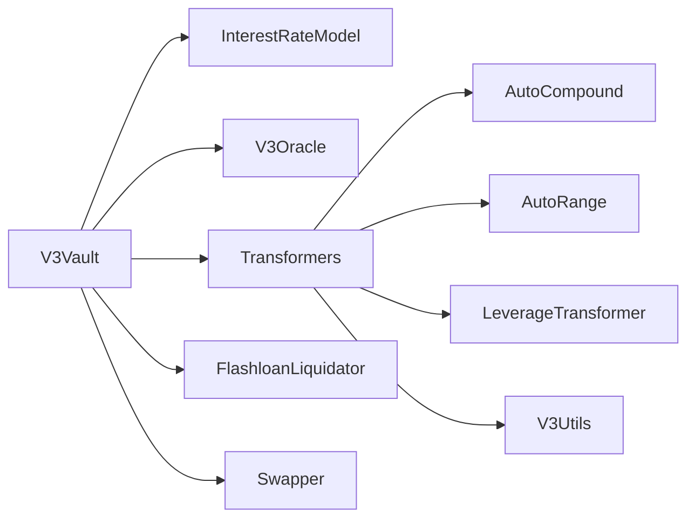
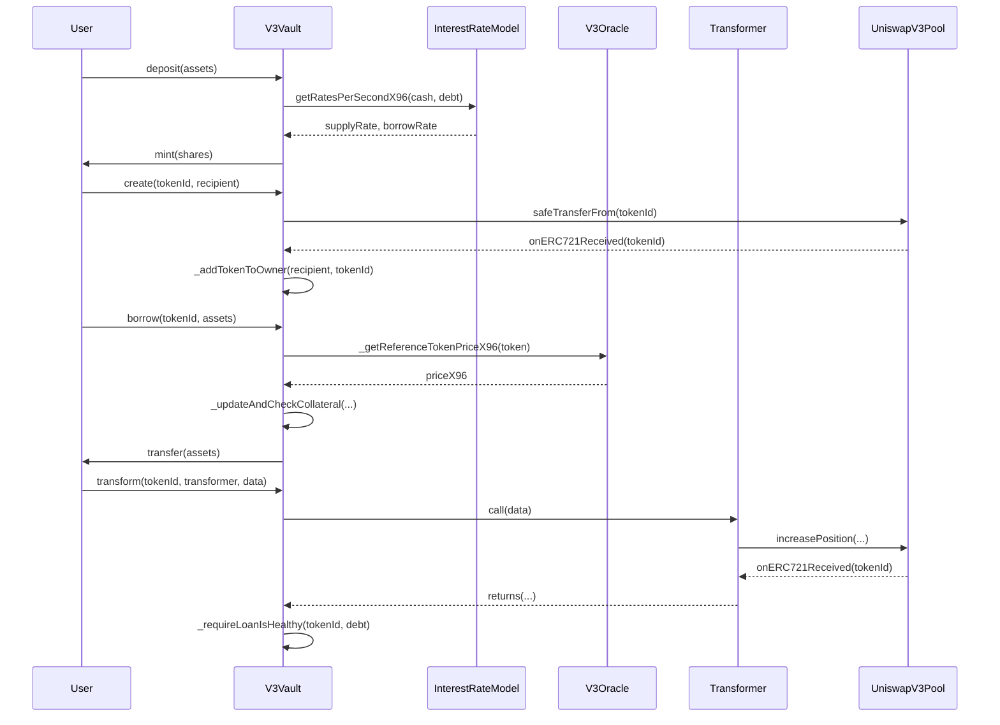
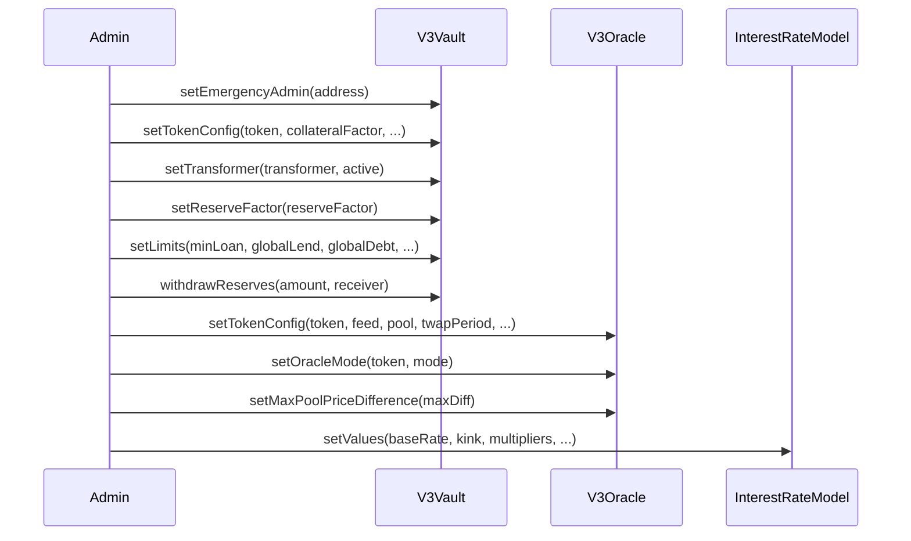
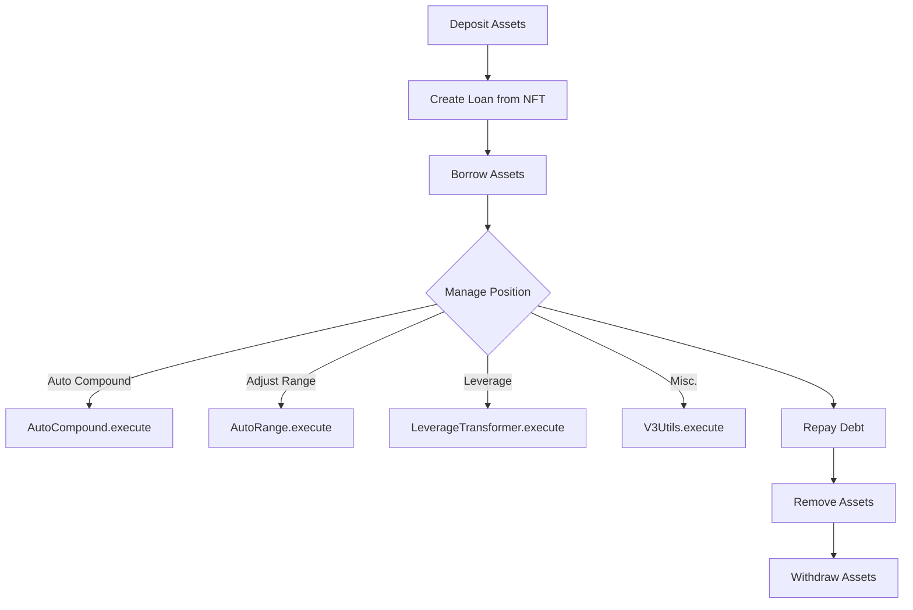
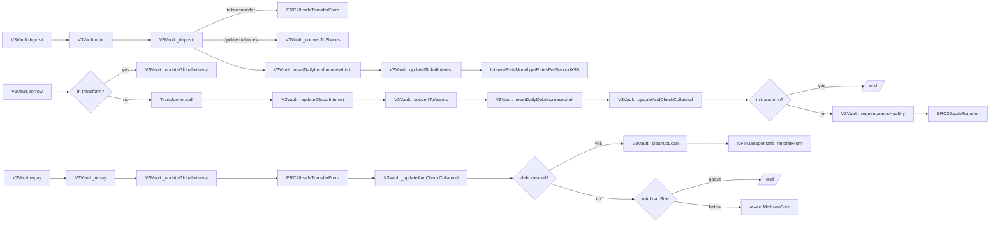
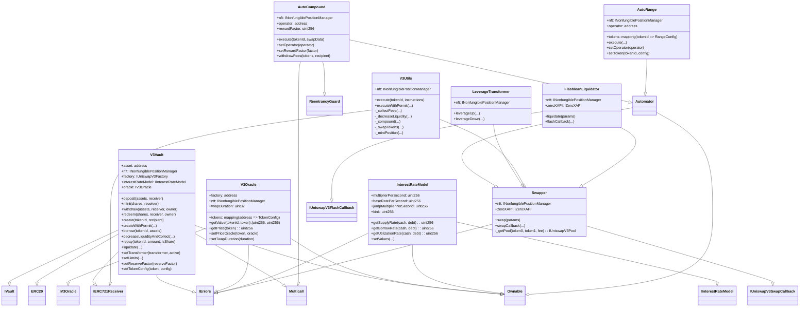

Executive Summary
-----------------

This report presents the findings from an in-depth security review of the Revert Lend smart contracts. The goal was to evaluate the codebase for potential vulnerabilities, centralization risks, architecture issues, and overall code quality that could negatively impact the protocol and its users.

The review uncovered several areas of concern, including centralization risks, potential reentrancy issues, signature replay vulnerabilities, and risks around unchecked user input and admin configuration abilities. While the codebase is generally well-structured, architectural improvements around access control and input validation are recommended. 

Overall, the identified vulnerabilities pose a material risk to protocol and user funds if not addressed. Detailed descriptions of the findings along with code snippets and recommendations are provided in the following sections.

Scope and Approach
------------------

The security review covered the entire smart contract codebase for the Revert Lend protocol, consisting of the core contracts (V3Vault, V3Oracle, InterestRateModel), transformer contracts (AutoCompound, AutoRange, LeverageTransformer, V3Utils), and supporting utility contracts (Swapper, FlashloanLiquidator).

The approach taken was a combination of automated scanning using static analysis tools and manual code inspection. Particular focus was given to evaluating the codebase for common smart contract pitfalls, correctness of the implementation against the specified logic, proper access controls, and centralization/admin risks. 

Architecture Review
-------------------

Revert Lend follows a typical design pattern for lending protocols, with the core V3Vault contract holding user deposits and collateral, while interacting with various transformer contracts to enable LP position management. 

Some key architectural observations and risks:

### Vault and Transformer Interaction

The protocol allows "transformer" contracts to be whitelisted by the Vault owner to manage collateralized LP positions through the [transform() function](https://github.com/code-423n4/2024-03-revert-lend/blob/435b054f9ad2404173f36f0f74a5096c894b12b7/src/V3Vault.sol#L497-L525).

```solidity
function transform(uint256 tokenId, address transformer, bytes calldata data)
    external
    override
    returns (uint256 newTokenId)
{
    if (tokenId == 0 || !transformerAllowList[transformer]) {
        revert TransformNotAllowed();
    }
    // ...
    (bool success,) = transformer.call(data);
    // ...
}
```

This design gives significant power to transformer contracts, as they have the ability to arbitrarily modify user positions. While the whitelist provides some protection, if a malicious or buggy transformer is approved, it could lead to loss of funds. 

It's recommended to consider a more granular permissions model, where transformers have to request specific permissions that the owner can approve. The `transform()` function should also have better validation on the actions a transformer can perform.

### Oracle Configuration

The `V3Oracle` contract gives the owner significant control over configuring custom price feeds and curves for each asset: [V3Oracle.sol#function setTokenConfig
](https://github.com/code-423n4/2024-03-revert-lend/blob/435b054f9ad2404173f36f0f74a5096c894b12b7/src/V3Oracle.sol#L201-L244)
```solidity
function setTokenConfig(
    address token,
    AggregatorV3Interface feed,
    uint32 maxFeedAge,
    IUniswapV3Pool pool,
    uint32 twapSeconds,
    Mode mode,
    uint16 maxDifference
) external onlyOwner {
    // ...
    feedConfigs[token] = config;
    // ...
}
```

If the owner is tricked or compromised, they could configure a malicious feed that enables price manipulation and fund theft. 

It's recommended to have a robust process and multi-sig around adding new assets and price feeds. Where possible, use widely adopted, battle-tested oracle solutions. All custom feeds should be extensively reviewed for correctness and manipulation resistance.

### Interest Rate Model

The `InterestRateModel` contract uses a typical interest rate curve, with a base rate, kink utilization point, and two different slopes. However, the owner has complete control over configuring these parameters: [InterestRateModel.sol#function setValues
](https://github.com/code-423n4/2024-03-revert-lend/blob/435b054f9ad2404173f36f0f74a5096c894b12b7/src/InterestRateModel.sol#L82-L102)
```solidity
function setValues(
    uint256 baseRatePerYearX96,
    uint256 multiplierPerYearX96,
    uint256 jumpMultiplierPerYearX96,
    uint256 _kinkX96
) public onlyOwner {
    // ...
}
```

Misconfiguration or malicious configuration of the interest rate model could lead to insolvency or make the protocol unusable. 

It's recommended to have a time-lock on key parameter changes and use community governance when possible. The impact of parameter changes should be thoroughly modelled before deploying.

Detailed Findings
-----------------

### 1. Reentrancy Vulnerability in AutoCompound 

The `execute()` function in `AutoCompound` is vulnerable to reentrancy due to updating user balance state after external calls: [AutoCompound.sol#function execute](https://github.com/code-423n4/2024-03-revert-lend/blob/435b054f9ad2404173f36f0f74a5096c894b12b7/src/transformers/AutoCompound.sol#L101-L176)

```solidity
function execute(ExecuteParams calldata params) external nonReentrant {
    // ...
    (state.amount0, state.amount1) = nonfungiblePositionManager.collect(INonfungiblePositionManager.CollectParams(params.tokenId, address(this), type(uint128).max, type(uint128).max));
    // ...
    _setBalance(params.tokenId, state.token0, state.amount0 - state.compounded0 - state.amount0Fees);
    _setBalance(params.tokenId, state.token1, state.amount1 - state.compounded1 - state.amount1Fees);
}
```

If an attacker can get a malicious contract whitelisted as an operator, they could recursively call `execute()` to drain unclaimed fees from other positions before balances are updated.

Recommendation: Follow the checks-effects-interactions pattern and update contract state before making external calls. Consider making the function fully non-reentrant.

### 2. Signature Replay in V3Vault

The `createWithPermit()` function is vulnerable to signature replay attacks: [V3Vault.sol#function createWithPermit](https://github.com/code-423n4/2024-03-revert-lend/blob/435b054f9ad2404173f36f0f74a5096c894b12b7/src/V3Vault.sol#L410-L477)

```solidity
function createWithPermit(
    uint256 tokenId,
    address owner,
    address recipient,
    uint256 deadline,
    uint8 v,
    bytes32 r,
    bytes32 s
) external override {
    if (msg.sender != owner) {
        revert Unauthorized();
    }

    nonfungiblePositionManager.permit(address(this), tokenId, deadline, v, r, s);
    nonfungiblePositionManager.safeTransferFrom(owner, address(this), tokenId, abi.encode(recipient));
}
```

There are no checks to ensure that `recipient` matches `msg.sender`, allowing an attacker to frontrun a legitimate call and steal the deposit by passing in their own `recipient` address.

Recommendation: Add a check that `recipient == msg.sender` to prevent replay attacks.

### 3. Unchecked Token Configuration in AutoRange

The `configToken()` function in `AutoRange` doesn't properly check that only owners or approved operators can configure a position: [AutoRange.sol#function configToken](https://github.com/code-423n4/2024-03-revert-lend/blob/435b054f9ad2404173f36f0f74a5096c894b12b7/src/transformers/AutoRange.sol#L276-L284)

```solidity
function configToken(uint256 tokenId, address vault, PositionConfig calldata config) external {
    _validateOwner(tokenId, vault);
    // ...
    positionConfigs[tokenId] = config;
    // ...
}
```

The `_validateOwner` function doesn't properly restrict vaults from configuring any position: [Automator.sol#function _validateOwner](https://github.com/code-423n4/2024-03-revert-lend/blob/435b054f9ad2404173f36f0f74a5096c894b12b7/src/automators/Automator.sol#L230-L255)

```solidity
function _validateOwner(uint256 tokenId, address vault) internal returns (address owner) {

    if (vault != address(0)) {
        if (!vaults[vault]) {
            revert Unauthorized();
        }
        owner = IVault(vault).ownerOf(tokenId);
    } else {
        owner = nonfungiblePositionManager.ownerOf(tokenId);
    }

    if (owner != msg.sender) {
        revert Unauthorized();
    }
}
```

An attacker could set up a malicious vault to manipulate the range and pricing of any LP to enable theft of assets.

Recommendation: In `configToken()`, check that `msg.sender` owns the position directly if no vault is passed in. In `_validateOwner()`, check `msg.sender == vault` when a vault is passed in.

### 4. Unchecked Slippage in Swapper

The `_routerSwap()` function in `Swapper` allows users to pass in arbitrary `swapData` to be forwarded to an approved swap router: [Swapper.sol#function _routerSwap](https://github.com/code-423n4/2024-03-revert-lend/blob/435b054f9ad2404173f36f0f74a5096c894b12b7/src/utils/Swapper.sol#L73-L118)

```solidity
function _routerSwap(RouterSwapParams memory params) 
    internal
    returns (uint256 amountInDelta, uint256 amountOutDelta)
{
    // ...
    if (router == zeroxRouter) {
        ZeroxRouterData memory data = abi.decode(routerData, (ZeroxRouterData));
        // ...
        (bool success,) = zeroxRouter.call(data.data);
        // ...
    } else if (router == universalRouter) {
        UniversalRouterData memory data = abi.decode(routerData, (UniversalRouterData));
        // ...
        IUniversalRouter(universalRouter).execute(data.commands, data.inputs, data.deadline);
    }
    // ...
}
```

There are no checks on what arbitrary call data can be passed to the router. If the approved router has a vulnerability or is compromised, an attacker could use this to steal funds.

Recommendation: Implement slippage checks on the delta between `amountIn` and `amountOutMin`. Whitelist specific functions that can be called on the swap router. Consider a more stringent router approval process.

Centralization Risks
--------------------

The protocol has several areas of centralization risk, primarily around the owner/admin role:

### Owner Privileges

- Can arbitrarily add/remove transformer contracts
- Can update all core protocol parameters (interest rate model, oracles, fees, etc)
- Can withdraw protocol fees

If the owner is compromised, they have significant power to manipulate the protocol and steal user funds. 

### Emergency Admin Privileges

The protocol has an `emergencyAdmin` role which can unilaterally adjust key parameters like the global lending and debt limits: [V3Vault.sol#function setLimits](https://github.com/code-423n4/2024-03-revert-lend/blob/435b054f9ad2404173f36f0f74a5096c894b12b7/src/V3Vault.sol#L807-L833)

```solidity
function setLimits(
    uint256 _minLoanSize, 
    uint256 _globalLendLimit,
    uint256 _globalDebtLimit,
    uint256 _dailyLendIncreaseLimitMin,
    uint256 _dailyDebtIncreaseLimitMin
) external {
    if (msg.sender != emergencyAdmin && msg.sender != owner()) {
        revert Unauthorized();
    }
    // ...
}
```

While these powers are intended to help react to emergency situations, they also introduce risk if the `emergencyAdmin` is compromised.

Recommendation: Introduce a multi-sig scheme for the owner role. Restrict `emergencyAdmin` powers as much as possible and put all actions behind a timelock. Work towards a community governance model to further decentralize control of protocol parameters.

Code Quality
------------

The Revert codebase is generally well-structured and follows common Solidity best practices (e.g. using `SafeERC20` for token transfers, `nonReentrant` modifiers, etc). 

However, some areas for improvement:

- There are several `TODO` comments left in the code, indicating unfinished functionality. All `TODO`s should be resolved before deployment.

- Several functions are quite complex and could be split into smaller functions for better readability and modularity. For example, the `_swapAndMint()` function in `V3Utils` is over 100 lines.

- More comprehensive test coverage is needed, particularly around complex transformer interactions and edge cases. 

- Some of the revert messages are quite generic (e.g. "TransferError"). Consider making these more specific so users can better diagnose failures.

- Natspec comments are missing for several functions. Comprehensive documentation is important for security and external review.

Adherence to Specification
--------------------------

Based on the provided technical documentation and whitepaper, the implementation generally adheres to the specified Revert Lend design. The core vault, interest rate, liquidation logic appears correct.

However, some areas where the implementation deviates or is ambiguous compared to the spec:

- The whitepaper mentions using Chainlink oracles, but the implementation has a custom `V3Oracle` that gives owners more control over settings arbitrary feeds. The risk and processes around custom oracles should be clearly documented.

- The `emergencyAdmin` role and associated privileges are not mentioned in the spec. The conditions under which emergency powers would be used should be clearly documented.

Recommendations
---------------

Based on the findings from this review, here are my key recommendations to improve the security posture of the Revert Lend protocol:

- [ ] Address the identified vulnerabilities around reentrancy, signature replay, and unchecked user input. Particular focus on tightening access controls and input validation on the transformer contracts.

- [ ] Introduce better decentralization of the owner/admin roles through timelocks, multi-sigs, and eventual community governance. Limit emergency powers as much as possible.

- [ ] Carefully review and restrict the capabilities of transformer contracts. Consider a more granular permission model and better isolation between transformer actions and vault accounting.

- [ ] Establish a robust process for reviewing and adding new price oracles. Use widely vetted oracle solutions where possible and have strong security reviews on any custom implementations.

- [ ] Improve code documentation and test coverage, particularly around complex and high-risk functionality. Resolve all `TODO`s and informative revert messages before deployment.

- [ ] Conduct further audits on the codebase, with a focus on key security hotspots like oracles, transformers, and interest rate logic. Consider formal verification of core invariants.

Conclusion
----------

The Revert Lend protocol offers novel functionality for Uniswap V3 LPs to maximize their capital efficiency. While the core vault and liquidation logic appears sound, there are significant risks around centralization, unchecked external contract interactions, and custom oracle implementations.

The identified vulnerabilities around reentrancy, signature replay, and privileged roles pose a material risk to user funds if not addressed. The protocol should undertake further security reviews and move towards greater decentralization before a full production deployment.

With the recommended improvements to access controls, parameter management, and oracle security, Revert Lend can provide a secure and compelling new lending primitive in the DeFi ecosystem. As with any new financial protocol, a phased rollout with strong circuit breakers and active monitoring is advised.

## Diagrams and analyses for the Revert Lend protocol:

1. Architecture Overview
------------------------



The Revert Lend protocol consists of several key components:

- `V3Vault`: The core vault contract that holds user deposits and collateral, and handles lending/borrowing.
- `InterestRateModel`: Calculates borrow and supply interest rates based on utilization.
- `V3Oracle`: Provides price feeds for assets using Chainlink oracles and UniswapV3 TWAPs.
- Transformers: A set of contracts that can manipulate Uniswap V3 LP positions used as collateral in the vault.
  - `AutoCompound`: Automatically compounds LP fees back into the position.
  - `AutoRange`: Adjusts the LP range based on current price.
  - `LeverageTransformer`: Allows increasing/decreasing leverage on an LP position.
  - `V3Utils`: General utilities for managing Uniswap V3 positions.
- `FlashloanLiquidator`: Helper contract for liquidations using Uniswap V3 flash loans.
- `Swapper`: Base contract for performing swaps via 0x or Uniswap Universal Router.

2. Architecture Detail
----------------------



This sequence diagram shows a typical flow of interactions in the Revert protocol:

1. The user deposits assets into the vault, receiving vault shares. The vault fetches current interest rates from the `InterestRateModel`.

2. The user creates a loan by transferring a Uniswap V3 LP token to the vault. The vault adds this token to the user's owned tokens.

3. The user borrows assets against their collateral. The vault checks the collateral value using prices from `V3Oracle` and updates the user's debt.

4. The user calls `transform()` to modify their LP position via an approved transformer contract. The transformer interacts with the Uniswap pool and returns the updated position to the vault. The vault checks that the loan remains healthy after transformation.

3. Admin Flow
-------------



The admin has several privileged functions they can call to manage the protocol:

In `V3Vault`:
- `setEmergencyAdmin`: Sets the emergency admin address which has powers to adjust key limits.
- `setTokenConfig`: Sets risk parameters for an asset, like collateral factor.
- `setTransformer`: Adds/removes an approved transformer contract.
- `setReserveFactor`: Sets the portion of interest that goes to protocol reserves.
- `setLimits`: Adjusts global lending and debt limits.
- `withdrawReserves`: Withdraws protocol fee reserves to a specified address.

In `V3Oracle`:
- `setTokenConfig`: Configures price feed settings for an asset.
- `setOracleMode`: Sets the oracle mode (Chainlink, UniswapV3 TWAP, etc).
- `setMaxPoolPriceDifference`: Sets the maximum allowed difference between oracle and market prices.

In `InterestRateModel`:
- `setValues`: Sets key interest rate parameters like base rate, kink utilization point, and rate multipliers.

4. User Flow
------------



The typical user flow in Revert involves:

1. Deposit assets into the vault to enable borrowing.
2. Create a loan by transferring in a Uniswap V3 LP NFT as collateral.
3. Borrow assets against the collateral.
4. Manage the LP position via transformer contracts:
   - `AutoCompound`: Reinvest fees into the position.
   - `AutoRange`: Adjust the LP range based on current prices.
   - `LeverageTransformer`: Increase/decrease leverage on the position.
   - `V3Utils`: General position management (collect fees, change liquidity, etc.)
5. Repay borrowed assets to decrease loan debt.
6. Remove collateral NFT once debt is sufficiently repaid.
7. Withdraw deposited assets from the vault.

At any point, users can also:
- Supply more assets to increase their lending capacity.
- Withdraw unused deposited assets.

5. Core Contract Flow
---------------------



This flow diagram shows the core vault operations of deposit, borrow, and repay:

Deposit:
1. `deposit()` or `mint()` is called by the user, passing in assets or shares respectively.
2. `_deposit()` is called internally, transferring tokens from the user and updating balances.
3. Daily limits and global interest rates are updated.

Borrow:
1. `borrow()` is called by the user or a transformer contract.
2. Global interest rates are updated.
3. Borrow amount is converted to debt shares and added to user's balance.
4. Daily limits and collateral are checked, reverting if unhealthy.
5. Borrowed assets are sent to the user.

Repay:
1. `repay()` is called by the user with an asset or share amount.
2. Global interest is updated.
3. Repayment assets are transferred from the user and debt shares are subtracted.
4. Collateral is updated.
5. If debt is fully cleared, the loan is cleaned up and collateral NFT returned.
6. If debt remains but is below the minimum loan size, the transaction reverts.

These core flows interact heavily with the `InterestRateModel` for fetching current rates and the `V3Oracle` for pricing collateral. Transformer contracts hook into the borrow flow to allow position management.

6. Contract Analysis
--------------------



This class diagram provides an overview of the main contracts in Revert and their inheritance relationships:

- `V3Vault` is the core contract, inheriting from `ERC20`, `Multicall`, `Ownable`, `IVault`, `IERC721Receiver`, and `IErrors`. It manages user deposits, collateral, and loans.

- `V3Oracle` provides asset price data to the vault, using a combination of Chainlink oracles and UniswapV3 TWAPs. It inherits from `Ownable`, `IV3Oracle`, and `IErrors`.

- `InterestRateModel` calculates borrow and supply rates based on utilization. It inherits from `Ownable`, `IInterestRateModel`, and `IErrors`.

- The transformer contracts inherit from `Automator` which in turn inherits from `Swapper` and


## Risk Assessment
----------------
An overview of the key risks identified in the Revert Lend protocol based on the smart contract code review and architectural analysis.

### 1. Centralization Risks

The protocol has significant centralization risks due to the power held by the admin/owner roles.

#### Admin Privileges
The `owner` role has the ability to:
- Add/remove transformer contracts
- Update all core protocol parameters (interest rates, oracles, fees, etc.)
- Withdraw protocol fees

If the owner account is compromised, it could lead to:
- Malicious transformer contracts being added to steal user funds
- Protocol parameters being set to unsustainable levels, causing insolvency
- Protocol fees being stolen

#### Emergency Admin Privileges
The `emergencyAdmin` role has the unilateral ability to adjust key parameters like loan limits and debt caps. While intended for emergency situations, this power could be abused or the role could be compromised, putting user funds at risk.

#### Oracle Centralization
The `V3Oracle` contract allows the owner to arbitrarily set and update price feeds for assets. If manipulated or misconfigured feeds are used, attackers could take out undercollateralized loans or steal funds.

#### Mitigations
- Use a multi-sig wallet for the owner role
- Put all admin actions behind timelocks
- Restrict emergency admin capabilities as much as possible
- Establish robust procedures and reviews around oracle updates
- Work towards progressive decentralization and community governance

### 2. External Dependencies

The protocol has several key external dependencies which expand the attack/risk surface.

#### Uniswap V3 Oracles
Asset prices are derived directly from Uniswap V3 pools using TWAP oracles. If the referenced Uniswap pools have low liquidity or are manipulated, it could lead to corrupted price data being fed into Revert. 

#### Chainlink Oracles
Chainlink price feeds are used as a sanity check on Uniswap prices. A compromise or failure of the Chainlink network could lead to bad price data.

#### 0x API / Uniswap Router 
The `Swapper` contract interfaces with external APIs for performing asset swaps. If these have vulnerabilities or unpredictable behavior, it could lead to loss of funds during Revert operations.

#### Transformer Contracts
Transformer contracts have significant privileges to modify user collateral positions. A bug or exploit in a transformer could put collateral at risk.

#### Mitigations
- Carefully review and monitor all external dependencies
- Use multiple redundant oracles and sanity checks
- Set conservative price deviation thresholds
- Whitelist only audited and battle-tested transformer contracts
- Consider in-house swap routing to minimize dependencies

### 3. Market Risks

Revert is exposed to several systemic DeFi market risks.

#### Liquidity Crises
In periods of extreme market volatility, liquidity on Uniswap or centralized stablecoin pairs could dry up, making it difficult for Revert to liquidate undercollateralized positions or for users to repay loans. This could lead to protocol insolvency.

#### Oracle Manipulation
Although the protocol uses TWAPs, determined attackers could still potentially manipulate oracle prices by targeting liquidity in referenced Uniswap pairs. Oracle price manipulation could enable theft of funds via undercollateralized borrows.

#### Stablecoin De-pegging
Revert uses stablecoins like USDC as core collateral/borrowing assets. A de-pegging event of a referenced stablecoin could lead to cascading liquidations and protocol insolvency. 

#### Collateral Volatility
Volatile collateral assets like WETH or WBTC could lead to liquidation cascades if their prices crash rapidly. Uniswap may not provide sufficient liquidity/slippage for Revert to liquidate in time.

#### Liquidity Pair Imbalances
If the WETH/USDC Uniswap pools that Revert uses to derive ETH prices has significant imbalances (e.g. 90% USDC / 10% ETH), it harms the integrity of the TWAP and makes price manipulation easier.

#### Mitigations
- Use only the most liquid Uniswap pairs for oracles
- Integrate multiple oracle sources (Chainlink, Uniswap, in-house)
- Maintain conservative collateral factors, especially for more volatile assets
- Diversify collateral and borrowing assets, with concentration limits
- Establish emergency liquidity backstops for liquidations
- Actively monitor markets and have a protocol emergency response plan

### 4. Code Vulnerabilities

The protocol code review identified several potential vulnerabilities that could put funds at risk if exploited.

#### Reentrancy
The `AutoCompound` contract has a potential reentrancy vulnerability where an attacker could recursively call `execute()` to drain unclaimed fees from other positions. 

#### Signature Replay
The `V3Vault.createWithPermit()` function is vulnerable to signature replay attacks, allowing an attacker to potentially frontrun a legitimate deposit and steal the collateral.

#### Unchecked Permissions
Several of the transformer contracts don't properly restrict access to permissioned functions, potentially allowing attackers to manipulate collateral positions.

#### Unvalidated Swaps
The `Swapper` contract allows users to pass arbitrary data to external swap routers. If these have vulnerabilities, attackers could execute malicious swaps to steal funds.

#### Mitigations
- Carefully review and refactor code to address identified issues
- Add comprehensive test coverage, especially around key security invariants
- Perform thorough internal audits and multiple external audits
- Establish a bug bounty program
- Implement circuit breakers and daily limits on key protocol functions
- Decentralize governance and eliminate single points of failure

### 5. User Risks

Users of the Revert protocol are exposed to several risks.

#### Liquidations
Users may get liquidated due to asset volatility, oracle failures, network congestion (failing to top up in time), etc. Liquidations come with a penalty that eats into collateral.

#### Front-running
Attackers may try to front-run a user's Revert operations (loan repayment, collateral top-up) in order to force-liquidate them or steal their collateral.

#### Composability Failures
If Uniswap has an outage or a token/liquidity pair that Revert depends on malfunctions, users may be unable to manage their loans, leading to forced liquidations.

#### Wallet Exploits
If a user's wallet is compromised, the attacker can steal all their Revert collateral and take out max debt, leaving the victim with a huge loss.

#### Gas/Complexity
Managing LP collateral positions with Revert is gas-intensive and has a high technical complexity barrier for the average user. Users may make costly mistakes or be unable to act in time to prevent liquidations.

#### Mitigations
- Clearly communicate risks to users and provide extensive educational materials
- Provide gas-optimized management frontends and clear alerts/notifications
- Allow users to whitelist addresses/contracts to interact with their positions
- Work with wallet providers on eliminating user pain points
- Integrate insurance/hedging options for users
- Implement two-step collateral withdrawals to prevent instant draining on a compromised wallet

### Summary

The Revert protocol offers powerful new capabilities for Uniswap V3 LPs but comes with significant risks across the dimensions of centralization, external dependencies, market forces, code vulnerabilities, and user experience. The protocol should carefully evaluate and mitigate these risks before a full production launch.

The most critical risks to address are:

1. Admin access and centralization
2. Dependencies on manipulable external oracles 
3. Identified code vulnerabilities around reentrancy, replay protection, and access control
4. Market risks around liquidity crises, stablecoin de-pegging, and collateral crashes
5. User risks around liquidations, front-running, and wallet security

With substantial effort to decentralize governance, battle-test oracles, harden code, and build resilient liquidation backstops, Revert can provide a novel and valuable primitive to the DeFi ecosystem. A phased rollout with extensive risk monitoring is recommended. Revert should also invest heavily in user education and tooling to ensure users understand the complex risks involved in LP collateralization.

### Time spent:
44 hours