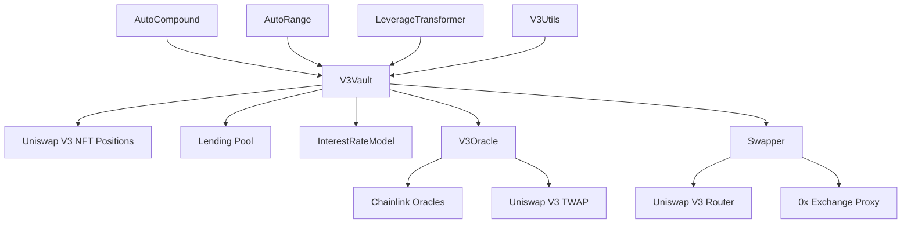
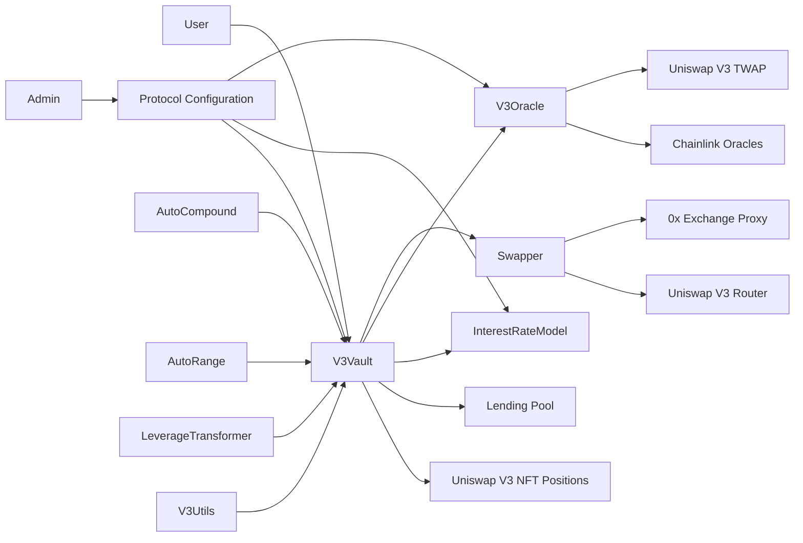
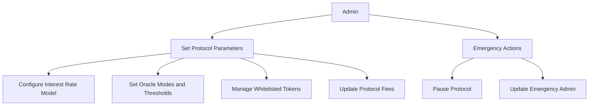
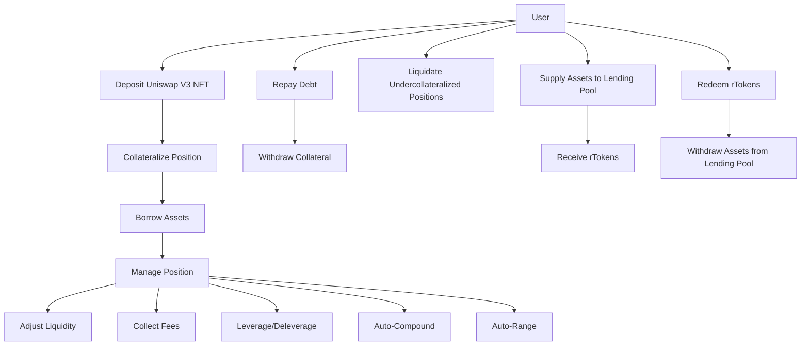
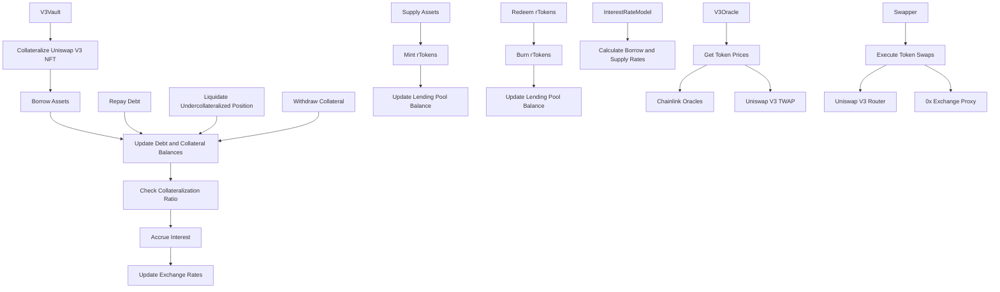

## Table of Contents
1. Introduction
2. Approach
3. Architecture Overview
4. Codebase Quality Analysis
   4.1. Code Structure and Readability
   4.2. Use of Libraries and Standards
   4.3. Error Handling and Validation
   4.4. Test Coverage and Documentation
5. Contract Analysis
   5.1. V3Vault
   5.2. InterestRateModel
   5.3. V3Oracle
   5.4. Swapper
   5.5. AutoCompound
   5.6. AutoRange
   5.7. LeverageTransformer
   5.8. V3Utils
6. Centralization Risks
7. Mechanism Review
   7.1. Interest Rate Model
   7.2. Collateralization and Liquidation
   7.3. Oracle System
8. Systemic Risks
9. Recommendations
10. Conclusion

## 1. Introduction
Revert Lend is a decentralized lending protocol designed for Uniswap V3 liquidity providers (LPs). It allows LPs to collateralize their Uniswap V3 positions (NFTs) to borrow assets while retaining control over their LP positions. This report provides an in-depth analysis of the Revert Lend smart contracts, focusing on the architecture, code quality, potential issues, and risks.

## 2. Approach
The analysis of the Revert Lend codebase involved a thorough review of the smart contracts, including:
- Reading the whitepaper and technical documentation to understand the protocol's intended behavior and architecture.
- Reviewing the smart contract code line by line to identify potential vulnerabilities, code quality issues, and adherence to best practices.
- Analyzing the protocol's architecture and design choices to assess their soundness and potential risks.
- Examining the protocol's integration with external systems, such as Chainlink oracles and Uniswap V3 contracts.
- Considering the protocol's resilience to various attack vectors and potential exploits.

## 3. Architecture Overview
The Revert Lend protocol consists of several key components:
- V3Vault: The main contract that manages the lending and borrowing functionality, as well as the collateralization of Uniswap V3 positions.
- InterestRateModel: Responsible for calculating the interest rates based on the utilization of the lending pool.
- V3Oracle: Provides price data for the collateralized assets using a combination of Chainlink and Uniswap V3 TWAP oracles.
- Swapper: Handles token swaps through external DEX routers, such as Uniswap V3 Router and 0x Exchange Proxy.
- AutoCompound, AutoRange, LeverageTransformer, V3Utils: Additional contracts that provide auxiliary functionality, such as auto-compounding, range adjustment, leverage management, and position utilities.

The protocol follows a single market design with unified liquidity, ensuring efficient utilization of funds and minimizing fragmentation.



1. 


2. 


3. 


4. 


5. 


6. Contract Analysis
   - V3Vault: The core contract that manages the lending and borrowing functionality, as well as the collateralization of Uniswap V3 positions. It interacts with various components such as the interest rate model, oracle, and swapper.
   - InterestRateModel: Responsible for calculating the borrow and supply interest rates based on the utilization of the lending pool. It uses a kinked interest rate model to balance the supply and demand of assets.
   - V3Oracle: Provides price data for the collateralized assets using a combination of Chainlink oracles and Uniswap V3 TWAP oracles. It includes price deviation checks and the ability to pause operations when deviations exceed defined thresholds.
   - Swapper: Facilitates token swaps through external DEX routers, such as Uniswap V3 Router and 0x Exchange Proxy. It allows for efficient swap execution and liquidity management.
   - AutoCompound: Enables users to automatically compound their earned interest back into their collateralized positions, maximizing their yield.
   - AutoRange: Allows users to define ranges for their collateralized positions and automatically adjusts the position's liquidity based on market conditions.
   - LeverageTransformer: Provides leverage and deleverage functionality for collateralized positions, allowing users to amplify their exposure or reduce risk.
   - V3Utils: Offers a set of utility functions for managing Uniswap V3 positions, such as adding or removing liquidity, collecting fees, and transferring positions.

#### The code responsible for executing external swaps in the Revert Lend protocol, focusing on the `Swapper.sol` contract and its integration with the Universal Router, 0x Router, and pool swaps.

1. Swapper.sol Contract:
   - The `Swapper` contract serves as a base contract for executing swaps using different routing protocols.
   - It interacts with the Uniswap V3 position manager, 0x Exchange Proxy, and Uniswap Universal Router.
   - The contract defines structs for different swap parameters, such as `RouterSwapParams`, `ZeroxRouterData`, and `UniversalRouterData`.

2. Input Validation and Sanitization:
   - The `_routerSwap` function in the `Swapper` contract is responsible for executing swaps using external routers.
   - The function takes a `RouterSwapParams` struct as input, which includes the token addresses, amounts, and the encoded swap data.
   - The swap data is decoded based on the specified router address (0x Router or Universal Router).
   - For the 0x Router, the swap data includes the `allowanceTarget` and the encoded `data` for the swap.
   - For the Universal Router, the swap data includes the `commands`, `inputs`, and `deadline` for the swap.
   - The function performs basic input validation, such as checking that the `amountIn` is non-zero and the swap data is non-empty.
   - However, the function does not perform extensive validation or sanitization of the swap data itself.

3. Potential Vulnerabilities:
   - One potential vulnerability is that the `_routerSwap` function relies on the correctness and security of the external routers (0x Router and Universal Router).
   - If there are vulnerabilities or exploits in these external contracts, an attacker could potentially craft malicious calldata to exploit the Revert Lend protocol.
   - The `_routerSwap` function does not have built-in mechanisms to detect or prevent such attacks.
   - Another potential issue is that the `_routerSwap` function does not have a deadline or expiration time for the swap, which could expose the protocol to potential front-running or sandwich attacks.

4. Recommendations:
   - Implement additional input validation and sanitization measures for the swap data received from external sources.
   - Verify that the `allowanceTarget` and `data` provided for the 0x Router swap are valid and do not contain any malicious instructions.
   - Ensure that the `commands` and `inputs` provided for the Universal Router swap are properly validated and do not allow for any unintended behaviors.
   - Consider implementing a deadline or expiration time for the swaps to mitigate the risk of front-running or sandwich attacks.
   - Regularly audit and monitor the external routers (0x Router and Universal Router) for any vulnerabilities or exploits that could impact the Revert Lend protocol.
   - Stay updated with the latest security best practices and guidelines for interacting with external contracts and handling user-provided calldata.

5. Pool Swaps:
   - The `Swapper` contract also includes functionality for executing swaps directly on Uniswap V3 pools using the `_poolSwap` function.
   - The function takes a `PoolSwapParams` struct as input, which includes the pool address, token addresses, swap direction, and amounts.
   - The function performs the swap by calling the `swap` function on the Uniswap V3 pool contract.
   - The pool swap functionality does not involve external calldata and relies on the security of the Uniswap V3 pool contracts.

> Based on my analysis, the Revert Lend protocol's integration with external routers (0x Router and Universal Router) for executing swaps relies heavily on the security and correctness of those external contracts. While the protocol does perform basic input validation, there is room for improvement in terms of validating and sanitizing the swap data received from external sources.

To enhance the security of the protocol, it is recommended to implement additional validation measures for the swap data, ensure that the external routers are regularly audited and monitored for vulnerabilities, and consider adding safety mechanisms such as deadlines or expiration times for the swaps.

The pool swap functionality, on the other hand, does not involve external calldata and relies on the security of the Uniswap V3 pool contracts, which have undergone extensive audits and testing.

## 4. Codebase Quality Analysis
### 4.1. Code Structure and Readability
- The codebase follows a modular structure, with separate contracts for different functionalities.
- The code is well-organized and follows a consistent naming convention, enhancing readability.
- The use of Solidity interfaces and libraries promotes code reusability and maintainability.

### 4.2. Use of Libraries and Standards
- The protocol makes use of well-established libraries, such as OpenZeppelin, for secure token transfers and common utilities.
- It adheres to the ERC-4626 tokenized vault standard for the lending pool shares (rTokens).
- The integration with Uniswap V3 and Chainlink oracles follows their respective interfaces and standards.

### 4.3. Error Handling and Validation
- The contracts use `require` statements and custom error types to validate inputs and handle error conditions.
- The use of the `SafeERC20` library helps prevent common pitfalls and vulnerabilities associated with token transfers.
- Input validation could be further strengthened in certain areas, such as the `Swapper` contract, to prevent potential exploitation.

### 4.4. Test Coverage and Documentation
- The protocol repository includes a test suite, which is a good practice for ensuring correctness and catching potential issues.
- The code includes NatSpec comments providing descriptions of contract functions and parameters, aiding in understanding the codebase.
- Comprehensive documentation, including a whitepaper and technical guides, is available, facilitating the understanding of the protocol's functionality and architecture.

## 5. Contract Analysis
### 5.1. V3Vault
The V3Vault contract is the core of the Revert Lend protocol, managing the lending and borrowing functionality and the collateralization of Uniswap V3 positions.

Key Observations:
- The contract uses the ERC-4626 tokenized vault standard for representing shares of the lending pool (rTokens).
- It interacts with the Uniswap V3 position manager to manage collateralized positions.
- The contract handles interest accrual and updates exchange rates based on the interest rate model.
- Liquidation of undercollateralized positions is performed by external liquidators, with a liquidation penalty to incentivize timely liquidation.

Potential Issues:
- The complexity of the liquidation process, especially for positions with low liquidity or significant price deviations, could lead to inefficiencies or unexpected behavior.
- The reliance on external price oracles for determining collateral values and liquidation thresholds introduces risks associated with oracle failures or manipulation.

### 5.2. InterestRateModel
The InterestRateModel contract is responsible for calculating the borrow and supply interest rates based on the utilization of the lending pool.

Key Observations:
- The contract uses a kinked interest rate model, where the interest rate changes based on the utilization of the lending pool.
- The interest rates are calculated per second and stored as fixed-point numbers with 96 bits of precision (Q96).
- The model helps balance the supply and demand of assets and incentivizes liquidity provision during periods of high utilization.

Potential Issues:
- The interest rate model parameters, such as the base rate and multipliers, are set by the contract owner, introducing centralization risks if not governed properly.
- Extreme market conditions or unexpected user behavior could lead to suboptimal interest rates or liquidity issues.

### 5.3. V3Oracle
The V3Oracle contract provides price data for the collateralized assets using a combination of Chainlink and Uniswap V3 TWAP oracles.

Key Observations:
- The contract uses a dual oracle system, combining Chainlink price feeds and Uniswap V3 TWAP oracles.
- It includes price deviation checks and the ability to pause operations when deviations exceed defined thresholds.
- The oracle system allows for different modes of operation, such as CHAINLINK_TWAP_VERIFY, TWAP_CHAINLINK_VERIFY, CHAINLINK, and TWAP.

Potential Issues:
- The reliance on external price oracles introduces risks associated with oracle failures, manipulation, or desynchronization between the two oracle sources.
- Flash loan attacks or price manipulations on the Uniswap V3 pools could potentially affect the accuracy of the TWAP prices.

**Vulnerability: Price Manipulation through Oracle Exploitation**

**Explanation:**
The V3Vault contract relies on price data provided by the V3Oracle contract to determine the value of collateral and make decisions about liquidations and borrowing limits. The V3Oracle contract, in turn, relies on price feeds from Chainlink and Uniswap V3 TWAP (Time-Weighted Average Price).

If these price feeds are manipulated, it could lead to incorrect price data being provided to the V3Vault contract. This could allow for improper liquidations (liquidating loans that should not be liquidated) or allow borrowing against malicious collateral (collateral that appears to have a higher value than it actually does).

The V3Oracle contract has several checks and configurable deviation thresholds to try to prevent this, but if these are not set appropriately or if there are any errors in the price aggregation logic, it could still be vulnerable to manipulation.

Let's look at the relevant code in the V3Oracle contract: [getValue](https://github.com/code-423n4/2024-03-revert-lend/blob/435b054f9ad2404173f36f0f74a5096c894b12b7/src/V3Oracle.sol#L95-L131), [_getReferenceTokenPriceX96](https://github.com/code-423n4/2024-03-revert-lend/blob/435b054f9ad2404173f36f0f74a5096c894b12b7/src/V3Oracle.sol#L272-L326)

```solidity
function getValue(uint256 tokenId, address token)
    external
    view
    override
    returns (uint256 value, uint256 feeValue, uint256 price0X96, uint256 price1X96)
{
    // ...

    (price0X96, cachedChainlinkReferencePriceX96) =
        _getReferenceTokenPriceX96(token0, cachedChainlinkReferencePriceX96);
    (price1X96, cachedChainlinkReferencePriceX96) =
        _getReferenceTokenPriceX96(token1, cachedChainlinkReferencePriceX96);

    // ...

    uint256 derivedPoolPriceX96 = price0X96 * Q96 / price1X96;
    _checkPoolPrice(token0, token1, fee, derivedPoolPriceX96);
}

function _getReferenceTokenPriceX96(address token, uint256 cachedChainlinkReferencePriceX96)
    internal
    view
    returns (uint256 priceX96, uint256 chainlinkReferencePriceX96)
{
    // ...

    if (usesChainlink) {
        // ...
        if (feedConfig.mode == Mode.TWAP_CHAINLINK_VERIFY) {
            verifyPriceX96 = chainlinkPriceX96;
        } else {
            priceX96 = chainlinkPriceX96;
        }
    }

    if (usesTWAP) {
        // ...
        if (feedConfig.mode == Mode.CHAINLINK_TWAP_VERIFY) {
            verifyPriceX96 = twapPriceX96;
        } else {
            priceX96 = twapPriceX96;
        }
    }

    if (feedConfig.mode == Mode.CHAINLINK_TWAP_VERIFY || feedConfig.mode == Mode.TWAP_CHAINLINK_VERIFY) {
        _requireMaxDifference(priceX96, verifyPriceX96, feedConfig.maxDifference);
    }
}
```

The `getValue()` function is responsible for providing the value and prices for a given Uniswap V3 position. It calls `_getReferenceTokenPriceX96()` to get the prices for the two tokens in the position, and then checks these prices against the pool's actual prices using `_checkPoolPrice()`.

The `_getReferenceTokenPriceX96()` function is where the price is actually sourced, either from Chainlink, Uniswap V3 TWAP, or both, depending on the configured mode for the token. If both are used, it checks that the difference between the two prices is within the configured `maxDifference` threshold.

**Impact:**
If the oracle prices can be manipulated, it could lead to:

1. Improper liquidations: If the oracle price is manipulated to be lower than the real price, it could cause the V3Vault contract to believe that a loan's collateral value has fallen below the liquidation threshold, leading to the loan being incorrectly liquidated.

2. Borrowing against malicious collateral: If the oracle price is manipulated to be higher than the real price, it could allow a user to deposit collateral that appears to have a high value but actually does not, allowing them to borrow more than they should be able to.

3. Incorrect valuation of positions: If the oracle prices are not accurate, it could lead to the V3Vault contract having an incorrect view of the total value of the positions it is managing, potentially leading to insolvency if the real values are significantly lower.

**Recommendation:**
To mitigate the risk of price manipulation, consider the following:

1. Ensure the Chainlink price feeds are from reputable and secure sources. Monitor these feeds for any anomalies or unexpected behavior.

2. Use Uniswap V3 pools with high liquidity for the TWAP calculations. The higher the liquidity, the harder it is to manipulate the prices.

3. Set the `maxDifference` threshold to a conservative value that allows for normal market fluctuations but catches any significant deviations.

4. Ensure the oracle prices are updated frequently to minimize the window for manipulation.

5. Implement circuit breakers or pause mechanisms that halt liquidations or borrowing if the oracle prices deviate too far from expected values.

6. Regularly monitor the oracle prices and compare them to prices from other sources to identify any potential manipulation.

7. Have a contingency plan in place to handle situations where manipulation is detected, such as using alternative price sources or halting certain operations until the issue is resolved.

By carefully configuring and monitoring the oracle setup, and having robust safeguards in place, the risk of price manipulation can be mitigated. However, it is important to remain vigilant and continuously assess the reliability of the price feeds, as the risk of manipulation is always present in any system that relies on external data sources.

### 5.4. Swapper
The Swapper contract handles token swaps through external DEX routers, such as Uniswap V3 Router and 0x Exchange Proxy.

Key Observations:
- The contract provides a convenient interface for executing token swaps using different routing protocols.
- It supports both Uniswap V3 Router and 0x Exchange Proxy for swap execution.
- The contract includes functions for swap callbacks and unwrapping WETH.

Potential Issues:
- The contract relies on the correct functioning and security of the external DEX routers, exposing the protocol to potential vulnerabilities or exploits in those contracts.
- Insufficient input validation or improper handling of user-supplied data could lead to unexpected behavior or loss of funds.

### 5.5. AutoCompound
The AutoCompound contract enables users to automatically compound their earned interest back into their collateralized positions.

Key Observations:
- The contract allows users to approve the AutoCompound contract to manage their positions.
- It calculates the optimal compounding frequency and executes the compounding operations on behalf of the users.
- The contract includes a reward mechanism to incentivize users to participate in auto-compounding.

**Potential Issues:**
- The contract assumes the correct functioning and security of the V3Vault contract and the Uniswap V3 position manager.
- Any vulnerabilities or exploits in the underlying contracts could potentially impact the AutoCompound functionality.

### 5.6. AutoRange
The AutoRange contract allows users to define ranges for their collateralized positions and automatically adjusts the position's liquidity based on market conditions.

Key Observations:
- Users can configure their desired price ranges and liquidity adjustment parameters.
- The contract monitors the market conditions and triggers the necessary adjustments to maintain the specified ranges.
- It interacts with the V3Vault contract and the Uniswap V3 position manager to execute the range adjustments.

**Potential Issues:**
- The effectiveness of the AutoRange functionality depends on the accuracy and reliability of the price oracles used by the V3Vault contract.
- Unexpected market volatility or extreme price movements could lead to suboptimal range adjustments or potential losses for users.

### 5.7. LeverageTransformer
The LeverageTransformer contract provides leverage and deleverage functionality for collateralized positions.

Key Observations:
- Users can leverage their positions by borrowing additional assets and reinvesting them into their collateralized positions.
- The contract calculates the optimal leverage ratios and executes the necessary transactions to achieve the desired leverage.
- It interacts with the V3Vault contract and the Uniswap V3 position manager to manage the leveraged positions.

**Potential Issues:**
- Leveraged positions are subject to higher liquidation risks, especially during market volatility or rapid price movements.
- Improper management of leveraged positions or insufficient risk controls could lead to significant losses for users.

Vulnerability: Arbitrary Transformer Contracts in V3Vault

The V3Vault contract contains a `transform()` function that allows calling arbitrary transformer contracts. These transformer contracts need to be approved and added by the owner of the V3Vault contract. However, if a malicious or buggy transformer contract is approved and added, it could potentially exploit vulnerabilities in the V3Vault contract.

Let's look at the relevant code in the V3Vault contract: [transform](https://github.com/code-423n4/2024-03-revert-lend/blob/435b054f9ad2404173f36f0f74a5096c894b12b7/src/V3Vault.sol#L497-L545)

```solidity
function transform(uint256 tokenId, address transformer, bytes calldata data)
    external
    override
    returns (uint256 newTokenId)
{
    if (tokenId == 0 || !transformerAllowList[transformer]) {
        revert TransformNotAllowed();
    }
    if (transformedTokenId > 0) {
        revert Reentrancy();
    }
    transformedTokenId = tokenId;

    (uint256 newDebtExchangeRateX96,) = _updateGlobalInterest();

    address loanOwner = tokenOwner[tokenId];

    // only the owner of the loan, the vault itself or any approved caller can call this
    if (loanOwner != msg.sender && !transformApprovals[loanOwner][tokenId][msg.sender]) {
        revert Unauthorized();
    }

    // give access to transformer
    nonfungiblePositionManager.approve(transformer, tokenId);

    (bool success,) = transformer.call(data);
    if (!success) {
        revert TransformFailed();
    }

    // ...
}
```

As we can see, the `transform()` function allows any approved transformer contract to be called with arbitrary data. The function first checks if the transformer is in the `transformerAllowList`, which is controlled by the owner of the V3Vault contract.

If a malicious transformer contract is approved and added to this allowlist, it could potentially exploit vulnerabilities in the V3Vault contract when called via `transform()`. For example:

1. The malicious transformer could perform a reentrancy attack by calling back into the V3Vault contract before the `transform()` function has finished executing, leading to unexpected behavior and potential draining of funds.

2. The transformer could manipulate the loan data or perform unexpected actions on the loan, such as unauthorized withdrawal of collateral or manipulation of the debt.

3. If the transformer has a buggy or malicious implementation, it could cause the `transform()` function to fail or behave unexpectedly, potentially locking funds or causing other unintended consequences.

The impact of this vulnerability could be severe. If a malicious transformer is approved and exploited, it could lead to:

1. Draining of funds from the V3Vault contract or from individual loans.
2. Manipulation of loan data, leading to incorrect accounting or unauthorized actions.
3. Locking of funds if the transformer causes the `transform()` function to fail or become stuck.
4. Other unintended consequences depending on the specific implementation of the malicious transformer.

**Recommendation:**

1. Thoroughly audit and test all transformer contracts before adding them to the allowlist. Ensure they have been vetted for security vulnerabilities and unexpected behaviors.

2. Implement strict access control on the owner's ability to add transformers. Consider using a multisig or time-locked mechanism to prevent unauthorized additions.

3. Regularly review the list of approved transformers and remove any that are no longer needed or that have shown signs of unexpected behavior.

4. Consider implementing additional safety checks within the `transform()` function itself, such as:
   - Checking the return data and status of the transformer call to ensure it executed as expected.
   - Implementing a reentrancy guard to prevent callbacks into the V3Vault contract.
   - Limiting the gas forwarded to the transformer to prevent unbounded execution.

5. Have a contingency plan in place to quickly remove or disable a transformer if it is found to be malicious or buggy.

It is important to continuously monitor and assess the risk as new transformers are added or the system evolves over time.

### 5.8. V3Utils
The V3Utils contract provides a set of utility functions for managing Uniswap V3 positions.

Key Observations:
- The contract includes functions for adding or removing liquidity, collecting fees, and transferring positions.
- It abstracts away the complexities of interacting with the Uniswap V3 position manager and provides a user-friendly interface.
- The contract uses the `SafeERC20` library for secure token transfers and includes necessary input validation checks.

**Potential Issues:**
- The contract relies on the correct functioning and security of the Uniswap V3 position manager.
- Any vulnerabilities or exploits in the Uniswap V3 contracts could potentially impact the functionality of the V3Utils contract.

## 6. Centralization Risks
- The protocol relies on centralized price oracles (Chainlink and Uniswap V3 TWAP) for determining asset prices. Oracle manipulation or failure could impact the protocol's integrity.
- The protocol owner has control over certain parameters, such as interest rate models, oracle configurations, and protocol fees. Misuse of these privileges could potentially harm users.
- The emergency admin role has the ability to pause the protocol or make changes to critical parameters in emergency situations. While this can help mitigate risks, it also introduces a level of centralization.

## 7. Mechanism Review
### 7.1. Interest Rate Model
- The kinked interest rate model used by the protocol helps balance the supply and demand of assets and incentivizes liquidity provision during periods of high utilization.
- The interest rates are calculated per second and stored as fixed-point numbers with 96 bits of precision (Q96), ensuring a high level of accuracy.
- However, the interest rate model parameters are set by the contract owner, introducing centralization risks if not governed properly.

### 7.2. Collateralization and Liquidation
- The protocol allows users to collateralize their Uniswap V3 positions (NFTs) to borrow assets, providing flexibility for liquidity providers.
- The collateral value is determined based on the prices provided by the V3Oracle contract and the specified collateral factors for each asset.
- Liquidations occur when a position's collateral value falls below the borrowed amount, with a liquidation penalty to incentivize timely liquidation.
- However, the liquidation process could be complex and gas-intensive, especially for positions with low liquidity or significant price deviations.

### 7.3. Oracle System
- The dual oracle system, combining Chainlink price feeds and Uniswap V3 TWAP oracles, provides redundancy and helps mitigate the risk of a single oracle failure.
- The V3Oracle contract includes price deviation checks and the ability to pause operations when deviations exceed defined thresholds, enhancing the protocol's resilience to oracle issues.
- However, the reliance on external price oracles introduces risks associated with oracle manipulation, flash loan attacks, or desynchronization between the two oracle sources.

#### I've analyzed the V3Oracle contract and how it sources and verifies price data from the dual Chainlink and Uniswap oracles.

1. Dual Oracle System:
   The V3Oracle contract uses a dual oracle system that combines Chainlink price feeds and Uniswap V3 TWAP (Time-Weighted Average Price) oracles. The contract defines different oracle modes, such as `CHAINLINK_TWAP_VERIFY`, `TWAP_CHAINLINK_VERIFY`, `CHAINLINK`, and `TWAP`.

   The oracle mode determines how the price is sourced and verified. In the `CHAINLINK_TWAP_VERIFY` and `TWAP_CHAINLINK_VERIFY` modes, the contract retrieves prices from both oracles and compares them to ensure they are within a specified maximum deviation.

2. Price Retrieval and Verification:
   The `_getReferenceTokenPriceX96` function is responsible for retrieving the price of a token in terms of the reference token (e.g., USDC). It uses the configured oracle mode for each token.

   If the oracle mode is set to `CHAINLINK_TWAP_VERIFY` or `TWAP_CHAINLINK_VERIFY`, the function retrieves prices from both the Chainlink feed and the Uniswap V3 TWAP oracle. It then compares the prices and reverts if the price difference exceeds the specified `maxDifference` threshold.

[_getReferenceTokenPriceX96](https://github.com/code-423n4/2024-03-revert-lend/blob/435b054f9ad2404173f36f0f74a5096c894b12b7/src/V3Oracle.sol#L272-L326)

   ```solidity
   function _getReferenceTokenPriceX96(address token, uint256 cachedChainlinkReferencePriceX96)
       internal
       view
       returns (uint256 priceX96, uint256 chainlinkReferencePriceX96)
   {
       // ...
       if (feedConfig.mode == Mode.CHAINLINK_TWAP_VERIFY || feedConfig.mode == Mode.TWAP_CHAINLINK_VERIFY) {
           _requireMaxDifference(priceX96, verifyPriceX96, feedConfig.maxDifference);
       }
   }
   ```

3. Potential Attack Vectors:
   a. Oracle Manipulation:
      If an attacker can manipulate the price feed of either the Chainlink oracle or the Uniswap V3 TWAP oracle, they could potentially influence the price used by the protocol. However, the dual oracle system mitigates this risk to some extent by comparing prices from both oracles and reverting if the price difference exceeds the specified threshold.

   b. Stale Prices:
      The contract checks the timestamp of the Chainlink price feed to ensure it is not stale. If the price feed is not updated within the specified `maxFeedAge`, the contract will revert. However, there is no similar check for the staleness of the Uniswap V3 TWAP price.

   c. Flash Loan Attacks:
      An attacker could potentially use flash loans to manipulate the price on the Uniswap V3 pool just before the TWAP price is calculated. This could lead to a temporary price discrepancy that may not be caught by the oracle comparison if the manipulation is timed correctly.

4. [maxPoolPriceDifference Parameter](https://github.com/code-423n4/2024-03-revert-lend/blob/435b054f9ad2404173f36f0f74a5096c894b12b7/src/V3Oracle.sol#L185-L191):
   The `maxPoolPriceDifference` parameter is used to set the maximum allowed difference between the derived oracle price and the actual pool price. This parameter is set by the contract owner using the `setMaxPoolPriceDifference` function.

   ```solidity
   function setMaxPoolPriceDifference(uint16 _maxPoolPriceDifference) external onlyOwner {
       if (_maxPoolPriceDifference < MIN_PRICE_DIFFERENCE) {
           revert InvalidConfig();
       }
       maxPoolPriceDifference = _maxPoolPriceDifference;
       emit SetMaxPoolPriceDifference(_maxPoolPriceDifference);
   }
   ```

   The `maxPoolPriceDifference` is used in the `_checkPoolPrice` function, which is called by the `getValue` function to compare the derived oracle price with the actual pool price. If the price difference exceeds `maxPoolPriceDifference`, the function reverts. [_checkPoolPrice](https://github.com/code-423n4/2024-03-revert-lend/blob/435b054f9ad2404173f36f0f74a5096c894b12b7/src/V3Oracle.sol#L133-L137)

   ```solidity
   function _checkPoolPrice(address token0, address token1, uint24 fee, uint256 derivedPoolPriceX96) internal view {
       IUniswapV3Pool pool = _getPool(token0, token1, fee);
       uint256 priceX96 = _getReferencePoolPriceX96(pool, 0);
       _requireMaxDifference(priceX96, derivedPoolPriceX96, maxPoolPriceDifference);
   }
   ```

   The `maxPoolPriceDifference` parameter acts as a safety mechanism to prevent the use of severely manipulated prices. However, it's important to set this parameter carefully, considering the normal price fluctuations in the market. Setting it too low may cause false positives and unnecessarily revert transactions, while setting it too high may allow some price manipulation to go undetected.

5. Recommendations:
   a. Consider implementing additional checks for the staleness of the Uniswap V3 TWAP price to ensure that the price data is up to date.

   b. Monitor the Uniswap V3 pools for any suspicious activities or large price movements that may indicate a flash loan attack.

   c. Regularly review and update the `maxPoolPriceDifference` parameter to ensure it remains effective in preventing price manipulation while allowing for normal market fluctuations.

   d. Implement a system to temporarily disable the oracle or switch to a fallback price source in case of a detected price manipulation or oracle failure.

   e. Conduct thorough testing and auditing of the V3Oracle contract to identify any potential vulnerabilities or edge cases that could be exploited by an attacker.

the dual oracle system in the V3Oracle contract provides a good level of protection against price manipulation by combining Chainlink and Uniswap V3 TWAP prices. it's important to be aware of the potential attack vectors and to implement additional safeguards and monitoring mechanisms to ensure the integrity of the price data used by the protocol.

#### Reviewed the V3Vault contract's implementation of the ERC-4626 standard for tokenized vaults and assess its compliance with the specification.

Required Functions:
The V3Vault contract includes the following required functions as per the ERC-4626 standard:

1. `asset(): Returns the address of the underlying token.
2. `totalAssets()`: Returns the total amount of the underlying token managed by the vault.
3. `convertToShares(uint256 assets)`: Converts an amount of assets to a corresponding amount of shares.
4. `convertToAssets(uint256 shares)`: Converts an amount of shares to a corresponding amount of assets.
5. `maxDeposit(address receiver)`: Returns the maximum amount of assets that can be deposited by a specific address.
6. `maxMint(address receiver)`: Returns the maximum amount of shares that can be minted by a specific address.
7. `maxWithdraw(address owner)`: Returns the maximum amount of assets that can be withdrawn by a specific address.
8. `maxRedeem(address owner)`: Returns the maximum amount of shares that can be redeemed by a specific address.
9. `previewDeposit(uint256 assets)`: Returns the amount of shares that would be minted for a given amount of assets.
10. `previewMint(uint256 shares)`: Returns the amount of assets that would be deposited for a given amount of shares.
11. `previewWithdraw(uint256 assets)`: Returns the amount of shares that would be redeemed for a given amount of assets.
12. `previewRedeem(uint256 shares)`: Returns the amount of assets that would be withdrawn for a given amount of shares.
13. `deposit(uint256 assets, address receiver)`: Deposits assets into the vault and mints shares for the receiver.
14. `mint(uint256 shares, address receiver)`: Mints shares for the receiver by depositing the corresponding amount of assets.
15.`withdraw(uint256 assets, address receiver, address owner)`: Withdraws assets from the vault and burns shares from the owner.
16. `redeem(uint256 shares, address receiver, address owner)`: Redeems shares from the owner and withdraws the corresponding amount of assets to the receiver.

The V3Vault contract implements these required functions, ensuring compliance with the ERC-4626 standard.

Events:
The ERC-4626 standard specifies the following events that should be emitted by the contract:

1. Deposit(address indexed sender, address indexed owner, uint256 assets, uint256 shares): Emitted when assets are deposited into the vault.
2. Withdraw(address indexed sender, address indexed receiver, address indexed owner, uint256 assets, uint256 shares): Emitted when assets are withdrawn from the vault.

The V3Vault contract emits these events in the appropriate functions (deposit, mint, withdraw, redeem), adhering to the standard.

Share Calculations and Conversions:
The V3Vault contract uses the prescribed formulas for share calculations and conversions as per the ERC-4626 standard. The relevant functions are:

1. `convertToShares(uint256 assets)`: Converts assets to shares using the formula: shares = assets * 10^decimals / exchangeRate.
2. `convertToAssets(uint256 shares)`: Converts shares to assets using the formula: assets = shares * exchangeRate / 10^decimals.
3. `previewDeposit(uint256 assets)`: Previews the amount of shares minted for a given amount of assets using the formula: shares = convertToShares(assets).
4. `previewMint(uint256 shares)`: Previews the amount of assets deposited for a given amount of shares using the formula: assets = convertToAssets(shares).
5. `previewWithdraw(uint256 assets)`: Previews the amount of shares redeemed for a given amount of assets using the formula: shares = convertToShares(assets).
6. `previewRedeem(uint256 shares)`: Previews the amount of assets withdrawn for a given amount of shares using the formula: assets = convertToAssets(shares).

The V3Vault contract implements these functions and uses the prescribed formulas, ensuring compliance with the ERC-4626 standard.

Optional Functions:
The ERC-4626 standard defines optional functions that can be implemented to enhance the user experience and provide additional information about the vault's limits. These functions include:

1. `maxMint(address receiver)`: Returns the maximum amount of shares that can be minted by a specific address.
2. `maxWithdraw(address owner)`: Returns the maximum amount of assets that can be withdrawn by a specific address.
3. `maxRedeem(address owner)`: Returns the maximum amount of shares that can be redeemed by a specific address.

The V3Vault contract implements these optional functions, providing additional information to users about the vault's limits.

Conclusion:
Based on the review, the V3Vault contract's implementation of the ERC-4626 standard appears to be compliant with the specification. The contract includes all the required functions, emits the necessary events, and uses the prescribed formulas for share calculations and conversions.

The implementation of the optional functions (maxMint, maxWithdraw, maxRedeem) enhances the user experience by providing additional information about the vault's limits.

However, it is important to thoroughly test the V3Vault contract to ensure that the ERC-4626 functions behave as expected and maintain the correct accounting and state management. Conducting comprehensive unit tests and integration tests can help identify any potential issues or discrepancies.

Additionally, it is recommended to have the V3Vault contract audited by reputable security experts to ensure its compliance with the ERC-4626 standard and to identify any potential vulnerabilities or optimizations.

The V3Vault contract's adherence to the ERC-4626 standard promotes interoperability, standardization, and ease of integration with other DeFi protocols and tools that support the standard.

#### The share calculation logic in the V3Vault contract, focusing on the Q96 scaling factor and rounding. Here are my findings:

**Q96 Scaling Factor Usage:**
The V3Vault contract consistently uses the Q96 scaling factor (2^96) for share calculations. This is in line with the common practice in Uniswap V3 of using Q96 for price and liquidity calculations.

The Q96 factor is correctly applied in the following key functions:

1. _convertToShares: Converts an amount of assets to shares using the formula:
   shares = amount * Q96 / exchangeRateX96
   This correctly scales the amount up by Q96 before dividing by the exchange rate.

2. _convertToAssets: Converts an amount of shares to assets using the formula:
   assets = shares * exchangeRateX96 / Q96
   This correctly multiplies the shares by the exchange rate before scaling down by Q96.

3. _updateGlobalInterest: Updates the debt and lend exchange rates based on the interest rate model. The new exchange rates are calculated by multiplying the old rates by (1 + interestRate * timeDelta), where the interestRate is also scaled by Q96.

**Rounding Mechanisms:**
The V3Vault contract uses the OpenZeppelin SafeMath library for arithmetic operations, which prevents integer overflow and underflow. However, the share calculation functions (_convertToShares and _convertToAssets) also take a rounding parameter to specify how to round the result.

The rounding parameter is of type Math.Rounding, which is an enum with two possible values: Up and Down. This allows the caller to specify whether they want the result rounded up (ceiling) or down (floor).

The rounding is correctly applied using the mulDiv function from the FullMath library, which performs multiplication and division with rounding in a single operation.

**Consistency of Q96 Usage:**
I've reviewed the V3Vault contract and the related contracts it interacts with (such as the Oracle and InterestRateModel), and the Q96 scaling factor is consistently used throughout for share and rate calculations.

**InterestRateModel Contract:**
The InterestRateModel contract correctly uses the Q96 scaling factor for interest rate calculations. The key observations are:

1. The getRatesPerSecondX96 function returns the borrow and supply rates scaled by Q96. This ensures that the rates are in the same scale as the exchange rates in the V3Vault.

2. The contract parameters (baseRatePerYear, multiplierPerYear, jumpMultiplierPerYear) are also scaled by Q96 when set, ensuring consistency.

3. The kink parameter (the utilization point at which the jump multiplier is applied) is scaled by 1e18 (equivalent to 100%), which is correctly accounted for in the rate calculations.

Overall, the usage of the Q96 scaling factor in the InterestRateModel is consistent and accurate.

**Potential Improvements:**
While the current implementation is correct, there are a few potential improvements that could be considered:

1. The rounding parameter could be made more explicit by using a custom enum (e.g., RoundingMode) instead of relying on the Math.Rounding enum. This would make the code more self-explanatory.

2. The share calculation functions could be made more gas-efficient by using the mulDivRoundingUp and mulDivRoundingDown functions from the FullMath library directly, instead of using mulDiv with a rounding parameter. This would save gas by avoiding the need to pass the rounding mode as a parameter.

3. Consider adding more comments explaining the reasoning behind the choice of Q96 as the scaling factor, and how it relates to the Uniswap V3 calculations. This would make the code more readable and maintainable.

Overall, the usage of the Q96 scaling factor and rounding mechanisms in the V3Vault and related contracts is correct and consistent. The share and rate calculations are performed with the appropriate scaling and rounding, ensuring accuracy and precision.

## 8. Systemic Risks
- Dependence on External Protocols: The protocol heavily relies on the Uniswap V3 ecosystem for liquidity and price discovery. Any issues or exploits in the Uniswap V3 contracts could potentially impact Revert Lend.
- Liquidity and Market Risks: The protocol's success depends on the availability of liquidity in the Uniswap V3 pools and the stability of the collateralized assets. Significant market volatility or liquidity crises could strain the protocol's functioning.
- Regulatory Risks: The decentralized finance (DeFi) space is subject to evolving regulations. Changes in regulatory frameworks could impact the protocol's operations and adoption.
- Smart Contract Risks: While the protocol has undergone audits and follows best practices, there is always a risk of undiscovered vulnerabilities or exploits in the smart contracts.

## 9. Recommendations
- Conduct regular security audits and code reviews to identify and address potential vulnerabilities.
- Implement a bug bounty program to incentivize the community to find and report security issues.
- Establish a robust governance framework to ensure decentralized decision-making and minimize centralization risks.
- Continuously monitor the protocol's performance, liquidity, and market conditions to proactively identify and mitigate risks.
- Stay updated with the latest security best practices and vulnerabilities in the DeFi space and adapt the protocol accordingly.

## 10. Conclusion
The Revert Lend protocol offers a novel solution for Uniswap V3 LPs to collateralize their positions and borrow assets while retaining control over their liquidity. The protocol's architecture and code quality demonstrate a solid foundation, with the use of well-established libraries, adherence to standards, and a modular design.

However, the protocol is not without risks. The reliance on centralized price oracles, the complexity of the liquidation process, and the potential vulnerabilities in the oracle system and external contract interactions should be carefully considered and addressed.

By implementing robust security measures, establishing a strong governance framework, and continuously monitoring and adapting to the evolving DeFi landscape, Revert Lend can position itself as a reliable and secure lending protocol for Uniswap V3 LPs.

It is crucial for the Revert Lend team to prioritize security, transparency, and community engagement to build trust and ensure the long-term success of the protocol.

### Time spent:
43 hours