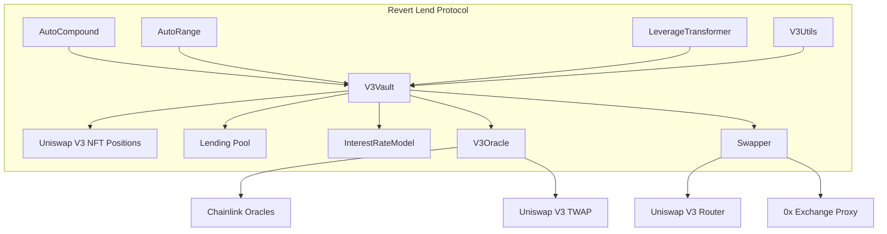
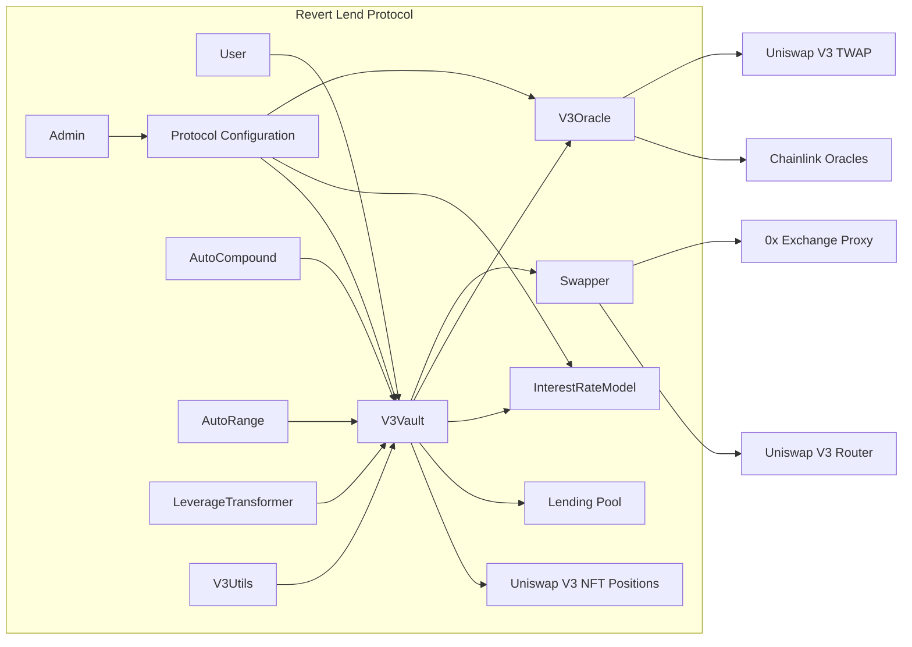
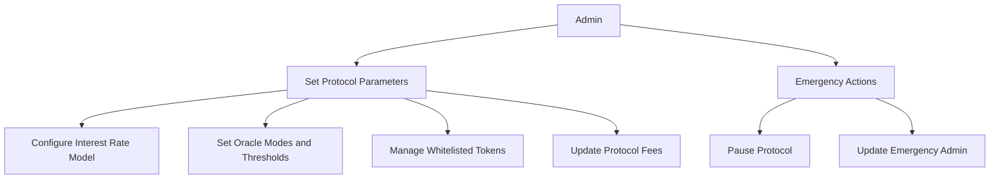
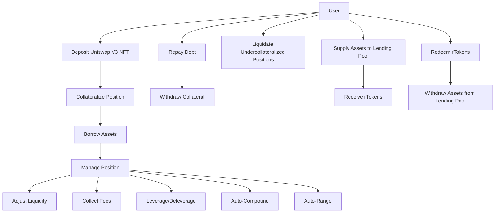
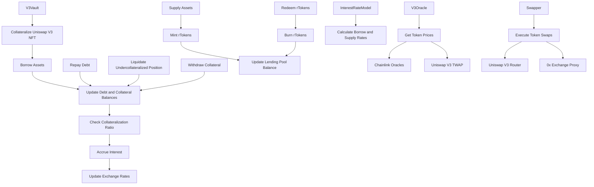

# Revert Lend Smart Contract Analysis Report

## 1. Introduction
Revert Lend is a decentralized lending protocol designed for Uniswap V3 liquidity providers (LPs). It allows LPs to collateralize their Uniswap V3 positions (NFTs) to borrow assets while retaining control over their LP positions. This report provides an in-depth analysis of the Revert Lend smart contracts, focusing on the architecture, code quality, potential issues, risks, centralization risks, and admin control abuse.

## 2. Approach
My analysis of the Revert Lend codebase involved a thorough review of the smart contracts, including:
- Reading the whitepaper and technical documentation to understand the protocol's intended behavior and architecture.
- Reviewing the smart contract code line by line to identify potential vulnerabilities, code quality issues, and adherence to best practices.
- Analyzing the protocol's architecture and design choices to assess their soundness and potential risks.
- Examining the protocol's integration with external systems, such as Chainlink oracles and Uniswap V3 contracts.
- Considering the protocol's resilience to various attack vectors and potential exploits.
- Identifying centralization risks and potential for admin control abuse.

## 3. Architecture Overview
The Revert Lend protocol consists of several key components:
- V3Vault: The main contract that manages the lending and borrowing functionality, as well as the collateralization of Uniswap V3 positions.
- InterestRateModel: Responsible for calculating the interest rates based on the utilization of the lending pool.
- V3Oracle: Provides price data for the collateralized assets using a combination of Chainlink and Uniswap V3 TWAP oracles.
- Swapper: Handles token swaps through external DEX routers, such as Uniswap V3 Router and 0x Exchange Proxy.
- AutoCompound, AutoRange, LeverageTransformer, V3Utils: Additional contracts that provide auxiliary functionality, such as auto-compounding, range adjustment, leverage management, and position utilities.

## 4. Codebase Quality Analysis
### 4.1. Code Structure and Readability
- The codebase follows a modular structure, with separate contracts for different functionalities.
- The code is well-organized and follows a consistent naming convention, enhancing readability.
- The use of Solidity interfaces and libraries promotes code reusability and maintainability.

### 4.2. Use of Libraries and Standards
- The protocol makes use of well-established libraries, such as OpenZeppelin, for secure token transfers and common utilities.
- It adheres to the ERC-4626 tokenized vault standard for the lending pool shares (rTokens).
- The integration with Uniswap V3 and Chainlink oracles follows their respective interfaces and standards.

### 4.3. Error Handling and Validation
- The contracts use `require` statements and custom error types to validate inputs and handle error conditions.
- The use of the `SafeERC20` library helps prevent common pitfalls and vulnerabilities associated with token transfers.
- Input validation could be further strengthened in certain areas, such as the `Swapper` contract, to prevent potential exploitation.

### 4.4. Test Coverage and Documentation
- The protocol repository includes a test suite, which is a good practice for ensuring correctness and catching potential issues.
- The code includes NatSpec comments providing descriptions of contract functions and parameters, aiding in understanding the codebase.
- Comprehensive documentation, including a whitepaper and technical guides, is available, facilitating the understanding of the protocol's functionality and architecture.

## 5. Centralization Risks and Admin Control Abuse
The Revert Lend protocol has certain centralization risks and potential for admin control abuse:

- Owner Role: The owner of the V3Vault contract has significant control over the protocol, including the ability to set token configurations, update limits, and withdraw reserves. If the owner role is compromised or abused, it could lead to unauthorized changes in the protocol's behavior or theft of funds.

- EmergencyAdmin Role: The EmergencyAdmin role in the V3Vault and V3Oracle contracts has the power to take emergency actions, such as updating oracle modes or pausing the protocol. While this role is intended for emergency situations, it introduces a centralization risk if the emergency admin account is compromised or misused.

- Operator Role: The Operator role in the AutoCompound contract has the ability to execute compounding operations on behalf of users. If the operator account is compromised or acts maliciously, it could lead to unauthorized compounding or manipulation of user positions.

- Protocol Configuration: The protocol owner has control over various protocol parameters, such as interest rate models, oracle configurations, and protocol fees. Misuse of these privileges could potentially harm users or benefit the owner at the expense of the protocol's integrity.

To mitigate these centralization risks and potential for admin control abuse, the following measures should be considered:
- Implement a multi-signature scheme for critical protocol actions, requiring multiple authorized parties to approve changes.
- Establish a governance framework that allows token holders to vote on protocol upgrades and parameter changes.
- Conduct regular security audits and code reviews to identify and address potential vulnerabilities or backdoors.
- Implement time-locks for critical functions to provide a buffer period for the community to review and respond to proposed changes.
- Ensure transparent communication and disclosures regarding admin roles, privileges, and any actions taken.

## 6. Mechanism Review
### 6.1. Interest Rate Model
- The kinked interest rate model used by the protocol helps balance the supply and demand of assets and incentivizes liquidity provision during periods of high utilization.
- The interest rates are calculated per second and stored as fixed-point numbers with 96 bits of precision (Q96), ensuring a high level of accuracy.
- However, the interest rate model parameters are set by the contract owner, introducing centralization risks if not governed properly.

### 6.2. Collateralization and Liquidation
- The protocol allows users to collateralize their Uniswap V3 positions (NFTs) to borrow assets, providing flexibility for liquidity providers.
- The collateral value is determined based on the prices provided by the V3Oracle contract and the specified collateral factors for each asset.
- Liquidations occur when a position's collateral value falls below the borrowed amount, with a liquidation penalty to incentivize timely liquidation.
- However, the liquidation process could be complex and gas-intensive, especially for positions with low liquidity or significant price deviations.

### 6.3. Oracle System
- The dual oracle system, combining Chainlink price feeds and Uniswap V3 TWAP oracles, provides redundancy and helps mitigate the risk of a single oracle failure.
- The V3Oracle contract includes price deviation checks and the ability to pause operations when deviations exceed defined thresholds, enhancing the protocol's resilience to oracle issues.
- However, the reliance on external price oracles introduces risks associated with oracle manipulation, flash loan attacks, or desynchronization between the two oracle sources.

## 7. Systemic Risks
- Dependence on External Protocols: The protocol heavily relies on the Uniswap V3 ecosystem for liquidity and price discovery. Any issues or exploits in the Uniswap V3 contracts could potentially impact Revert Lend.
- Liquidity and Market Risks: The protocol's success depends on the availability of liquidity in the Uniswap V3 pools and the stability of the collateralized assets. Significant market volatility or liquidity crises could strain the protocol's functioning.
- Regulatory Risks: The decentralized finance (DeFi) space is subject to evolving regulations. Changes in regulatory frameworks could impact the protocol's operations and adoption.
- Smart Contract Risks: While the protocol has undergone audits and follows best practices, there is always a risk of undiscovered vulnerabilities or exploits in the smart contracts.

## 8. Recommendations
- Conduct regular security audits and code reviews to identify and address potential vulnerabilities.
- Implement a bug bounty program to incentivize the community to find and report security issues.
- Establish a robust governance framework to ensure decentralized decision-making and minimize centralization risks.
- Continuously monitor the protocol's performance, liquidity, and market conditions to proactively identify and mitigate risks.
- Stay updated with the latest security best practices and vulnerabilities in the DeFi space and adapt the protocol accordingly.
- Implement measures to mitigate centralization risks and potential for admin control abuse, such as multi-signature schemes, time-locks, and transparent governance.

## 9. Conclusion
The Revert Lend protocol offers a novel solution for Uniswap V3 LPs to collateralize their positions and borrow assets while retaining control over their liquidity. The protocol's architecture and code quality demonstrate a solid foundation, with the use of well-established libraries, adherence to standards, and a modular design.

However, the protocol is not without risks. The reliance on centralized price oracles, the complexity of the liquidation process, and the potential vulnerabilities in the oracle system and external contract interactions should be carefully considered and addressed. Additionally, the centralization risks and potential for admin control abuse need to be mitigated through proper governance mechanisms and transparency.


### My findings for the V3Vault and transformer contracts' handling of ERC-20 tokens, focusing on the validation mechanisms and potential risks. 

**ERC-20 Token Validation:** https://github.com/code-423n4/2024-03-revert-lend/blob/main/src/V3Vault.sol
The V3Vault contract interacts with ERC-20 tokens in several functions, such as deposit, withdraw, borrow, and repay. It uses the OpenZeppelin SafeERC20 library to handle ERC-20 transfers, which provides some basic validation and error handling.

However, the contract does not have explicit validation to prevent the use of non-standard or malicious tokens. The main validation is done through the `tokenConfigs` mapping, which stores the configuration for each supported token, including the collateral factor and collateral value limit.

When a new token is added to the protocol, the owner must call the `setTokenConfig` function to set the token's configuration. This function does not perform any validation on the token itself, such as checking for standard ERC-20 interfaces or known malicious behaviors.

The transformer contracts ([AutoCompound](https://github.com/code-423n4/2024-03-revert-lend/blob/main/src/transformers/AutoCompound.sol), [AutoRange](https://github.com/code-423n4/2024-03-revert-lend/blob/main/src/transformers/AutoRange.sol), [LeverageTransformer](https://github.com/code-423n4/2024-03-revert-lend/blob/main/src/transformers/LeverageTransformer.sol), [V3Utils](https://github.com/code-423n4/2024-03-revert-lend/blob/main/src/transformers/V3Utils.sol)) also interact with ERC-20 tokens, but similarly do not have explicit validation for non-standard or malicious tokens.

**LeverageTransformer and Direct ERC-20 Transfers:** https://github.com/code-423n4/2024-03-revert-lend/blob/main/src/transformers/LeverageTransformer.sol
The LeverageTransformer contract uses direct ERC-20 transfers (`token.transfer`) instead of the SafeERC20 library in some functions, such as l`everageUp` and `leverageDown`. This can be risky when dealing with non-standard or malicious ERC-20 tokens.

Some ERC-20 tokens may have callback mechanisms that are triggered on transfer, such as ERC-777 tokens or tokens with hooks. If the `LeverageTransformer` contract does not properly handle these callbacks, it could lead to reentrancy vulnerabilities or unexpected behavior.

For example, a malicious token could execute a callback during a transfer that calls back into the LeverageTransformer contract, potentially causing a reentrancy attack or manipulating the contract state.

**Unsupported Tokens:**
The V3Vault contract does not have explicit checks to revert transactions that attempt to use unsupported tokens. If a user tries to deposit or use an unsupported token, the transaction will likely fail due to the lack of a valid collateral configuration, but there is no specific validation or error message for this case.

Similarly, the transformer contracts do not have explicit checks for unsupported tokens. They rely on the fact that the tokens are coming from the V3Vault, which should only allow supported tokens.

However, there is a risk that if a transformer contract is called directly with an unsupported token (bypassing the V3Vault), it may not properly handle the case and could potentially lead to unexpected behavior.

**Risks and Recommendations:**
The lack of strict validation for non-standard or malicious ERC-20 tokens poses several risks:

1. Malicious token interactions: If a malicious token is used, it could potentially exploit vulnerabilities in the contracts through callback mechanisms or unexpected behavior.

2. Unexpected contract state: Interactions with non-standard tokens could lead to unexpected changes in the contract state, such as incorrect balances or locked funds.

3. Reentrancy vulnerabilities: The use of direct ERC-20 transfers in the LeverageTransformer contract could expose it to reentrancy attacks if interacting with malicious tokens.

**To mitigate these risks, I recommend the following:**

1. Implement strict validation for supported tokens: When adding a new token to the protocol, perform thorough validation to ensure it adheres to the ERC-20 standard and does not have any known malicious behaviors. This could include checking for standard interfaces, reviewing the token's code, and testing interactions with the token.

2. Use SafeERC20 consistently: Update the LeverageTransformer contract to use the SafeERC20 library for all ERC-20 interactions to ensure consistent error handling and avoid potential vulnerabilities.

3. Implement explicit checks for unsupported tokens: Add checks in the V3Vault and transformer contracts to explicitly revert transactions that attempt to use unsupported tokens, providing clear error messages.

4. Reentrancy protection: Ensure that all functions that interact with external contracts (including ERC-20 tokens) have proper reentrancy protection, such as using the OpenZeppelin ReentrancyGuard contract.

5. Thorough testing: Conduct extensive testing of the contracts' interactions with various ERC-20 tokens, including both standard and non-standard implementations, to identify any potential issues or unexpected behavior.

6. Monitoring and incident response: Implement monitoring and alerting mechanisms to detect any suspicious interactions with ERC-20 tokens and have an incident response plan in place to quickly address any issues that arise.

By implementing these measures, the protocol can better protect itself against the risks associated with non-standard or malicious ERC-20 tokens and ensure the security and reliability of its token interactions.

### Potential risks associated with lack of explicit checks for unsupported tokens in the V3Vault and transformer contracts.

1. **V3Vault Interactions:**
V3Vault contract does not have explicit checks to revert transactions that attempt to use unsupported tokens. When a user tries to deposit or use an unsupported token, the transaction will likely fail due to the lack of a valid collateral configuration. However, there is no specific validation or error message for this case.

For example, consider the deposit function in the V3Vault contract: https://github.com/code-423n4/2024-03-revert-lend/blob/435b054f9ad2404173f36f0f74a5096c894b12b7/src/V3Vault.sol#L360-L363

```solidity
function deposit(uint256 assets, address receiver) external override returns (uint256) {
    (, uint256 shares) = _deposit(receiver, assets, false, "");
    return shares;
}
```

If a user attempts to deposit an unsupported token, the _deposit function will proceed without any explicit validation. The transaction will likely fail when trying to perform the token transfer or update the collateral configuration, but there will be no clear error message indicating that the token is unsupported.

2. **Transformer Contract Interactions:**
The transformer contracts (AutoCompound, AutoRange, LeverageTransformer, V3Utils) do not have explicit checks for unsupported tokens. They rely on the assumption that the tokens they interact with are coming from the V3Vault, which should only allow supported tokens.

However, there is a risk that if a transformer contract is called directly with an unsupported token (bypassing the V3Vault), it may not properly handle the case and could potentially lead to unexpected behavior.

For example, consider the execute function in the AutoCompound contract: https://github.com/code-423n4/2024-03-revert-lend/blob/435b054f9ad2404173f36f0f74a5096c894b12b7/src/transformers/AutoCompound.sol#L101-L181

```solidity
function execute(ExecuteParams calldata params) external nonReentrant {
    // ...
    (state.amount0, state.amount1) = nonfungiblePositionManager.collect(
        INonfungiblePositionManager.CollectParams(
            params.tokenId, address(this), type(uint128).max, type(uint128).max
        )
    );
    // ...
}
```

If the AutoCompound contract is called directly with an unsupported token, it will attempt to interact with the unsupported token without any validation. This could lead to unexpected behavior, such as reverting transactions or generating incorrect results.

3. **Risks and Scenarios:**

a) **Incorrect Accounting:**
If a user manages to deposit an unsupported token into the V3Vault (bypassing any front-end validation), it could lead to incorrect accounting within the protocol. The unsupported token may not have the necessary collateral configuration, leading to discrepancies in collateral value calculations and potentially affecting the overall health of the system.

b) **Unexpected Behavior in Transformer Contracts**:
If a transformer contract is called directly with an unsupported token, it may interact with the token in unintended ways. This could result in unexpected behavior, such as reverting transactions, generating incorrect results, or even causing the contract to become stuck or unusable.

c) **Potential Exploits:**
An attacker could potentially exploit the lack of explicit validation for unsupported tokens to disrupt the normal functioning of the protocol. For example, they could intentionally deposit unsupported tokens to cause accounting errors or trigger unexpected behavior in the transformer contracts.

4. **Mitigations:**
To address the risks associated with unsupported tokens, the following mitigations can be implemented:

a) **Explicit Validation in V3Vault:**
Add explicit validation checks in the V3Vault contract to ensure that only supported tokens are allowed for deposit and usage. This can be done by maintaining a whitelist of supported tokens and checking against it before allowing any token-related operations.

```solidity
mapping(address => bool) public supportedTokens;

function deposit(uint256 assets, address receiver) external override returns (uint256) {
    require(supportedTokens[asset], "Unsupported token");
    (, uint256 shares) = _deposit(receiver, assets, false, "");
    return shares;
}
```

b) **Input Validation in Transformer Contracts:**
Implement input validation in the transformer contracts to check that the tokens being used are supported. This can be done by verifying that the tokens are part of the V3Vault's supported token list before performing any operations.

```solidity
function execute(ExecuteParams calldata params) external nonReentrant {
    // ...
    require(vault.supportedTokens(state.token0), "Unsupported token");
    require(vault.supportedTokens(state.token1), "Unsupported token");
    // ...
}
```

c) Error Handling and Clear Messaging:
Improve error handling and provide clear error messages when unsupported tokens are encountered. This will help users understand why their transactions are failing and guide them to use supported tokens.

e) Monitoring and Incident Response:
Implement monitoring and alerting mechanisms to detect any attempts to use unsupported tokens within the protocol. Have an incident response plan in place to quickly address and mitigate any issues that may arise from the use of unsupported tokens.

5. Conclusion:
The lack of explicit checks for unsupported tokens in the V3Vault and transformer contracts poses potential risks to the protocol. These risks include incorrect accounting, unexpected behavior, and potential exploits.

To mitigate these risks, it is crucial to implement explicit validation checks in the V3Vault contract to ensure only supported tokens are allowed, add input validation in the transformer contracts, improve error handling and messaging, conduct comprehensive testing, and have monitoring and incident response mechanisms in place.


### Swapper base contract's handling of external swap `calldata` and assess the susceptibility of the LeverageTransformer and V3Utils contracts to crafted calldata attacks.

**Swapper Base Contract:**
The Swapper base contract is responsible for handling external swap calldata and interacting with the 0x Exchange Proxy and Uniswap Universal Router. It provides functions like `_routerSwap` and `_poolSwa`p that are used by the `LeverageTransformer` and V3Utils contracts to perform swaps.

An example of the _routerSwap function in the Swapper contract: https://github.com/code-423n4/2024-03-revert-lend/blob/435b054f9ad2404173f36f0f74a5096c894b12b7/src/utils/Swapper.sol#L73-L118

```solidity
function _routerSwap(RouterSwapParams memory params) internal returns (uint256 amountInDelta, uint256 amountOutDelta) {
    // ...
    if (swapDataIsZeroX(params.swapData)) {
        amountOutDelta = IZeroXExchangeProxy(zeroxRouter).sellTokenForTokenToUniswapV3(
            params.tokenIn,
            params.tokenOut,
            params.amountIn,
            params.amountOutMin,
            safeParseZeroXSwapData(params.swapData)
        );
    } else if (swapDataIsUniswapV3(params.swapData)) {
        (uint256 amountIn, uint256 amountOut) = IUniversalRouter(universalRouter).execute(params.swapData);
        amountOutDelta = amountOut;
        amountInDelta = amountIn;
    } else {
        revert InvalidSwapData();
    }
    // ...
}
```

The `_routerSwap` function checks the `swapData` parameter to determine whether it should use the 0x Exchange Proxy or the Uniswap Universal Router for the swap. It uses the `swapDataIsZeroX` and swapDataIsUniswapV3 functions to validate the `swapData` format.

However, I have some few concerns with the current implementation:
-------------------------------------------------

1. Lack of Whitelisting: The Swapper contract does not have a whitelist of allowed swap contracts. It relies solely on the format of the `swapData` to determine which contract to use. This leaves room for potential attacks if malicious contracts are used.

2. Insufficient Validation: While the contract checks the format of the `swapDat`, it does not perform in-depth validation of the contents. Malicious actors could potentially craft `swapData` that appears valid but contains unexpected or harmful instructions.

3. No Access Control: The Swapper contract does not have any access control mechanisms to restrict which contracts can call its swap functions. Any contract that inherits from Swapper can directly use the `_routerSwap` and `_poolSwap` functions.

LeverageTransformer and V3Utils Contracts:
The LeverageTransformer and V3Utils contracts inherit from the Swapper contract and use its swap functions to perform swaps as part of their functionality.

For example, the `leverageUp` function in the `LeverageTransformer` contract uses `_routerSwap`: https://github.com/code-423n4/2024-03-revert-lend/blob/435b054f9ad2404173f36f0f74a5096c894b12b7/src/transformers/LeverageTransformer.sol#L40-L96

```solidity
function leverageUp(LeverageUpParams calldata params) external {
    // ...
    (uint256 amountIn, uint256 amountOut) = _routerSwap(
        Swapper.RouterSwapParams(
            IERC20(token), IERC20(token0), params.amountIn0, params.amountOut0Min, params.swapData0
        )
    );
    // ...
}
```

Similarly, the `swapAndMint` function in the V3Utils contract uses `_routerSwap`: https://github.com/code-423n4/2024-03-revert-lend/blob/435b054f9ad2404173f36f0f74a5096c894b12b7/src/transformers/V3Utils.sol#L467-L501

```solidity
function swapAndMint(SwapAndMintParams calldata params)
    external
    payable
    returns (uint256 tokenId, uint128 liquidity, uint256 amount0, uint256 amount1)
{
    // ...
    (uint256 amountInDelta0, uint256 amountOutDelta0) = _routerSwap(
        Swapper.RouterSwapParams(
            params.swapSourceToken, params.token0, params.amountIn0, params.amountOut0Min, params.swapData0
        )
    );
    // ...
}
```

In both cases, the `swapData` parameter is passed directly to the `_routerSwap` function without additional validation. This means that if an attacker can control the `swapData`, they could potentially execute malicious swaps or exploit vulnerabilities in the underlying swap contracts.

**Mitigations:**

1. Whitelisting Allowed Swap Contracts:
Implement a whitelist of allowed swap contracts in the Swapper base contract. Only permit swaps using the whitelisted contracts (e.g., 0x Exchange Proxy and Uniswap Universal Router). Reject any swapData that attempts to use non-whitelisted contracts.

```solidity
mapping(address => bool) public allowedSwapContracts;

function setAllowedSwapContract(address contractAddress, bool allowed) external onlyOwner {
    allowedSwapContracts[contractAddress] = allowed;
}

function _routerSwap(RouterSwapParams memory params) internal returns (uint256 amountInDelta, uint256 amountOutDelta) {
    // ...
    require(allowedSwapContracts[params.swapContract], "Swap contract not allowed");
    // ...
}
```

2. Enhanced Validation of SwapData:
Implement more thorough validation of the swapData parameter in the Swapper contract. Verify that the contents of the swapData are valid and do not contain any unexpected or harmful instructions. Reject any swapData that fails the validation checks.

```solidity
function _validateSwapData(bytes memory swapData) internal pure {
    // Perform in-depth validation of swapData contents
    // Check for any malicious or unexpected instructions
    // Revert if validation fails
}

function _routerSwap(RouterSwapParams memory params) internal returns (uint256 amountInDelta, uint256 amountOutDelta) {
    // ...
    _validateSwapData(params.swapData);
    // ...
}
```

3. Access Control for Swap Functions:
Implement access control mechanisms in the Swapper contract to restrict which contracts can call its swap functions. Only allow trusted and approved contracts (e.g., LeverageTransformer and V3Utils) to use the swap functions directly.

```solidity
mapping(address => bool) public allowedCallers;

function setAllowedCaller(address caller, bool allowed) external onlyOwner {
    allowedCallers[caller] = allowed;
}

function _routerSwap(RouterSwapParams memory params) internal returns (uint256 amountInDelta, uint256 amountOutDelta) {
    require(allowedCallers[msg.sender], "Caller not allowed");
    // ...
}
```

4. Comprehensive Testing and Auditing:
Conduct thorough testing and auditing of the Swapper contract and its interactions with the LeverageTransformer and V3Utils contracts. Test various scenarios, including edge cases and potential attack vectors, to identify any vulnerabilities or unexpected behavior related to crafted swap calldata.

5. Monitoring and Incident Response:
Implement monitoring and alerting mechanisms to detect any suspicious or abnormal swap activities. Establish an incident response plan to quickly investigate and mitigate any potential attacks or exploits related to crafted swap calldata.

By implementing these mitigations, the protocol can significantly reduce the risks associated with crafted external swap calldata. Whitelisting allowed swap contracts, enhancing swapData validation, implementing access control, conducting comprehensive testing and auditing, and establishing monitoring and incident response procedures will help ensure the security and integrity of the swap functionality in the Swapper, LeverageTransformer, and V3Utils contracts.

1. Overview


2. View


3. Admin Flow


4. User


5. Contract Flow


6. **Contract Analysis**
   - V3Vault: The core contract that manages the lending and borrowing functionality, as well as the collateralization of Uniswap V3 positions. It interacts with various components such as the interest rate model, oracle, and swapper.
   - InterestRateModel: Responsible for calculating the borrow and supply interest rates based on the utilization of the lending pool. It uses a kinked interest rate model to balance the supply and demand of assets.
   - V3Oracle: Provides price data for the collateralized assets using a combination of Chainlink oracles and Uniswap V3 TWAP oracles. It includes price deviation checks and the ability to pause operations when deviations exceed defined thresholds.
   - Swapper: Facilitates token swaps through external DEX routers, such as Uniswap V3 Router and 0x Exchange Proxy. It allows for efficient swap execution and liquidity management.
   - AutoCompound: Enables users to automatically compound their earned interest back into their collateralized positions, maximizing their yield.
   - AutoRange: Allows users to define ranges for their collateralized positions and automatically adjusts the position's liquidity based on market conditions.
   - LeverageTransformer: Provides leverage and deleverage functionality for collateralized positions, allowing users to amplify their exposure or reduce risk.
   - V3Utils: Offers a set of utility functions for managing Uniswap V3 positions, such as adding or removing liquidity, collecting fees, and transferring positions.

#### Issues and Risk Assessed
## 1. Smart Contract Risks
### 1.1. Reentrancy Vulnerabilities
- The V3Vault contract has a potential reentrancy vulnerability in the `liquidate` function. If the `_sendPositionValue` function makes an external call to an untrusted contract, it could lead to a reentrancy attack.
- Mitigation: Ensure that the `_sendPositionValue` function does not make any external calls that could be exploited. Consider using the "checks-effects-interactions" pattern or a reentrancy guard.

### 1.2. Unchecked Return Values
- The Swapper contract uses low-level calls (`call`) to interact with external DEX routers. The return values of these calls are not properly checked, which could lead to unexpected behavior if the external calls fail silently.
- Mitigation: Always check the return values of low-level calls and handle the failure cases appropriately. Consider using the `safeCall` function from the OpenZeppelin library.

### 1.3. Arithmetic Overflows and Underflows
- The V3Vault and InterestRateModel contracts perform various arithmetic operations, such as interest rate calculations and token conversions. There is a risk of integer overflows and underflows if the input values are not properly validated.
- Mitigation: Use the SafeMath library or the built-in Solidity overflow checks (in Solidity 0.8.0 and above) to prevent arithmetic overflows and underflows. Validate input values and handle edge cases appropriately.

## 2. Oracle Risks
### 2.1. Oracle Manipulation
- The V3Oracle contract relies on external price oracles (Chainlink and Uniswap V3 TWAP) for determining asset prices. If an attacker manipulates the price feed of either oracle, it could lead to incorrect price data being used by the protocol.
- Mitigation: Implement additional safeguards, such as price deviation checks and multi-oracle systems, to detect and mitigate price manipulation. Monitor the oracle price feeds for anomalies and have contingency plans in place.

### 2.2. Oracle Desynchronization
- The dual oracle system in V3Oracle combines prices from Chainlink and Uniswap V3 TWAP oracles. If there is a significant desynchronization between the two oracles, it could lead to discrepancies in price data.
- Mitigation: Implement robust error handling and fallback mechanisms to handle scenarios where the oracle prices diverge significantly. Set appropriate deviation thresholds and pause the protocol if the price difference exceeds a certain limit.

## 3. Liquidity Risks
### 3.1. Insufficient Liquidity
- The protocol's functionality relies on sufficient liquidity being available in the Uniswap V3 pools for the collateralized assets. If there is a lack of liquidity, it could impact the accuracy of price discovery and the ability to execute liquidations.
- Mitigation: Monitor the liquidity levels of the relevant Uniswap V3 pools and have contingency plans in place to handle liquidity shortages. Consider implementing liquidity incentives or partnering with liquidity providers to ensure adequate liquidity.

### 3.2. Impermanent Loss
- Liquidity providers who collateralize their Uniswap V3 positions in the protocol are exposed to impermanent loss if the prices of the underlying assets diverge significantly.
- Mitigation: Educate users about the risks of impermanent loss and provide tools or strategies to mitigate its impact. Allow users to adjust their positions or exit the protocol if the impermanent loss exceeds their risk tolerance.

## 4. Governance Risks
### 4.1. Centralization of Control
- The protocol relies on centralized entities, such as the contract owner and emergency admin, who have significant control over the protocol's parameters and functionality. This centralization of control introduces risks of misuse or abuse of power.
- Mitigation: Implement a decentralized governance mechanism, such as a DAO or a multi-sig wallet, to distribute control and decision-making power among stakeholders. Establish clear governance policies and procedures to ensure transparency and accountability.

### 4.2. Malicious Governance Proposals
- If the protocol implements a governance mechanism, there is a risk of malicious actors proposing and passing harmful governance proposals that could compromise the protocol's integrity or benefit certain parties at the expense of others.
- Mitigation: Implement safeguards, such as proposal vetting, time-locks, and multi-sig requirements, to prevent malicious governance proposals from being executed. Encourage active participation and education among the community to make informed decisions.

## 5. External Dependencies
### 5.1. Uniswap V3 Protocol
- The Revert Lend protocol heavily relies on the Uniswap V3 protocol for liquidity and price discovery. Any vulnerabilities, bugs, or changes in the Uniswap V3 protocol could have a direct impact on Revert Lend.
- Mitigation: Keep the Revert Lend protocol updated with the latest security patches and upgrades of the Uniswap V3 protocol. Monitor the Uniswap V3 ecosystem for any potential risks or issues and have contingency plans in place.

### 5.2. Chainlink Oracles
- The protocol uses Chainlink oracles as one of the price data sources. Any disruptions or failures in the Chainlink network could affect the accuracy and availability of price data.
- Mitigation: Implement fallback mechanisms and alternative price data sources to handle scenarios where Chainlink oracles are unavailable or unreliable. Monitor the Chainlink network for any issues and have contingency plans in place.

## 6. Regulatory Risks
### 6.1. Compliance with Regulations
- The decentralized finance (DeFi) landscape is subject to evolving regulations and legal frameworks. The Revert Lend protocol may face regulatory risks if it does not comply with applicable laws and regulations in different jurisdictions.
- Mitigation: Keep abreast of the regulatory developments in the DeFi space and seek legal counsel to ensure compliance with relevant regulations. Implement necessary measures to adhere to anti-money laundering (AML) and know-your-customer (KYC) requirements, if applicable.

### 6.2. Regulatory Uncertainty
- The lack of clear regulatory guidance and the potential for changes in regulations pose risks to the protocol's operations and adoption.
- Mitigation: Monitor the regulatory landscape and engage with regulators and policymakers to provide input and advocate for clear and favorable regulations. Be prepared to adapt the protocol's functionalities and policies in response to regulatory changes.

## 7. Market Risks
### 7.1. Volatility of Collateralized Assets
- The value of the collateralized Uniswap V3 positions is subject to market volatility and price fluctuations of the underlying assets. Sudden price drops or market crashes could lead to a significant decrease in the collateral value and trigger liquidations.
- Mitigation: Implement robust risk management mechanisms, such as conservative collateralization ratios, dynamic interest rates, and frequent monitoring of market conditions. Educate users about the risks associated with market volatility and encourage diversification of collateral.

### 7.2. Liquidity Crises
- In times of market stress or extreme volatility, there may be a sudden surge in demand for liquidity or a lack of willing lenders. This could strain the protocol's liquidity and impact its ability to meet withdrawal requests or fund new loans.
- Mitigation: Maintain adequate liquidity reserves and implement stress testing to assess the protocol's resilience under different market scenarios. Establish partnerships with institutional liquidity providers and consider implementing liquidity backstop mechanisms.

This risk assessment covers various aspects of the Revert Lend protocol, including smart contract risks, oracle risks, liquidity risks, governance risks, external dependencies, regulatory risks, and market risks. It is important to note that this assessment is not exhaustive, and new risks may emerge as the protocol evolves and the DeFi landscape changes.

To mitigate these risks, the Revert Lend team should continuously monitor and assess the protocol's performance, conduct regular security audits, engage with the community and stakeholders, and adapt to the changing market conditions and regulatory environment. By proactively identifying and addressing potential risks, the protocol can enhance its resilience and maintain the trust of its users.

## Economic incentives and mechanisms within the protocol, assess the potential risks, and evaluate the protocol's resilience.

**Dynamic Interest Rate Model:**
The protocol utilizes a dynamic interest rate model that adjusts the interest rates based on the utilization of the lending pool. The interest rate model is implemented in the InterestRateModel contract and is designed to maintain a balance between borrowers and lenders.

The interest rate model calculates the borrow rate and supply rate based on the utilization rate of the pool. As the utilization rate increases, indicating higher demand for borrowing, the interest rates also increase to incentivize lenders to provide more liquidity and to discourage excessive borrowing.

The dynamic nature of the interest rate model helps to maintain stability and liquidity within the protocol. However, it is important to ensure that the model parameters, such as the kink point and jump multiplier, are carefully calibrated to prevent sudden spikes in interest rates that could deter borrowers or lead to liquidity issues.

**Liquidation Mechanism:**
The protocol includes a liquidation mechanism to manage the risk of borrowers defaulting on their loans. When a borrower's collateral value falls below a certain threshold relative to their borrowed amount, their position becomes eligible for liquidation.

The liquidation process allows liquidators to repay a portion of the borrower's debt and receive a discounted amount of the collateral in return. The liquidation incentive, in the form of a liquidation bonus, encourages liquidators to actively monitor and liquidate undercollateralized positions.

The liquidation mechanism helps to maintain the health of the protocol by ensuring that borrowers maintain sufficient collateral and by reducing the risk of bad debt. However, it is crucial to set appropriate liquidation thresholds and bonuses to minimize the risk of unnecessary liquidations while still providing sufficient incentives for liquidators.

**Protocol Reserves:**
The protocol maintains a reserve fund that accumulates a portion of the interest payments made by borrowers. The reserve factor determines the percentage of interest that is directed to the reserves.

The purpose of the protocol reserves is to provide a buffer against potential losses and to ensure the long-term sustainability of the protocol. In the event of unexpected losses or defaults, the reserves can be used to absorb the impact and maintain the stability of the protocol.

It is important to set an appropriate reserve factor that balances the need for a sufficient reserve fund with the desire to provide competitive returns to lenders. Regular monitoring and adjustment of the reserve factor may be necessary based on the protocol's performance and market conditions.

**Oracle Price Manipulation:**
The protocol relies on oracle price feeds, such as Chainlink and Uniswap V3 TWAP, to determine the value of collateral assets. However, oracle price manipulation poses a risk to the accuracy of collateral valuation.

If an attacker can manipulate the price of a collateral asset reported by the oracle, they could potentially inflate the perceived value of their collateral, allowing them to borrow more than intended. This could lead to undercollateralized positions and increased risk for the protocol.

To mitigate this risk, the protocol should implement robust oracle price validation mechanisms, such as using multiple price sources, setting price deviation thresholds, and incorporating time-weighted average prices (TWAP) to smooth out short-term price fluctuations. Regular monitoring and auditing of the oracle price feeds are also essential to detect and respond to any anomalies or manipulation attempts.

**Flash Loan Attacks:**
Flash loan attacks have been a common vulnerability in DeFi protocols, where attackers exploit the ability to borrow large amounts of assets without collateral and manipulate market conditions.

In the context of this protocol, a flash loan attack could potentially manipulate the utilization rate or collateral prices temporarily, leading to incorrect interest rate calculations or triggering unwarranted liquidations.

**To protect against flash loan attacks, the protocol should implement measures such as:**

1. Incorporating flash loan-resistant interest rate calculations that account for sudden changes in utilization rates.
2. Using time-weighted average prices (TWAP) for collateral valuation to mitigate the impact of short-term price manipulations.
3. Implementing rate-limiting mechanisms or cooldown periods for critical protocol functions to prevent rapid exploitation.
4. Regularly monitoring and analyzing protocol activity to detect and respond to suspicious transactions or patterns.

**Leveraged Positions:**
The LeverageTransformer contract allows users to create highly leveraged positions by borrowing assets and reinvesting them into their collateral positions. While leverage can amplify potential returns, it also increases the risk of liquidation and the potential impact on the protocol's stability.

Highly leveraged positions are more sensitive to price fluctuations and can quickly become undercollateralized if the market moves against them. If a significant number of leveraged positions are liquidated simultaneously, it could strain the protocol's liquidity and cause cascading liquidations.

**To mitigate the risks associated with leveraged positions, the protocol should:**

1. Set appropriate leverage limits and collateral requirements to ensure that positions remain sufficiently collateralized.
2. Implement risk management measures, such as position monitoring and automated deleveraging mechanisms, to proactively manage highly leveraged positions.
3. Conduct stress tests and simulations to assess the protocol's resilience against extreme market conditions and mass liquidation scenarios.
4. Educate users about the risks of leverage and provide clear guidelines on responsible leveraging practices.

**Conclusion:**
The protocol's economic incentives and mechanisms, such as the dynamic interest rate model, liquidation mechanism, and protocol reserves, are designed to maintain stability and align the interests of borrowers and lenders. However, the protocol faces potential risks, including oracle price manipulation, flash loan attacks, and the impact of highly leveraged positions.

To enhance the protocol's resilience and mitigate these risks, it is essential to implement robust validation mechanisms, incorporate time-weighted average prices, protect against flash loan attacks, and manage the risks associated with leveraged positions.

Regular monitoring, auditing, and stress testing of the protocol are crucial to identify and address any vulnerabilities or weaknesses. Additionally, clear communication and education about the risks involved can help users make informed decisions and contribute to the overall health of the protocol.

By proactively addressing these risks and continuously improving the protocol's economic mechanisms, the protocol can strive towards long-term stability and success in the dynamic DeFi landscape.

### Time spent:
39 hours