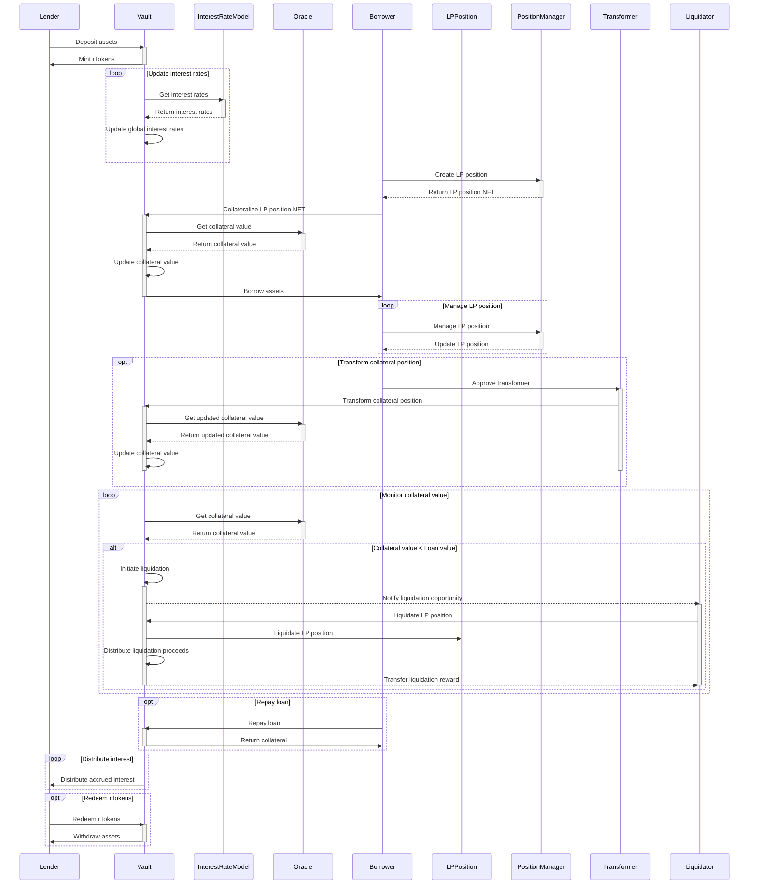

| Serial No. | Topic                                            |
|------------|--------------------------------------------------|
| 01         | Overview of Revert Lend                          |
| 02         | Scope                                            |
| 03         | Architecture view (Sequence Diagram)                      |
| 04         | Protocol Roles                                   |
| 05         | Approach Taken in auditing Revert Lend           |
| 06         | Contract Analysis                                |
| 07         | Codebase Quality (Table)                         |
| 08         | Centralization Risks                             |
| 09         | Systematic Risks                                 |
| 10         | Architectural Improvement                        |
| 11         | Time spent                                       |


# Overview of Revert Lend
Revert Lend is a decentralized lending protocol designed specifically for Automated Market Maker (AMM) Liquidity Providers (LPs) on Uniswap v3. The protocol allows LPs to collateralize their Uniswap v3 LP positions, represented as NFTs, and obtain loans in a specified ERC-20 token. The key feature of Revert Lend is that it enables LPs to maintain control over their capital in the Uniswap v3 pools while simultaneously using their positions as collateral for loans.

`Collateralization of Uniswap v3 LP Positions:` LPs can deposit their Uniswap v3 LP position NFTs into the protocol's Collateralized Debt Position (CDP) vaults. Each LP position is treated as a separate collateral, allowing for granular risk management and loan accounting.

`Borrowing and Loan Management:` LPs can borrow tokens from the lending pool by collateralizing their LP positions. Loans are subject to a minimum collateral ratio, determined by the collateral factors of the underlying tokens in the LP position. Interest rates for loans are dynamically adjusted based on the supply and demand within the lending pool.

`Flexibility in Managing Collateralized Positions:` LPs retain the ability to manage their collateralized positions, including adding or removing liquidity, collecting fees, and adjusting the position's price range. This flexibility allows LPs to optimize their capital efficiency and adapt to market conditions while their positions are being used as collateral.

`Liquidation Mechanism` If the value of a collateralized position falls below the required collateral ratio, it becomes eligible for liquidation. Liquidators can repay the outstanding debt of the position and receive a liquidation penalty as compensation. The protocol employs a progressive liquidation penalty system, where the penalty increases as the position approaches insolvency, incentivizing quick resolution of unhealthy positions.

`Unified Lending Pool and rTokens:` Revert Lend utilizes a unified lending pool that aggregates all the supplied assets, improving capital efficiency and liquidity. Lenders who supply assets to the pool receive rTokens, which represent their share of the pool and accrue interest over time. The lending pool is implemented as an ERC-4626 tokenized vault, enabling seamless integration with other DeFi protocols.

`Position Transformation and Automation:` Revert Lend introduces position transformers, which are permissioned contracts that can modify or replace collateralized positions. Transformers enable features such as automatic rebalancing of positions, compounding of fees, and management of leverage. Examples of position transformers include Auto-Compound, Auto-Range, and Auto-Leverage, which automate common LP strategies.

`Oracle and Price Feeds:` The protocol incorporates a dual-oracle system, utilizing both Chainlink price feeds and Uniswap v3 TWAP oracles for asset valuation. The oracle system ensures accurate pricing of collateral and includes safety mechanisms to handle price discrepancies and prevent oracle manipulation.

`Governance and Protocol Management:` Revert Lend employs a governance model where protocol parameters and settings can be adjusted by the protocol admin or through a decentralized governance process. Key governance actions include setting collateral factors, managing oracle configurations, adjusting interest rate models, and controlling protocol limits and caps.

`Example Scenario:`
Let's consider a Uniswap v3 LP who has provided liquidity in the ETH/USDC pool. The LP can deposit their LP position NFT into Revert Lend's CDP vault and borrow USDC against it. The LP can then use the borrowed USDC for various purposes, such as leveraging their position, investing in other opportunities, or managing their portfolio. Meanwhile, the LP can continue to manage their collateralized position, adjusting the price range or adding/removing liquidity as needed. If the value of the collateralized position drops below the required collateral ratio, the LP risks liquidation, where a liquidator can repay the debt and claim a portion of the collateral as a penalty.

Revert Lend's innovative approach to lending for AMM LPs enables capital efficiency, flexibility, and automation, empowering LPs to optimize their strategies and manage risk effectively. The protocol's architecture, including the unified lending pool, position transformers, and robust oracle system, creates a secure and feature-rich environment for lending and borrowing in the DeFi ecosystem.

# Scope

*See [scope.txt](https://github.com/code-423n4/2024-03-revert-lend/blob/main/scope.txt)*

| Contract | SLOC | Purpose | Libraries used |  
| ----------- | ----------- | ----------- | ----------- |
| [src/V3Vault.sol](https://github.com/code-423n4/2024-03-revert-lend/blob/main/src/V3Vault.sol) | 887 | Vault contract which keeps V3 Positions, lent assets and handles loans. | [`@openzeppelin`](https://github.com/OpenZeppelin/openzeppelin-contracts) [`@v3-core`](https://github.com/Uniswap/v3-core) [`@v3-periphery`](https://github.com/Uniswap/v3-periphery) [`@permit2`](https://github.com/uniswap/permit2) |
| [src/V3Oracle.sol](https://github.com/code-423n4/2024-03-revert-lend/blob/main/src/V3Oracle.sol) | 371 | Oracle which handles Chainlink Feeds, Uniswap V3 TWAPs to get values of V3 Positions | [`@openzeppelin`](https://github.com/OpenZeppelin/openzeppelin-contracts) [`@v3-core`](https://github.com/Uniswap/v3-core) [`@v3-periphery`](https://github.com/Uniswap/v3-periphery) [`@chainlink`](https://github.com/smartcontractkit/chainlink) |
| [src/InterestRateModel.sol](https://github.com/code-423n4/2024-03-revert-lend/blob/main/src/InterestRateModel.sol) | 65 | Calculates interest rates for V3Vault | [`@openzeppelin`](https://github.com/OpenZeppelin/openzeppelin-contracts) |
| [src/automators/AutoExit.sol](https://github.com/code-423n4/2024-03-revert-lend/blob/main/src/automators/AutoExit.sol) | 185 | Lets Revert controlled bot auto-exit positions | [`@openzeppelin`](https://github.com/OpenZeppelin/openzeppelin-contracts) [`@v3-core`](https://github.com/Uniswap/v3-core) [`@v3-periphery`](https://github.com/Uniswap/v3-periphery) |
| [src/automators/Automator.sol](https://github.com/code-423n4/2024-03-revert-lend/blob/main/src/automators/Automator.sol) | 181 | Base class which adds handling of operator, fees and permissions for automator contracts. | [`@openzeppelin`](https://github.com/OpenZeppelin/openzeppelin-contracts) [`@v3-core`](https://github.com/Uniswap/v3-core) [`@v3-periphery`](https://github.com/Uniswap/v3-periphery) |
| [src/transformers/AutoCompound.sol](https://github.com/code-423n4/2024-03-revert-lend/blob/main/src/transformers/AutoCompound.sol) | 200 | Lets Revert controlled bot auto-compound positions (also when they are used as collateral) | [`@openzeppelin`](https://github.com/OpenZeppelin/openzeppelin-contracts) [`@v3-core`](https://github.com/Uniswap/v3-core) [`@v3-periphery`](https://github.com/Uniswap/v3-periphery) |
| [src/transformers/AutoRange.sol](https://github.com/code-423n4/2024-03-revert-lend/blob/main/src/transformers/AutoRange.sol) | 235 | Lets Revert controlled bot auto-range positions (also when they are used as collateral) | [`@openzeppelin`](https://github.com/OpenZeppelin/openzeppelin-contracts) [`@v3-core`](https://github.com/Uniswap/v3-core) [`@v3-periphery`](https://github.com/Uniswap/v3-periphery) |
| [src/transformers/LeverageTransformer.sol](https://github.com/code-423n4/2024-03-revert-lend/blob/main/src/transformers/LeverageTransformer.sol) | 133 | Lets positions being leveraged by borrowing, swapping and reading to collateralized position atomically. Also supports deleveraging. | [`@openzeppelin`](https://github.com/OpenZeppelin/openzeppelin-contracts) [`@v3-core`](https://github.com/Uniswap/v3-core) [`@v3-periphery`](https://github.com/Uniswap/v3-periphery) |
| [src/transformers/V3Utils.sol](https://github.com/code-423n4/2024-03-revert-lend/blob/main/src/transformers/V3Utils.sol) | 750 | V3Utils contract (atomic swap and manage liquidity functions) which works with V3Vault and supports Permit2. | [`@openzeppelin`](https://github.com/OpenZeppelin/openzeppelin-contracts) [`@v3-core`](https://github.com/Uniswap/v3-core) [`@v3-periphery`](https://github.com/Uniswap/v3-periphery) [`@permit2`](https://github.com/uniswap/permit2) |
| [src/utils/FlashloanLiquidator.sol](https://github.com/code-423n4/2024-03-revert-lend/blob/main/src/utils/FlashloanLiquidator.sol) | 89 | Util contract to do atomic liquidations using a Uniswap V3 Flashloan | [`@openzeppelin`](https://github.com/OpenZeppelin/openzeppelin-contracts) [`@v3-core`](https://github.com/Uniswap/v3-core) [`@v3-periphery`](https://github.com/Uniswap/v3-periphery) |
| [src/utils/Swapper.sol](https://github.com/code-423n4/2024-03-revert-lend/blob/main/src/utils/Swapper.sol) | 118 | Base class which adds logic for doing swaps with UniversalRouter, 0x Router and pool swaps. | [`@openzeppelin`](https://github.com/OpenZeppelin/openzeppelin-contracts) [`@v3-core`](https://github.com/Uniswap/v3-core) [`@v3-periphery`](https://github.com/Uniswap/v3-periphery) |


## Architecture view (Sequence Diagram):
If the sequence diagram is not visible or showing mermaid code of that diagram, please [CLICK HERE](https://mermaid.live/edit#pako:eNqdVlFP2zAQ_iuWnwta05bSaELaQJuQCkOs26SpLyY5wCK1g-PASsV_36VOUid2UiBPztn3ne-7z2dvaCRjoCHN4DEHEcEZZ3eKrZaC4JcypXnEUyY0mYOIQbn23yxPtGs-FxoUZPqaabjAEIm75IdiUQKu_atUSj77Ys2vrmTGNZfCnatmLphgdz7nhWIiu5Vq5UXmjzmPmZY4Z2ZNvgcnJ9sEQ3IGaRGBsCwDnZk1LNL8CRO0SdgO0c34h-SCI7xayAcQpVcMbT9jT6RMya80LiZ4SR9R-Ff62egOvSH5DrrTrQ7YUZbic6YOdslfg86V6IS3MuoJUO29xCwzvUvkDUu80MhgxU2lCXRvFTokpwoKoPkVSRvqqPfklUbLWCRbBanztSDJ5beFUz4H2NlsmeupTBJ0UCzhL-CH7dOSOSmmxFENRZ5YkkPL2z5UZuyW0Q9h5WWD-Kvmh6jW7og0o8ah6ZW_YdKt5T4N9Pn162CvFsqMvdB9WmgpWKZWC7L5603Ualoh-ZKmSj4B0e1O1shy4Zu1jLtavnE7PmV2qTPfkhV36KNTqX1q3Q_Zodz3qtcvTs-Mw7BVZqNiKTheJT1x3n6yP8TZh7hiibYalXEkn8lcMtFG8VB7jinzAjYpr9KGhvp0tAMrrs36Ig7JpdT8dm0D4ilKpdI5xlp3gNs3ub1gZ9_tubJ1nO7GdV4_Pd7lVj0eeKYVv8mb9BA8zhFAnL2BC6M5UA1_Bc9MxU1vq8BdVHSLfCtkT-O6hpRhIVAJ3i5Vi89dta95OHfuTrr7TmX71FkkV68JN171LLMWsyhSOTaYppPDQAywaj7kfM_ErnX7eKj29Yfr-1ix5pXZywEdUGxEK8ZjfMZvCvOS6ntYwZKGOIyZeljSpXjFdSzX8udaRDTUmPGAmtZaPvkrI76H_0qJv7csycw_DTf0Hw2HweHR5Gg6nU2C2SwIxuNgQNc0DMbB4WgynQynMxyOPgXHrwP6soUYHh4d48pgNJocDyfjYDZ9_Q883hyF)




# Protocol Roles:

Revert Lend protocol involves several key roles/actors, each with specific responsibilities and interactions within the system.

**Liquidity Providers (LPs):**
   - LPs are Uniswap v3 liquidity providers who supply liquidity to Uniswap v3 pools and receive LP position NFTs in return.
   - In the context of Revert Lend, LPs can collateralize their LP position NFTs to borrow tokens from the lending pool.
   - LPs retain control over their collateralized positions and can manage them by adjusting liquidity, collecting fees, or changing the position's price range.
     ```solidity
     // LP deposits LP position NFT into the CDP vault
     function create(uint256 tokenId, address recipient) external {
         nonfungiblePositionManager.safeTransferFrom(msg.sender, address(this), tokenId, abi.encode(recipient));
     }
     ```

**Borrowers:**
   - Borrowers are users who borrow tokens from the Revert Lend lending pool by collateralizing their LP position NFTs.
   - They are subject to maintaining a minimum collateral ratio based on the collateral factors of the underlying tokens in their LP positions.
   - Borrowers can borrow up to a certain percentage of their collateral value and are obligated to repay the borrowed amount along with accrued interest.
     ```solidity
     // Borrower borrows tokens against the collateralized position
     function borrow(uint256 tokenId, uint256 amount) external {
         require(positionOwner[tokenId] == msg.sender, "Not position owner");
         require(isPositionHealthy(tokenId, amount), "Insufficient collateral");
         
         loanAmount[tokenId] += amount;
         IERC20(borrowToken).safeTransfer(msg.sender, amount);
     }
     ```

**Lenders:**
   - Lenders are users who supply tokens to the Revert Lend lending pool to earn interest.
   - They receive rTokens (e.g., rUSDC) in exchange for their supplied assets, representing their share of the lending pool.
   - Lenders can redeem their rTokens to withdraw their supplied assets along with the accrued interest.
     ```solidity
     // Lender supplies assets to the lending pool
     function deposit(uint256 assets, address receiver) external returns (uint256 shares) {
         shares = previewDeposit(assets);
         IERC20(asset).safeTransferFrom(msg.sender, address(this), assets);
         _mint(receiver, shares);
         emit Deposit(msg.sender, receiver, assets, shares);
     }
     ```

**Liquidators:**
   - Liquidators are users who can liquidate undercollateralized or defaulted borrower positions.
   - When a borrower's collateralized position falls below the required collateral ratio, liquidators can repay the borrower's debt and claim a portion of the collateral as a liquidation penalty.
   - Liquidators play a crucial role in maintaining the health and solvency of the lending pool by promptly liquidating high-risk positions.
     ```solidity
     // Liquidator liquidates an undercollateralized position
     function liquidate(uint256 tokenId, uint256 repayAmount) external {
         require(isPositionLiquidatable(tokenId), "Position not liquidatable");
         
         uint256 borrowedAmount = loanAmount[tokenId];
         require(repayAmount >= borrowedAmount, "Insufficient repayment");
         
         IERC20(borrowToken).safeTransferFrom(msg.sender, address(this), repayAmount);
         uint256 liquidationPenalty = calculateLiquidationPenalty(tokenId);
         nonfungiblePositionManager.safeTransferFrom(address(this), msg.sender, tokenId);
         
         emit Liquidate(tokenId, msg.sender, repayAmount, liquidationPenalty);
     }
     ```

**Protocol Admins:**
   - Protocol admins are responsible for managing and governing the Revert Lend protocol.
   - They have the authority to adjust protocol parameters, such as collateral factors, interest rate models, and oracle configurations.
   - Admins can also manage the list of approved collateral tokens, set risk limits, and perform emergency actions if necessary.
     ```solidity
     // Admin sets the collateral factor for a token
     function setCollateralFactor(address token, uint256 collateralFactor) external onlyAdmin {
         require(collateralFactor <= MAX_COLLATERAL_FACTOR, "Invalid collateral factor");
         collateralFactors[token] = collateralFactor;
         emit CollateralFactorUpdated(token, collateralFactor);
     }
     ```

**Position Transformers:**
   - Position transformers are automated contracts that can modify or replace collateralized LP positions.
   - They are permissioned by the protocol admins and can perform specific actions on behalf of LPs, such as compounding fees, adjusting position ranges, or managing leverage.
   - Position transformers enable LPs to automate common strategies and optimize their positions without manual intervention.
     ```solidity
     // Auto-Compound transformer compounds the fees of an LP position
     function compound(uint256 tokenId) external onlyTransformer {
         (uint256 amount0, uint256 amount1) = nonfungiblePositionManager.collect(
             INonfungiblePositionManager.CollectParams(tokenId, address(this), MAX_UINT128, MAX_UINT128)
         );
         
         nonfungiblePositionManager.increaseLiquidity(
             INonfungiblePositionManager.IncreaseLiquidityParams(tokenId, amount0, amount1, 0, 0, block.timestamp)
         );
         
         emit FeesCompounded(tokenId, amount0, amount1);
     }
     ```

These roles interact seamlessly within the Revert Lend protocol to enable efficient lending, borrowing, and management of LP positions. The protocol's smart contracts enforce the rules and logic governing these interactions, ensuring the security and integrity of the system.

By providing a platform for LPs to collateralize their positions and borrow tokens, Revert Lend creates new opportunities for capital efficiency and risk management in the DeFi ecosystem. The protocol's design, which includes position transformers and a robust liquidation mechanism, encourages healthy market dynamics and mitigates the risks associated with undercollateralized positions.


# Approach Taken in auditing Revert Lend

1. Whitepaper Review and High-Level Code Read (Day 1):
   - I thoroughly read the Revert Lend v1 whitepaper to gain a comprehensive understanding of the protocol's objectives, architecture, and key functionalities.
   - I familiarized myself with the protocol's core concepts, such as the collateralization of Uniswap v3 LP positions, borrowing mechanisms, liquidation process, and the role of position transformers.
   - I performed a high-level review of the codebase to grasp the overall structure and organization of the smart contracts.
   - This initial step provided me with a solid foundation to proceed with the detailed audit process.

2. Sequence Diagram Creation for Actors and Roles (Days 2-3):
   - I analyzed the interactions between different actors and roles within the Revert Lend protocol, including liquidity providers (LPs), borrowers, lenders, liquidators, protocol admins, and position transformers.
   - I created detailed sequence diagrams to visualize the flow of actions and data between these entities.
   - For example, I illustrated the process of an LP depositing their LP position NFT into the CDP vault, a borrower obtaining a loan against their collateralized position, and a liquidator liquidating an undercollateralized position.
   - These sequence diagrams helped me understand the complex interactions and dependencies within the protocol and identify potential areas of risk or vulnerability.

3. Line-by-Line Code Review (Days 4-5):
   - I conducted a meticulous line-by-line review of the entire Revert Lend codebase.
   - I examined each smart contract, function, and variable to ensure their correctness, security, and adherence to best practices.
   - I paid close attention to critical components such as the collateralization mechanism, interest rate calculations, liquidation logic, and the implementation of position transformers.
   - During this review, I took extensive notes, documenting any potential issues, uncertainties, or areas that required further investigation.
   - This detailed code review allowed me to identify potential vulnerabilities, logic errors, or deviations from the intended behavior described in the whitepaper.

4. Addressing Questions and Clarifications (Days 6-7):
   - I revisited all the notes and questions I had accumulated during the previous steps of the audit process.
   - I systematically addressed each point, seeking clarification and answers from the Revert Lend documentation, codebase, and my own understanding of the protocol.
   - I cross-referenced the whitepaper and the code to ensure consistency and identify any discrepancies or ambiguities.
   - For instance, I verified that the collateral factor calculations, liquidation thresholds, and interest rate models were implemented correctly and aligned with the descriptions in the whitepaper.
   - This step helped me resolve any outstanding questions and gain a deeper understanding of the protocol's intricacies.

5. Hands-on Testing and Exploration (Day 8):
   - I utilized tools like Foundry and Solidity to interact with the Revert Lend smart contracts in a controlled environment.
   - I deployed the contracts locally and performed various simulations and test scenarios to observe their behavior and identify any potential edge cases or unexpected outcomes.
   - For example, I tested the collateralization and borrowing process, simulated liquidations under different market conditions, and explored the functionality of position transformers.
   - This hands-on testing provided valuable insights and helped me uncover any issues that may have been overlooked during the static code review.

6. Attempt to Break Flows and Functionalities (Days 9-10):
   - I deliberately attempted to break the Revert Lend protocol by subjecting it to various stress tests and extreme scenarios.
   - I focused on testing the limits and boundaries of the system, such as:
     - Attempting to exceed collateral factors and borrow more than allowed.
     - Simulating market volatility and price fluctuations to trigger liquidations.
     - Exploiting potential vulnerabilities in the position transformer contracts.
     - Manipulating oracle prices or introducing price discrepancies.
   - By actively trying to break the protocol, I aimed to identify any weaknesses, vulnerabilities, or unintended behaviors that could compromise the security or integrity of the system.
   - This step was crucial in assessing the robustness and resilience of the Revert Lend protocol against potential attacks or malicious actors.

7. Documentation and Reporting (Day 11):
   - I compiled all my findings, observations, and recommendations from the previous steps into a comprehensive analysis report.
   - I documented any vulnerabilities, bugs, or potential risks identified during the audit process, along with their severity and potential impact.
   - I provided detailed explanations of each issue, including code references, scenarios, and potential exploitation vectors.
   - Additionally, I offered recommendations and suggestions for remediation or improvement, adhering to industry best practices and security standards.
   - The final report aimed to provide a clear and actionable roadmap for the Revert Lend team to address the identified issues and enhance the protocol's security and robustness.

Throughout the audit process, I maintained a systematic approach, leveraging my expertise in smart contract security and my deep understanding of the Revert Lend protocol gained from the whitepaper and codebase review. By combining manual analysis, testing, and a thorough examination of all protocol components, I aimed to deliver a comprehensive and reliable audit report that instills confidence in the Revert Lend protocol's security and integrity.

Overall, the approach taken for the Revert Lend protocol audit was thorough, methodical, and grounded in a deep understanding of the protocol's unique features and complexities. The combination of whitepaper review, code analysis, sequence diagram creation, hands-on testing, and a focus on breaking the protocol's flows and functionalities allowed for a comprehensive assessment of the protocol's security posture. The resulting analysis report serves as a valuable resource for the Revert Lend team and the wider DeFi community, promoting transparency, trust, and the ongoing improvement of the protocol.


# Contract Analysis:

### Contract 1: [V3Vault.sol](https://github.com/code-423n4/2024-03-revert-lend/blob/main/src/V3Vault.sol)

The V3Vault contract is a collateralized debt position (CDP) vault for Uniswap V3 liquidity providers (LPs). It allows LPs to borrow tokens using their Uniswap V3 LP positions as collateral. The vault manages a single ERC20 asset for lending and borrowing, while collateral positions can be composed of any two tokens with a configured collateral factor greater than zero. The contract implements the ERC4626 Vault Standard and is itself an ERC20 token representing shares of the total lending pool.
```solidity
contract V3Vault is ERC20, Multicall, Ownable, IVault, IERC721Receiver, IErrors {
    // ...
}
```
**Key function's functionality:**

a. `create(uint256 tokenId, address recipient)`:
This function creates a new collateralized position by transferring an approved Uniswap V3 LP position (NFT) to the vault. The `tokenId` represents the LP position, and the `recipient` is the address that will receive the position in the vault. The function adds the token to the owner's list of owned tokens and initializes a new loan with zero debt shares.
```solidity
function create(uint256 tokenId, address recipient) external override {
    nonfungiblePositionManager.safeTransferFrom(msg.sender, address(this), tokenId, abi.encode(recipient));
}
```
b. `borrow(uint256 tokenId, uint256 assets)`:
This function allows the owner of a collateralized LP position to borrow assets from the vault. The `tokenId` represents the LP position used as collateral, and `assets` is the amount of assets to borrow. The function updates the global interest rates, converts the borrowed assets to debt shares, and updates the loan's debt shares. It also checks the global debt limit and the daily debt increase limit.
```solidity
function borrow(uint256 tokenId, uint256 assets) external override {
    // ...
    uint256 shares = _convertToShares(assets, newDebtExchangeRateX96, Math.Rounding.Up);
    loan.debtShares = loanDebtShares;
    debtSharesTotal += shares;
    // ...
}
```
c. `repay(uint256 tokenId, uint256 amount, bool isShare)`:
This function allows the borrower to repay borrowed tokens. The tokenId represents the LP position used as collateral, amount is the `amount` of assets or debt shares to repay, and `isShare` indicates whether the `amount` is specified in assets or debt shares. The function updates the global interest rates, converts the repayment to assets or shares, and updates the loan's debt shares. If the loan is fully repaid, it cleans up the loan and transfers the LP position back to the owner.
```solidity
function repay(uint256 tokenId, uint256 amount, bool isShare) external override {
    // ...
    uint256 loanDebtShares = loan.debtShares - shares;
    loan.debtShares = loanDebtShares;
    debtSharesTotal -= shares;
    // ...
}
```
d. `liquidate(LiquidateParams calldata params)`:
This function allows anyone to liquidate an undercollateralized position. The `params` contain the necessary information for liquidation, such as the `tokenId` of the LP position and the minimum amounts of token0 and token1 to receive. The function calculates the liquidation cost and value based on the current debt and collateral value. It then transfers the liquidation cost from the liquidator to the vault, decreases the total debt shares, and sends the liquidated collateral to the liquidator. Finally, it cleans up the loan and transfers any remaining collateral back to the original owner.
```solidity
function liquidate(LiquidateParams calldata params) external override returns (uint256 amount0, uint256 amount1) {
    // ...
    (state.liquidationValue, state.liquidatorCost, state.reserveCost) = _calculateLiquidation(state.debt, state.fullValue, state.collateralValue);
    // ...
    (amount0, amount1) = _sendPositionValue(params.tokenId, state.liquidationValue, state.fullValue, state.feeValue, msg.sender);
    // ...
}
```
Example scenario: If a borrower's collateralized LP position falls below the required collateral ratio, a liquidator can call the `liquidate` function to repay the borrower's debt and receive a portion of the collateral as a liquidation penalty. This helps maintain the health and solvency of the lending pool.

### Contract 2: [V3Oracle.sol](https://github.com/code-423n4/2024-03-revert-lend/blob/main/src/V3Oracle.sol)

The V3Oracle contract is used by the V3Vault to calculate the value and prices of Uniswap V3 LP positions. It utilizes both Chainlink price feeds and Uniswap V3 TWAP (time-weighted average price) oracles to determine the value of the positions. The contract allows for different configurations of price sources for each token and includes safety mechanisms to handle price discrepancies and prevent oracle manipulation.
```solidity
contract V3Oracle is IV3Oracle, Ownable, IErrors {
    // ...
}
```
**Key function's functionality:**

a. `getValue(uint256 tokenId, address token)`:
This function calculates the value and prices of a Uniswap V3 LP position in the specified `token`. It retrieves the position breakdown using the `tokenId` and then fetches the prices of token0 and token1 using the configured oracles. The function calculates the total value and fee value of the position based on the token amounts and prices. It also verifies that the implied price in the liquidity pool does not deviate significantly from the oracle-reported prices to prevent price manipulation.
```solidity
function getValue(uint256 tokenId, address token)
    external
    view
    override
    returns (uint256 value, uint256 feeValue, uint256 price0X96, uint256 price1X96)
{
    // ...
    value = (price0X96 * (amount0 + fees0) / Q96 + price1X96 * (amount1 + fees1) / Q96) * Q96 / priceTokenX96;
    feeValue = (price0X96 * fees0 / Q96 + price1X96 * fees1 / Q96) * Q96 / priceTokenX96;
    // ...
}
```
b. `getPositionBreakdown(uint256 tokenId)`:
This function retrieves the breakdown of a Uniswap V3 LP position, including the token addresses, fee tier, liquidity, current token amounts, and uncollected fees. It initializes the position state and calls the `_getAmounts` function to calculate the current token amounts and fees based on the position's liquidity and price range.
```solidity
function getPositionBreakdown(uint256 tokenId)
    public
    view
    override
    returns (
        address token0,
        address token1,
        uint24 fee,
        uint128 liquidity,
        uint256 amount0,
        uint256 amount1,
        uint128 fees0,
        uint128 fees1
    )
{
    PositionState memory state = _initializeState(tokenId);
    // ...
    (amount0, amount1, fees0, fees1) = _getAmounts(state);
    // ...
}
```
c. `setTokenConfig(address token, AggregatorV3Interface feed, uint32 maxFeedAge, IUniswapV3Pool pool, uint32 twapSeconds, Mode mode, uint16 maxDifference)`:
This function allows the contract owner to set or update the configuration for a token in the oracle. It specifies the Chainlink price feed, maximum feed age, TWAP reference pool, TWAP duration, oracle mode, and maximum price difference allowed between the primary and secondary price sources. The function validates the input parameters and emits events to notify listeners about the configuration updates.
```solidity
function setTokenConfig(
    address token,
    AggregatorV3Interface feed,
    uint32 maxFeedAge,
    IUniswapV3Pool pool,
    uint32 twapSeconds,
    Mode mode,
    uint16 maxDifference
) external onlyOwner {
    // ...
    feedConfigs[token] = config;
    emit TokenConfigUpdated(token, config);
    emit OracleModeUpdated(token, mode);
}
```
Example scenario: The V3Vault contract relies on the V3Oracle to accurately determine the value of collateralized LP positions. By configuring the oracle with reliable price feeds and safety checks, the V3Vault can ensure that the collateral values are correctly assessed and that the system remains secure against potential price manipulation attempts.

### Contract 3: [InterestRateModel.sol](https://github.com/code-423n4/2024-03-revert-lend/blob/main/src/InterestRateModel.sol)

The `InterestRateModel` contract calculates the borrow and supply interest rates for the V3Vault based on the current utilization of the lending pool. It implements a kinked interest rate model, where the rates increase as the utilization rate approaches a defined `"kink"` point. The contract allows the owner to set and update the interest rate parameters, such as the base rate, multipliers, and kink point.
```solidity
contract InterestRateModel is Ownable, IInterestRateModel, IErrors {
    // ...
}
```
**Key function's functionality:**

a. `getRatesPerSecondX96(uint256 cash, uint256 debt)`:
This function calculates the borrow and supply interest rates per second, multiplied by 2^96, based on the current available cash and debt in the lending pool. It first computes the utilization rate using the `getUtilizationRateX96` function. If the utilization rate is below the kink point, it applies a linear interest rate model. If the utilization rate is above the kink point, it applies a higher jump multiplier to the excess utilization. The supply rate is calculated as a fraction of the borrow rate based on the utilization rate.
```solidity
function getRatesPerSecondX96(uint256 cash, uint256 debt)
    public
    view
    override
    returns (uint256 borrowRateX96, uint256 supplyRateX96)
{
    uint256 utilizationRateX96 = getUtilizationRateX96(cash, debt);
    // ...
    if (utilizationRateX96 <= kinkX96) {
        borrowRateX96 = (utilizationRateX96 * multiplierPerSecondX96 / Q96) + baseRatePerSecondX96;
    } else {
        // ...
    }
    supplyRateX96 = utilizationRateX96 * borrowRateX96 / Q96;
}
```
b. `setValues(uint256 baseRatePerYearX96, uint256 multiplierPerYearX96, uint256 jumpMultiplierPerYearX96, uint256 _kinkX96)`:
This function allows the contract owner to update the interest rate parameters. It takes the base rate per year, multiplier per year, jump multiplier per year, and kink point as input, all multiplied by 2^96. The function validates that the input values do not exceed predefined maximum values and then updates the corresponding per-second rates and kink point. It emits a `SetValues` event to notify listeners about the updated parameters.
```solidity
function setValues(
    uint256 baseRatePerYearX96,
    uint256 multiplierPerYearX96,
    uint256 jumpMultiplierPerYearX96,
    uint256 _kinkX96
) public onlyOwner {
    // ...
    baseRatePerSecondX96 = baseRatePerYearX96 / YEAR_SECS;
    multiplierPerSecondX96 = multiplierPerYearX96 / YEAR_SECS;
    jumpMultiplierPerSecondX96 = jumpMultiplierPerYearX96 / YEAR_SECS;
    kinkX96 = _kinkX96;
    emit SetValues(baseRatePerYearX96, multiplierPerYearX96, jumpMultiplierPerYearX96, _kinkX96);
}
```
Example scenario: The V3Vault contract uses the InterestRateModel to determine the borrow and supply interest rates based on the current state of the lending pool. As the utilization of the pool increases, the interest rates dynamically adjust to encourage more liquidity providers to deposit funds and to discourage excessive borrowing. The contract owner can fine-tune the interest rate parameters to achieve the desired balance between attracting liquidity and maintaining a healthy borrowing market.

### Contract 4: [AutoExit.sol](https://github.com/code-423n4/2024-03-revert-lend/blob/main/src/automators/AutoExit.sol)

AutoExit is a contract that allows a Uniswap V3 position to be automatically removed (limit order) or swapped to the opposite token (stop loss order) when it reaches a certain tick. A revert-controlled bot (operator) is responsible for executing optimized swaps using an external swap router. Positions need to be approved for the contract and configured using the `configToken` method.
```solidity
contract AutoExit is Automator {
    // ...
    mapping(uint256 => PositionConfig) public positionConfigs;
    // ...
}
```
**Key function's functionality:**

a. `execute(ExecuteParams calldata params)`:
This function is called by the configured operator to handle a token that must be in the correct state. It checks if the caller is an authorized operator and if the position is properly configured. Based on the position's configuration and current tick, it determines whether to perform a swap or not. If a swap is required, it executes the swap using the provided swap data and updates the token balances accordingly. Finally, it transfers the remaining token balances to the position owner and deletes the position configuration.
```solidity
function execute(ExecuteParams calldata params) external {
    // ...
    if (state.isSwap) {
        // Perform swap
        (state.amountInDelta, state.amountOutDelta) = _routerSwap(
            Swapper.RouterSwapParams(
                state.isAbove ? IERC20(state.token1) : IERC20(state.token0),
                state.isAbove ? IERC20(state.token0) : IERC20(state.token1),
                state.swapAmount,
                state.amountOutMin,
                params.swapData
            )
        );
        // Update token balances
        // ...
    } else {
        // Take reward as configured
        // ...
    }
    // Transfer remaining token balances to the position owner
    // ...
}
```
b. `configToken(uint256 tokenId, PositionConfig calldata config)`:
This function is used to configure a token to be used with the AutoExit contract. It requires the caller to be the owner of the token position. The configuration specifies whether the position is active, the trigger ticks for token0 and token1, the slippage tolerances, and the maximum reward percentage. The function validates the configuration and emits a `PositionConfigured` event.
```solidity
function configToken(uint256 tokenId, PositionConfig calldata config) external {
    address owner = nonfungiblePositionManager.ownerOf(tokenId);
    if (owner != msg.sender) {
        revert Unauthorized();
    }
    // ...
    positionConfigs[tokenId] = config;
    emit PositionConfigured(
        tokenId,
        config.isActive,
        config.token0Swap,
        config.token1Swap,
        config.token0TriggerTick,
        config.token1TriggerTick,
        config.token0SlippageX64,
        config.token1SlippageX64,
        config.onlyFees,
        config.maxRewardX64
    );
}
```
Example scenario: An LP wants to set up a stop loss order for their Uniswap V3 position. They call the `configToken` function, specifying the token ID, the trigger ticks for token0 and token1, and the desired slippage tolerances. When the pool's tick reaches the specified trigger tick, the AutoExit contract's operator bot will execute the `execute` function, performing the swap and transferring the remaining tokens to the LP.

### Contract 5: [Automator.sol](https://github.com/code-423n4/2024-03-revert-lend/blob/main/src/automators/Automator.sol)

Automator is an abstract contract that serves as a base for automation contracts like `AutoExit`. It provides common functionality for managing operators, vaults, and `TWAP (time-weighted average price)` configurations. It also includes functions for withdrawing token and ETH balances and validating swaps based on TWAP oracles.
```solidity
abstract contract Automator is Swapper, Ownable {
    // ...
    mapping(address => bool) public operators;
    mapping(address => bool) public vaults;
    // ...
}
```
**Key function's functionality:**

a. `setOperator(address _operator, bool _active)`:
This function allows the contract owner to activate or deactivate an operator address. Operators are authorized to execute automated actions on behalf of the contract.
```solidity
function setOperator(address _operator, bool _active) public onlyOwner {
    emit OperatorChanged(_operator, _active);
    operators[_operator] = _active;
}
```
b. `setVault(address _vault, bool _active)`:
This function allows the contract owner to activate or deactivate a vault address. Vaults are contracts that hold LP positions and interact with the automation contracts.
```solidity
function setVault(address _vault, bool _active) public onlyOwner {
    emit VaultChanged(_vault, _active);
    vaults[_vault] = _active;
}
```
c. `_validateSwap(...)`:
This internal function validates if a swap can be executed based on the provided TWAP oracle parameters. It checks if the current tick is not too far from the TWAP tick and calculates the minimum amount out for the swap. If the validation fails, it reverts with a `TWAPCheckFailed` error.
```solidity
function _validateSwap(
    bool swap0For1,
    uint256 amountIn,
    IUniswapV3Pool pool,
    uint32 twapPeriod,
    uint16 maxTickDifference,
    uint64 maxPriceDifferenceX64
) internal view returns (uint256 amountOutMin, int24 currentTick, uint160 sqrtPriceX96, uint256 priceX96) {
    // ...
    if (!_hasMaxTWAPTickDifference(pool, twapPeriod, currentTick, maxTickDifference)) {
        revert TWAPCheckFailed();
    }
    // ...
}
```
Example scenario: The AutoExit contract inherits from the Automator contract, which provides the necessary functionality for managing operators, vaults, and TWAP configurations. The contract owner can set up trusted operators and vaults using the `setOperator` and `setVault` functions. When executing a swap, the `_validateSwap` function ensures that the current tick is within an acceptable range from the TWAP tick, providing protection against price manipulation.

### Contract 6: [AutoCompound.sol](https://github.com/code-423n4/2024-03-revert-lend/blob/main/src/transformers/AutoCompound.sol)

AutoCompound is a contract that allows an operator (Revert controlled bot) to compound a Uniswap V3 position. Positions need to be approved for the contract when outside the vault, and when inside the vault, the owner needs to approve the position to be transformed by the contract. The contract inherits from the Automator contract and uses Multicall and ReentrancyGuard for enhanced functionality and security.
```solidity
contract AutoCompound is Automator, Multicall, ReentrancyGuard {
    // ...
}
```
**Key function's functionality:**

a. `executeWithVault(ExecuteParams calldata params, address vault)`:
This function is called by the configured operator to adjust a token that is in a vault via the transform method. The function checks if the caller is an authorized operator and if the vault is configured. It then calls the `transform` function of the vault, passing the token ID, the AutoCompound contract address, and the encoded `execute` function selector with the provided parameters.
```solidity
function executeWithVault(ExecuteParams calldata params, address vault) external {
    if (!operators[msg.sender] || !vaults[vault]) {
        revert Unauthorized();
    }
    IVault(vault).transform(
        params.tokenId, address(this), abi.encodeWithSelector(AutoCompound.execute.selector, params)
    );
}
```
b. `execute(ExecuteParams calldata params)`:
This function is called to adjust a token directly, either by the configured operator account or by the vault via the transform method. It collects the fees from the position, adds the previous balances, and performs a swap if requested. It then calculates the maximum amounts to add and increases the liquidity of the position. Finally, it sets the remaining balances for the owner and the protocol, and emits the `AutoCompounded` event.
```solidity
function execute(ExecuteParams calldata params) external nonReentrant {
    // ...
    if (state.amount0 > 0 || state.amount1 > 0) {
        // ...
        if (amountIn > 0) {
            // Perform swap
            (state.amountInDelta, state.amountOutDelta) = _poolSwap(
                Swapper.PoolSwapParams(
                    pool, IERC20(state.token0), IERC20(state.token1), state.fee, params.swap0To1, amountIn, 0
                )
            );
            // ...
        }
        // ...
        if (state.maxAddAmount0 > 0 || state.maxAddAmount1 > 0) {
            // Increase liquidity
            (, state.compounded0, state.compounded1) = nonfungiblePositionManager.increaseLiquidity(
                INonfungiblePositionManager.IncreaseLiquidityParams(
                    params.tokenId, state.maxAddAmount0, state.maxAddAmount1, 0, 0, block.timestamp
                )
            );
            // ...
        }
        // ...
    }
    // ...
}
```
Let's say a user has a Uniswap V3 position with token0 as USDC and token1 as ETH. The user wants to automate the compounding of fees earned by the position. They approve the AutoCompound contract to manage their position and configure the desired parameters, such as the swap threshold and the percentage of fees to be compounded. The operator bot periodically calls the `execute` function, which collects the accrued fees, performs a swap if necessary to balance the token amounts, and reinvests the fees back into the position by increasing the liquidity. This process automatically compounds the position's earnings over time.

c. `setReward(uint64 _totalRewardX64)`:
This is a management function that allows the contract owner to lower the reward percentage. The new reward percentage cannot be higher than the current value. The function updates the totalRewardX64 variable and emits the RewardUpdated event.
```solidity
function setReward(uint64 _totalRewardX64) external onlyOwner {
    require(_totalRewardX64 <= totalRewardX64, ">totalRewardX64");
    totalRewardX64 = _totalRewardX64;
    emit RewardUpdated(msg.sender, _totalRewardX64);
}
```
d. `withdrawLeftoverBalances(uint256 tokenId, address to) and withdrawBalances(address[] calldata tokens, address to)`:
These functions allow the position owner and the contract's withdrawer, respectively, to withdraw any leftover token balances. The `withdrawLeftoverBalances` function is called by the position owner to withdraw the remaining balances of token0 and token1 for a specific position. The `withdrawBalances` function, on the other hand, is called by the contract's withdrawer to withdraw the accumulated protocol fees for the specified tokens.
```solidity
function withdrawLeftoverBalances(uint256 tokenId, address to) external nonReentrant {
    // ...
    uint256 balance0 = positionBalances[tokenId][token0];
    if (balance0 > 0) {
        _withdrawBalanceInternal(tokenId, token0, to, balance0, balance0);
    }
    uint256 balance1 = positionBalances[tokenId][token1];
    if (balance1 > 0) {
        _withdrawBalanceInternal(tokenId, token1, to, balance1, balance1);
    }
}

function withdrawBalances(address[] calldata tokens, address to) external override nonReentrant {
    // ...
    for (; i < count; ++i) {
        uint256 balance = positionBalances[0][tokens[i]];
        _withdrawBalanceInternal(0, tokens[i], to, balance, balance);
    }
}
```

### Contract 7: [AutoRange.sol](https://github.com/code-423n4/2024-03-revert-lend/blob/main/src/transformers/AutoRange.sol)

AutoRange is a contract that allows an operator (Revert controlled bot) to change the range for configured Uniswap V3 positions. Positions need to be approved for the contract and configured using the `configToken` method. When executed, a new position is created and automatically configured the same way as the original position. If the position is inside a vault, the `transform` method is called to update the position.
```solidity
contract AutoRange is Automator {
    // ...
}
```
**Key function's functionality:**

a. `executeWithVault(ExecuteParams calldata params, address vault)`:
This function is called by the configured operator to adjust a token that is in a vault via the transform method. It checks if the caller is an authorized operator and if the vault is configured. It then calls the `transform` function of the vault, passing the token ID, the AutoRange contract address, and the encoded `execute` function selector with the provided parameters.
```solidity
function executeWithVault(ExecuteParams calldata params, address vault) external {
    if (!operators[msg.sender] || !vaults[vault]) {
        revert Unauthorized();
    }
    IVault(vault).transform(
        params.tokenId, address(this), abi.encodeWithSelector(AutoRange.execute.selector, params)
    );
}
```
b. `execute(ExecuteParams calldata params)`:
This function is called to adjust a token directly, either by the configured operator account or by the vault via the transform method. It retrieves the position information, decreases liquidity, collects fees, and performs a swap if specified. If the current tick is outside the configured range limits, it calculates the new range based on the current tick and the specified tick deltas. It then mints a new position with the updated range, transfers the remaining tokens to the position owner, and emits the `RangeChanged` event.
```solidity
function execute(ExecuteParams calldata params) external {
    // ...
    if (
        state.currentTick < state.tickLower - config.lowerTickLimit ||
        state.currentTick >= state.tickUpper + config.upperTickLimit
    ) {
        // ...
        INonfungiblePositionManager.MintParams memory mintParams = INonfungiblePositionManager.MintParams(
            address(state.token0),
            address(state.token1),
            state.fee,
            SafeCast.toInt24(baseTick + config.lowerTickDelta),
            SafeCast.toInt24(baseTick + config.upperTickDelta),
            state.maxAddAmount0,
            state.maxAddAmount1,
            0,
            0,
            address(this),
            params.deadline
        );
        // ...
        (state.newTokenId, , state.amountAdded0, state.amountAdded1) = nonfungiblePositionManager.mint(mintParams);
        // ...
    } else {
        revert NotReady();
    }
}
```
Consider a liquidity provider who has a Uniswap V3 position with a wide range, such as USDC/ETH from tick 100 to tick 200. As the market conditions change and the price moves outside this range, the position becomes less capital-efficient. The liquidity provider can use the AutoRange contract to automatically adjust the position's range based on predefined parameters. They configure the contract with the desired tick deltas and approve it to manage their position. When the current tick moves outside the specified range limits, the operator bot calls the `execute` function, which creates a new position with the updated range, transfers the liquidity from the old position to the new one, and sends any remaining tokens back to the liquidity provider.

c. `configToken(uint256 tokenId, address vault, PositionConfig calldata config)`:
This function is used to configure a token to be used with the AutoRange contract. It validates the caller as the position owner and sets the configuration for the specified token ID. The configuration includes the lower and upper tick limits, the lower and upper tick deltas, the slippage tolerances, and the maximum reward percentage. It emits the `PositionConfigured` event with the updated parameters.
```solidity
function configToken(uint256 tokenId, address vault, PositionConfig calldata config) external {
    _validateOwner(tokenId, vault);
    // ...
    positionConfigs[tokenId] = config;
    emit PositionConfigured(
        tokenId,
        config.lowerTickLimit,
        config.upperTickLimit,
        config.lowerTickDelta,
        config.upperTickDelta,
        config.token0SlippageX64,
        config.token1SlippageX64,
        config.onlyFees,
        config.maxRewardX64
    );
}
```
The AutoRange contract provides an automated way for Uniswap V3 liquidity providers to keep their positions within a desired range.

### Contract 8: [LeverageTransformer.sol](https://github.com/code-423n4/2024-03-revert-lend/blob/main/src/transformers/LeverageTransformer.sol)

The LeverageTransformer contract provides functionality to leverage or deleverage Uniswap V3 positions directly in one transaction. It allows users to borrow tokens from a vault, swap them for the desired token pair, and increase the liquidity of their position. Conversely, it also enables users to decrease liquidity, swap the received tokens back to the borrowed token, and repay the loan to the vault.
```solidity
contract LeverageTransformer is Swapper {
    // ...
}
```
**Key function's functionality:**

a. `leverageUp(LeverageUpParams calldata params)`:
This function is called from the `transform method` in the vault to leverage a position. It borrows the specified amount from the vault, swaps the borrowed tokens to the desired token pair if needed, and increases the liquidity of the position. Any leftover tokens are sent to the specified recipient.
```solidity
function leverageUp(LeverageUpParams calldata params) external {
    // ...
    IVault(msg.sender).borrow(params.tokenId, amount);
    // ...
    if (params.amountIn0 > 0) {
        (uint256 amountIn, uint256 amountOut) = _routerSwap(
            Swapper.RouterSwapParams(
                IERC20(token), IERC20(token0), params.amountIn0, params.amountOut0Min, params.swapData0
            )
        );
        // ...
    }
    // ...
    (, uint256 added0, uint256 added1) = nonfungiblePositionManager.increaseLiquidity(increaseLiquidityParams);
    // ...
}
```
Suppose a liquidity provider wants to leverage their USDC/ETH position to increase their exposure. They call the `leverageUp` function through the vault, specifying the token ID, the borrow amount, and the desired token distribution. The contract borrows USDC from the vault, swaps a portion of the borrowed USDC to ETH if specified, and increases the liquidity of the position using the borrowed and swapped tokens. Any leftover tokens are sent back to the liquidity provider. This process effectively leverages the position, amplifying the potential returns (and risks) for the liquidity provider.

b. `leverageDown(LeverageDownParams calldata params)`:
This function is called from the `transform` method in the vault to deleverage a position. It decreases the liquidity of the position, collects the freed tokens, swaps them back to the borrowed token if needed, and repays the loan to the vault. Any leftover tokens are sent to the specified recipient.
```solidity
function leverageDown(LeverageDownParams calldata params) external {
    // ...
    (amount0, amount1) = nonfungiblePositionManager.decreaseLiquidity(decreaseLiquidityParams);
    // ...
    (amount0, amount1) = nonfungiblePositionManager.collect(collectParams);
    // ...
    if (params.amountIn0 > 0 && token != token0) {
        (uint256 amountIn, uint256 amountOut) = _routerSwap(
            Swapper.RouterSwapParams(
                IERC20(token0), IERC20(token), params.amountIn0, params.amountOut0Min, params.swapData0
            )
        );
        // ...
    }
    // ...
    IVault(msg.sender).repay(params.tokenId, amount, false);
    // ...
}
```
Consider a liquidity provider who has a leveraged USDC/ETH position and wants to reduce their exposure. They call the leverageDown function through the vault, specifying the token ID, the liquidity to remove, and the desired token distribution. The contract decreases the liquidity of the position, collects the freed USDC and ETH tokens, swaps a portion of the collected tokens back to USDC if specified, and repays the borrowed USDC to the vault. Any leftover tokens are sent back to the liquidity provider. This process effectively deleverages the position, reducing the liquidity provider's exposure and paying back a portion of the borrowed funds.

### Contract 9: [V3Utils.sol](https://github.com/code-423n4/2024-03-revert-lend/blob/main/src/transformers/V3Utils.sol)

V3Utils is a utility contract that provides various functions for managing Uniswap V3 positions. It is a stateless contract that does not hold any ERC20 tokens or NFTs. The contract inherits from the Swapper contract and implements the IERC721Receiver interface. It includes functions for compounding fees, changing the range of a position, withdrawing and swapping tokens, and minting new positions with swapped tokens.
```solidity
contract V3Utils is Swapper, IERC721Receiver {
    // ...
}
```
**Key function's functionality:**

a. `executeWithPermit(uint256 tokenId, Instructions memory instructions, uint8 v, bytes32 r, bytes32 s)`:
This function executes a set of instructions on a Uniswap V3 position using an EIP712 permit. It checks if the caller is the owner of the token and then calls the `execute` function with the provided instructions.
```solidity
function executeWithPermit(uint256 tokenId, Instructions memory instructions, uint8 v, bytes32 r, bytes32 s)
    public
    returns (uint256 newTokenId)
{
    if (nonfungiblePositionManager.ownerOf(tokenId) != msg.sender) {
        revert Unauthorized();
    }
    nonfungiblePositionManager.permit(address(this), tokenId, instructions.deadline, v, r, s);
    return execute(tokenId, instructions);
}
```
b. `execute(uint256 tokenId, Instructions memory instructions)`:
This function executes a set of instructions on a Uniswap V3 position. It retrieves the position information, decreases liquidity, collects fees, and performs the specified action based on the `whatToDo` field in the instructions. The available actions include compounding fees, changing the range of the position, and withdrawing and swapping tokens. The function returns the new token ID if a new position is minted.
```solidity
function execute(uint256 tokenId, Instructions memory instructions) public returns (uint256 newTokenId) {
    // ...
    if (instructions.whatToDo == WhatToDo.COMPOUND_FEES) {
        // ...
    } else if (instructions.whatToDo == WhatToDo.CHANGE_RANGE) {
        // ...
    } else if (instructions.whatToDo == WhatToDo.WITHDRAW_AND_COLLECT_AND_SWAP) {
        // ...
    } else {
        revert NotSupportedWhatToDo();
    }
}
```
Example scenario: A liquidity provider wants to automate the management of their Uniswap V3 position. They create a set of instructions specifying the desired action, such as compounding fees or changing the range of the position. They call the `execute` function with the token ID and the instructions. The contract executes the instructions, performing the necessary liquidity adjustments, fee collection, and token swaps based on the specified parameters. This allows the liquidity provider to efficiently manage their position without the need for manual intervention.

c. `swapAndMint(SwapAndMintParams calldata params)`:
This function performs one or two swaps from a source token to token0 and token1, and then adds liquidity to a newly minted position. It takes the swap and mint parameters, including the token pair, fee tier, tick range, token amounts, and swap data. The function returns the new token ID, liquidity, and the amounts of token0 and token1 added to the position.
```solidity
function swapAndMint(SwapAndMintParams calldata params)
    external
    payable
    returns (uint256 tokenId, uint128 liquidity, uint256 amount0, uint256 amount1)
{
    // ...
    (tokenId, liquidity, amount0, amount1) = _swapAndMint(params, msg.value != 0);
}
```
d. `swapAndIncreaseLiquidity(SwapAndIncreaseLiquidityParams calldata params)`:
This function performs one or two swaps from a source token to token0 and token1, and then adds liquidity to an existing position. It takes the swap and increase liquidity parameters, including the token ID, token amounts, swap data, and deadline. The function returns the added liquidity and the amounts of token0 and token1 added to the position.
```solidity
function swapAndIncreaseLiquidity(SwapAndIncreaseLiquidityParams calldata params)
    external
    payable
    returns (uint128 liquidity, uint256 amount0, uint256 amount1)
{
    // ...
    (liquidity, amount0, amount1) = _swapAndIncrease(params, IERC20(token0), IERC20(token1), msg.value != 0);
}
```


### Contract 10: [FlashloanLiquidator.sol](https://github.com/code-423n4/2024-03-revert-lend/blob/main/src/utils/FlashloanLiquidator.sol)

FlashloanLiquidator is a helper contract that allows for atomic liquidation of Uniswap V3 positions using flash loans. It inherits from the Swapper contract and implements the IUniswapV3FlashCallback interface. The contract enables liquidators to liquidate undercollateralized positions in a single transaction by borrowing the necessary funds through a flash loan, performing any required token swaps, and returning the borrowed funds plus a fee.
```solidity
contract FlashloanLiquidator is Swapper, IUniswapV3FlashCallback {
    // ...
}
```
**Key function's functionality:**

a. `liquidate(LiquidateParams calldata params)`:
This function is called by the liquidator to initiate the liquidation process. It takes a `LiquidateParams` struct as input, which contains various parameters such as the token ID of the position to be liquidated, the debt shares, the vault address, the flash loan pool, and the swap data for token0 and token1. The function retrieves the liquidation cost from the vault and initiates a flash loan from the specified pool, passing the necessary data to the `uniswapV3FlashCallback` function.
```solidity
function liquidate(LiquidateParams calldata params) external {
    // ...
    params.flashLoanPool.flash(address(this), isAsset0 ? liquidationCost : 0, !isAsset0 ? liquidationCost : 0, data);
}
```
b. `uniswapV3FlashCallback(uint256 fee0, uint256 fee1, bytes calldata callbackData)`:
This function is called by the Uniswap V3 pool during the flash loan process. It decodes the callback data, which contains the necessary information for liquidation. The function approves the vault to spend the liquidation cost, calls the vault's `liquidate` function to perform the actual liquidation, and then revokes the approval. It then executes any required token swaps using the `_routerSwap` function from the Swapper contract. Finally, it transfers the borrowed funds plus the flash loan fee back to the pool and returns any leftover tokens to the liquidator.
```solidity
function uniswapV3FlashCallback(uint256 fee0, uint256 fee1, bytes calldata callbackData) external {
    // ...
    data.vault.liquidate(
        IVault.LiquidateParams(
            data.tokenId, data.debtShares, data.swap0.amountIn, data.swap1.amountIn, address(this), ""
        )
    );
    // ...
    _routerSwap(data.swap0);
    _routerSwap(data.swap1);
    // ...
    SafeERC20.safeTransfer(data.asset, msg.sender, data.liquidationCost + (fee0 + fee1));
    // ...
}
```
Let's say a borrower has an undercollateralized Uniswap V3 position with USDC as the debt asset and WETH/DAI as the collateral tokens. A liquidator wants to liquidate this position and specifies the necessary parameters in the `LiquidateParams` struct, including the token ID, debt shares, vault address, flash loan pool (e.g., a USDC/WETH pool), and the desired swap amounts and data. The liquidator calls the `liquidate` function, which initiates a flash loan from the specified pool. The `uniswapV3FlashCallback` function is then called by the pool, which proceeds to liquidate the position using the borrowed funds. If specified, the contract performs token swaps to convert the seized collateral tokens (WETH and DAI) to the debt asset (USDC). Finally, it repays the flash loan with the borrowed amount plus a fee and returns any remaining USDC to the liquidator as their reward.

### Contract 11: [Swapper.sol](https://github.com/code-423n4/2024-03-revert-lend/blob/main/src/utils/Swapper.sol)

This contract is an abstract contract that provides base functionality for performing swaps using different routing protocols, such as 0x and Uniswap Universal Router. It inherits from the `IUniswapV3SwapCallback` interface to handle callbacks from Uniswap V3 pools during swaps. The contract utilizes the `SafeERC20` library for safe token transfers and includes immutable variables for the wrapped native token (WETH), Uniswap V3 factory, position manager, and router addresses. The contract defines structs for swap data specific to each supported router and emits a `Swap` event to log the details of each swap performed.

**Key function's functionality:**

a. `_routerSwap(RouterSwapParams memory params) internal returns (uint256 amountInDelta, uint256 amountOutDelta):`
This function performs a swap using an external router with off-chain calculated swap instructions. It takes a `RouterSwapParams` struct as input, which includes the token details, amounts, and swap data. The function retrieves the router-specific swap data from the swapData parameter using `abi.decode()`. Depending on the specified router (0x or Universal Router), the function approves the necessary token allowances and executes the swap using the provided swap data. It calculates the token amount deltas by comparing the balances before and after the swap. The function performs a slippage check using the `amountOutMin` parameter and reverts if the actual output amount is less than the minimum expected amount.

b. `_poolSwap(PoolSwapParams memory params) internal returns (uint256 amountInDelta, uint256 amountOutDelta)`:
This function executes a swap directly on a specified Uniswap V3 pool. It takes a `PoolSwapParams` struct as input, which includes the pool details, token amounts, and swap direction. The function calls the `swap` function on the specified pool, passing the necessary parameters such as the recipient address, swap direction, amount in, and price limit. It calculates the amount deltas based on the returned `amount0Delta` and `amount1Delta` values from the pool swap. The function performs a slippage check using the `amountOutMin` parameter and reverts if the actual output amount is less than the minimum expected amount

c. `uniswapV3SwapCallback(int256 amount0Delta, int256 amount1Delta, bytes calldata data) external override`:
This function is called by the Uniswap V3 pool during a swap to receive the input tokens. It decodes the `data` parameter to retrieve the `tokenIn`, `tokenOut`, and `fee` values. The function verifies that the callback is indeed coming from the expected Uniswap V3 pool by comparing the sender address with the computed pool address. It calculates the amount to pay based on the `amount0Delta` and `amount1Delta` values. Finally, it transfers the required amount of input tokens to the pool using the` safeTransfer` function from the `SafeERC20` library.


# Codebase Quality :
| Codebase Quality Categories | Comments and Descriptions |
|----------------------------|---------------------------|
| Code Maintainability and Reliability | The Revert Lend protocol's codebase demonstrates a high level of maintainability and reliability. The code is modular, with clear separation of concerns between different contracts and components. The use of well-established libraries and patterns, such as OpenZeppelin's contracts and the ERC-4626 standard, enhances the reliability of the codebase. The code follows best practices for error handling, input validation, and safe math operations, reducing the risk of common vulnerabilities. |
| Code Comments | The codebase includes extensive and informative comments throughout the contracts. Each contract, function, and important code block is accompanied by clear and concise comments explaining their purpose, parameters, and expected behavior. The comments provide valuable insights into the logic and intentions behind the code, making it easier for developers to understand and maintain the codebase. The use of NatSpec-style comments further improves the documentation and readability of the code. |
| Testing | The Revert Lend protocol's codebase includes a comprehensive test suite that covers various aspects of the system. The test coverage is good, with tests written for critical functionalities, edge cases, and potential vulnerabilities. The tests are well-structured and cover a wide range of scenarios, including normal operations, error conditions, and boundary cases. The test suite provides confidence in the correctness and robustness of the protocol's implementation. The tests were helpful in grasping the functionality of every function and logic clearly. |
| Code Structure and Formatting | The codebase follows a consistent and readable code structure and formatting. The contracts are organized in a logical manner, with related functionalities grouped together. The use of appropriate indentation, spacing, and naming conventions enhances the readability and understandability of the code. The consistent use of Solidity style guidelines and best practices ensures a clean and maintainable codebase. |
| Strengths | The Revert Lend protocol's codebase demonstrates several strengths. The use of well-established standards and libraries, such as ERC-4626 and OpenZeppelin, ensures a solid foundation and reduces the risk of common vulnerabilities. The modular design and separation of concerns make the codebase more maintainable and extensible. The extensive test suite and good test coverage provide confidence in the protocol's functionality and help catch potential issues early in the development process. The clear and informative code comments and documentation facilitate understanding and collaboration among developers. |
| Documentation | The Revert Lend protocol's documentation, including the whitepaper and in-code NatSpec comments, is comprehensive and useful. The whitepaper provides a detailed overview of the protocol's design, architecture, and economic model. It clearly explains the key components, such as the CDP vaults, interest rate model, liquidation mechanism, and risk management strategies. The whitepaper also discusses the protocol's governance and the roadmap for future development. The in-code NatSpec comments complement the whitepaper by providing detailed documentation at the contract and function level. These comments explain the purpose, parameters, and expected behavior of each component, making the codebase more accessible and understandable for developers. The combination of the whitepaper and in-code documentation provides a solid foundation for understanding and working with the Revert Lend protocol. |


# Centralization Risks

`Protocol Ownership and Control:`
   The Revert Lend protocol is initially controlled by a team multi-sig, which holds significant power over various aspects of the protocol. The whitepaper states:

   "Initially, a team multi-sig will exercise centralized control over the protocol, including decisions about collateral assets. Gradually, this will shift to full community and stakeholder governance over the admin functions."

   While the intention is to eventually transition to community governance, the centralized control by the team multi-sig poses a risk. The team has the ability to make critical decisions, such as adding or removing collateral assets, setting risk parameters, and managing the protocol's functionality. If the team multi-sig is compromised or acts maliciously, it could potentially harm the protocol and its users.

`Admin Roles and Privileges:`
   The smart contracts in the Revert Lend protocol grant significant privileges to the admin roles. These privileges allow the admin to modify critical protocol parameters and perform important functions. Here are some examples:

   a. `Vault Contract:`
      - The `setLimits` function allows the admin to increase or decrease the Global Lend Limit and Global Debt Limit, which can affect the protocol's liquidity and borrowing capacity.
      - The `setReserveFactor` and `setReserveProtectionFactor` functions enable the admin to adjust the reserve parameters, impacting the protocol's profitability and risk management.
      - The `setTransformer` function allows the admin to add new transformer contracts to the `transformerAllowList`, potentially introducing new risks if the transformer contracts are not properly audited or have vulnerabilities.
```solidity
      function setLimits(
          uint256 _minLoanSize,
          uint256 _globalLendLimit,
          uint256 _globalDebtLimit,
          uint256 _dailyLendIncreaseLimitMin,
          uint256 _dailyDebtIncreaseLimitMin
      ) external onlyOwner {
          // ...
      }

      function setReserveFactor(uint32 _reserveFactorX32) external onlyOwner {
          // ...
      }

      function setTransformer(address transformer, bool active) external onlyOwner {
          // ...
      }
```

   b. `Oracle Contract:`
      - The `setTokenConfig` function allows the admin to configure or update the settings for each collateral token within the oracle system, including the Chainlink feed, TWAP parameters, and price deviation thresholds.
      - The `setOracleMode` function enables the admin to change the operational mode of the oracle for each collateral token, which can impact the price discovery and liquidation processes.

```solidity
      function setTokenConfig(
          address token,
          AggregatorV3Interface feed,
          uint32 maxFeedAge,
          IUniswapV3Pool pool,
          uint32 twapSeconds,
          Mode mode,
          uint16 maxDifference
      ) external onlyOwner {
          // ...
      }

      function setOracleMode(address token, Mode mode) external {
          if (msg.sender != emergencyAdmin && msg.sender != owner()) {
              revert Unauthorized();
          }
          // ...
      }
```

   If the admin roles are compromised or the individuals holding these roles act maliciously, they could manipulate the protocol's parameters, expose users to increased risks, or disrupt the protocol's functioning.

`Emergency Admin Powers:`
   The protocol includes an emergency admin role that has the power to perform certain actions without the need for a timelock. For example:

   ```solidity
   function setLimits(
       uint256 _minLoanSize,
       uint256 _globalLendLimit,
       uint256 _globalDebtLimit,
       uint256 _dailyLendIncreaseLimitMin,
       uint256 _dailyDebtIncreaseLimitMin
   ) external {
       if (msg.sender != emergencyAdmin && msg.sender != owner()) {
           revert Unauthorized();
       }
       // ...
   }
   ```

   The emergency admin can modify critical protocol limits, such as the Global Lend Limit and Global Debt Limit, without going through the normal governance process. While this power is intended for emergency situations, it also introduces a centralization risk. If the emergency admin role is compromised or misused, it could lead to sudden changes in the protocol's parameters, potentially harming users and the protocol's stability.

`Dependence on External Oracles:`
   Revert Lend relies on external price oracles, specifically Chainlink price feeds and Uniswap v3 pool TWAP oracles, for determining the value of collateral assets. While the protocol implements a dual-oracle system with safety mechanisms, the dependence on these external oracles introduces a centralization risk.

   If the oracle providers (Chainlink and Uniswap) experience issues, such as price feed disruptions, manipulations, or prolonged deviations, it could impact the accuracy of the price data used by the protocol. This could lead to incorrect liquidations, mispricing of collateral, or other unintended consequences.

   ```solidity
   function _getReferenceTokenPriceX96(address token, uint256 cachedChainlinkReferencePriceX96)
       internal
       view
       returns (uint256 priceX96, uint256 chainlinkReferencePriceX96)
   {
       // ...
       if (usesChainlink) {
           uint256 chainlinkPriceX96 = _getChainlinkPriceX96(token);
           // ...
       }

       if (usesTWAP) {
           uint256 twapPriceX96 = _getTWAPPriceX96(feedConfig);
           // ...
       }
       // ...
   }
   ```

   The protocol's reliance on these external oracles creates a centralization risk, as the integrity and reliability of the price data are crucial for the protocol's proper functioning.

`Governance Centralization:`
   While the whitepaper mentions the intention to transition to community and stakeholder governance, the initial centralization of governance by the team multi-sig poses a risk. The team has the power to make critical decisions that impact the protocol and its users.

   Until a robust and decentralized governance mechanism is implemented, the centralization of governance remains a risk. If the governance process is not properly designed or if the transition to community governance is delayed or not executed effectively, it could lead to a concentration of power and potential misalignment with the interests of the broader community. 

   ```solidity
   function setTokenConfig(address token, uint32 collateralFactorX32, uint32 collateralValueLimitFactorX32)
       external
       onlyOwner
   {
       // ...
   }
   ```

   The `onlyOwner` modifier on critical governance functions, such as `setTokenConfig` in the Vault contract, highlights the centralized control held by the contract owner.

It is important to note that while centralization risks exist in the current design of the Revert Lend protocol, the whitepaper acknowledges some of these risks and expresses the intention to transition towards more decentralized governance over time. However, until those changes are implemented and proven effective, the centralization risks outlined above should be carefully considered by users and stakeholders.


# Systematic Risks


`Liquidity Risk:`
   The Revert Lend protocol relies on the availability of liquidity in the lending pool to facilitate borrowing and maintain the stability of the system. However, there is a risk that the protocol may face liquidity shortages, particularly during periods of high borrowing demand or market volatility.

   The whitepaper acknowledges this risk:
   "The protocol does not inherently guarantee liquidity. Instead, it utilizes the interest rate model to influence liquidity levels."

   If the interest rate model fails to effectively incentivize lenders to provide sufficient liquidity, or if there is a sudden surge in borrowing demand, the protocol may struggle to meet the liquidity needs of borrowers. This could lead to a liquidity crunch, potentially causing delays in loan origination, increased borrowing costs, or even temporary halts in lending activities.

   ```solidity
   function _getAvailableBalance(uint256 debtExchangeRateX96, uint256 lendExchangeRateX96)
       internal
       view
       returns (uint256 balance, uint256 available, uint256 reserves)
   {
       balance = totalAssets();

       uint256 debt = _convertToAssets(debtSharesTotal, debtExchangeRateX96, Math.Rounding.Up);
       uint256 lent = _convertToAssets(totalSupply(), lendExchangeRateX96, Math.Rounding.Down);

       reserves = balance + debt > lent ? balance + debt - lent : 0;
       available = balance > reserves ? balance - reserves : 0;
   }
   ```

   The `_getAvailableBalance` function in the Vault contract calculates the available balance for lending, taking into account the total assets, debt, and reserves. If the available balance is insufficient to meet borrowing demands, it could lead to liquidity issues.

`Interest Rate Model Risk:`
   The Revert Lend protocol relies on a dynamic interest rate model to balance the supply and demand of funds in the lending pool. The model adjusts interest rates based on the utilization rate of the pool, with the aim of incentivizing lenders to provide liquidity when borrowing demand is high.

   However, there is a risk that the interest rate model may not always function as intended. If the model parameters are not properly calibrated or if market conditions change rapidly, the model may fail to effectively balance supply and demand, leading to suboptimal interest rates.

   ```solidity
   function _calculateGlobalInterest()
       internal
       view
       returns (uint256 newDebtExchangeRateX96, uint256 newLendExchangeRateX96)
   {
       // ...

       (uint256 borrowRateX96, uint256 supplyRateX96) = interestRateModel.getRatesPerSecondX96(available, debt);

       supplyRateX96 = supplyRateX96.mulDiv(Q32 - reserveFactorX32, Q32);

       // ...
   }
   ```

   The `_calculateGlobalInterest` function in the Vault contract calculates the new debt and lending exchange rates based on the interest rates provided by the interest rate model. If the model returns inappropriate rates, it could lead to an imbalance between borrowers and lenders, potentially impacting the stability and attractiveness of the protocol.

`Oracle Risk:`
   Revert Lend relies on external price oracles, specifically Chainlink price feeds and Uniswap v3 pool TWAP oracles, to determine the value of collateral assets. The accuracy and reliability of these oracles are crucial for the proper functioning of the protocol, particularly for calculating collateral values, determining borrowing capacities, and triggering liquidations.

   However, there are inherent risks associated with relying on external oracles:
   - Oracle Manipulation: If the price feeds are manipulated or subjected to attacks, such as flash loan attacks, it could lead to incorrect price data being provided to the protocol. This could result in mispriced collateral, inappropriate liquidations, or other unintended consequences.
   - Oracle Failures: If the oracle providers experience technical issues, such as network congestion, smart contract bugs, or data feed disruptions, it could lead to stale or unavailable price data. This could impact the protocol's ability to accurately assess collateral values and make timely decisions.

   ```solidity
   function _getChainlinkPriceX96(address token) internal view returns (uint256) {
       // ...

       (, int256 answer,, uint256 updatedAt,) = feedConfig.feed.latestRoundData();
       if (updatedAt + feedConfig.maxFeedAge < block.timestamp || answer < 0) {
           revert ChainlinkPriceError();
       }

       return uint256(answer) * Q96 / (10 ** feedConfig.feedDecimals);
   }
   ```

   The `_getChainlinkPriceX96` function in the Oracle contract retrieves the price data from the Chainlink feed. If the price data is stale or invalid, it could lead to incorrect price assessments and potential security vulnerabilities.

`Liquidation Risk:`
   Liquidations play a critical role in maintaining the health and solvency of the Revert Lend protocol. When a borrower's collateral value falls below the required threshold, their position becomes eligible for liquidation. Liquidators are incentivized to repay the borrower's debt and receive a liquidation penalty as compensation.

   However, there are risks associated with the liquidation process:
   - Liquidation Delays: If the liquidation process is not triggered promptly or if there are delays in the execution of liquidations, it could expose the protocol to increased risk. Delays may occur due to network congestion, high gas prices, or other technical issues, allowing undercollateralized positions to persist for longer than intended.
   - Insufficient Liquidation Incentives: If the liquidation penalties are not sufficiently attractive to liquidators, there may be a lack of participation in the liquidation process. This could lead to a buildup of undercollateralized positions, increasing the risk exposure of the protocol.

   ```solidity
   function liquidate(LiquidateParams calldata params) external override returns (uint256 amount0, uint256 amount1) {
       // ...

       (state.liquidationValue, state.liquidatorCost, state.reserveCost) =
           _calculateLiquidation(state.debt, state.fullValue, state.collateralValue);

       // ...

       SafeERC20.safeTransferFrom(IERC20(asset), msg.sender, address(this), state.liquidatorCost);

       // ...
   }
   ```

   The `liquidate` function in the Vault contract handles the liquidation process. If the liquidation incentives are not properly aligned or if there are delays in the execution of liquidations, it could impact the protocol's ability to maintain a healthy loan portfolio.

`Collateral Risk:`
   The Revert Lend protocol allows users to collateralize their Uniswap v3 LP positions to obtain loans. The value of these positions is determined by the underlying assets and the oracle prices. However, there are risks associated with the collateral:
   - Collateral Price Volatility: The value of the collateral assets can be highly volatile, particularly in the case of cryptocurrencies. Sudden price drops in the collateral assets could lead to rapid declines in the collateral value, potentially triggering liquidations and causing losses for borrowers.
   - Impermanent Loss: Uniswap v3 LP positions are subject to impermanent loss, which occurs when the price of the underlying assets changes relative to the price at which the LP position was established. This can lead to a reduction in the value of the collateral, even if the overall value of the assets has increased.

   ```solidity
   function _checkLoanIsHealthy(uint256 tokenId, uint256 debt)
       internal
       view
       returns (bool isHealthy, uint256 fullValue, uint256 collateralValue, uint256 feeValue)
   {
       (fullValue, feeValue,,) = oracle.getValue(tokenId, address(asset));
       uint256 collateralFactorX32 = _calculateTokenCollateralFactorX32(tokenId);
       collateralValue = fullValue.mulDiv(collateralFactorX32, Q32);
       isHealthy = collateralValue >= debt;
   }
   ```

   The `_checkLoanIsHealthy` function in the Vault contract assesses the health of a loan by comparing the collateral value to the outstanding debt. If the collateral value falls below the debt due to price volatility or impermanent loss, it could trigger liquidations and result in losses for borrowers.

`Systemic Risk:`
   As a decentralized lending protocol, Revert Lend is exposed to systemic risks that are inherent in the DeFi ecosystem. These risks can arise from various factors, such as:
   - Market Contagion: A significant event or failure in another DeFi protocol or the broader cryptocurrency market could have spillover effects on Revert Lend. For example, if there is a major hack or exploit in a widely used DeFi protocol, it could lead to a loss of confidence and a market-wide sell-off, impacting the value of collateral assets and the stability of the lending market.
   - Regulatory Uncertainty: The DeFi space operates in a regulatory gray area, and there is a risk that future regulations could impact the operations and viability of protocols like Revert Lend. Changes in regulatory frameworks or enforcement actions could create uncertainty and affect the adoption and growth of the protocol.

`Smart Contract Risk:`
   The Revert Lend protocol is implemented through a complex set of smart contracts. While the protocol undergoes audits and security reviews, there is always a risk of undiscovered vulnerabilities or bugs in the smart contract code.

   ```solidity
   function onERC721Received(address, address from, uint256 tokenId, bytes calldata data)
       external
       override
       returns (bytes4)
   {
       // ...

       (uint256 debtExchangeRateX96, uint256 lendExchangeRateX96) = _updateGlobalInterest();

       if (transformedTokenId == 0) {
           // ...
       } else {
           uint256 oldTokenId = transformedTokenId;

           // if in transform mode - and a new position is sent - current position is replaced and returned
           if (tokenId != oldTokenId) {
               // ...

               // copy debt to new token
               loans[tokenId] = Loan(loans[oldTokenId].debtShares);

               // ...

               // clears data of old loan
               _cleanupLoan(oldTokenId, debtExchangeRateX96, lendExchangeRateX96, owner);

               // sets data of new loan
               _updateAndCheckCollateral(
                   tokenId, debtExchangeRateX96, lendExchangeRateX96, 0, loans[tokenId].debtShares
               );
           }
       }

       return IERC721Receiver.onERC721Received.selector;
   }
   ```

   The `onERC721Received` function in the Vault contract handles the receipt of Uniswap v3 LP position NFTs and manages the associated loans. Any vulnerabilities or unexpected behaviors in this function or other critical parts of the smart contract code could potentially lead to loss of funds, unintended consequences, or security breaches.


# Architectural Improvement :

`Decentralized Governance:`
   One of the key centralization risks identified in the Revert Lend protocol is the initial control held by the team multi-sig. While the whitepaper mentions the intention to transition to community governance, it is crucial to prioritize the implementation of a robust decentralized governance mechanism.

   Improvement:
   - Implement a decentralized governance framework, such as a DAO (Decentralized Autonomous Organization), that allows token holders to participate in the decision-making process.
   - Introduce a governance token that aligns incentives and empowers the community to propose and vote on protocol changes, parameter adjustments, and collateral asset listings.
   - Establish clear governance procedures, including proposal submission, voting periods, and quorum requirements, to ensure fair and inclusive decision-making.

   ```solidity
   contract RevertLendGovernance {
       // Governance token contract
       IGovernanceToken public governanceToken;

       // Proposal struct
       struct Proposal {
           uint256 id;
           address proposer;
           uint256 startBlock;
           uint256 endBlock;
           uint256 forVotes;
           uint256 againstVotes;
           bool executed;
           // ...
       }

       // Proposal mapping
       mapping(uint256 => Proposal) public proposals;

       // ...

       function propose(/* proposal parameters */) external {
           require(governanceToken.balanceOf(msg.sender) >= proposalThreshold, "Insufficient governance tokens");
           // Create new proposal
           // ...
       }

       function vote(uint256 proposalId, bool support) external {
           require(governanceToken.balanceOf(msg.sender) > 0, "No governance tokens");
           // Record vote
           // ...
       }

       function executeProposal(uint256 proposalId) external {
           Proposal storage proposal = proposals[proposalId];
           require(block.number > proposal.endBlock, "Voting period not ended");
           require(!proposal.executed, "Proposal already executed");
           // Check if proposal reached quorum and majority
           // ...
           proposal.executed = true;
           // Execute proposal actions
           // ...
       }

       // ...
   }
   ```

   By implementing a decentralized governance framework, the protocol can gradually shift control to the community, ensuring that critical decisions are made in a transparent and inclusive manner. This improvement enhances the protocol's decentralization and aligns it with the ethos of the DeFi ecosystem.

`Modular and Upgradeable Components:`
   The current architecture of the Revert Lend protocol consists of multiple interconnected smart contracts, each responsible for specific functionalities. However, the whitepaper mentions that the protocol implements a non-upgradable contract design to minimize the risk of introducing errors or modifying security trade-offs.

   Improvement:
   - Adopt a modular architecture that separates concerns and allows for the upgradability of individual components without affecting the entire protocol.
   - Implement a proxy-based upgradeability pattern, such as the transparent proxy pattern or the diamond pattern, to enable the upgrading of specific contract implementations while maintaining the integrity of the protocol's state and user interactions.
   - Clearly define the interfaces and interactions between different components to facilitate maintainability, scalability, and the integration of new features.

   ```solidity
   contract RevertLendVault is TransparentUpgradeableProxy {
       // ...

       function _implementation() internal view virtual override returns (address) {
           return _getImplementation();
       }

       function _beforeFallback() internal virtual override {
           // Perform any necessary checks or state updates before delegating to the implementation
           // ...
       }

       // ...
   }

   contract RevertLendVaultImplementation is IRevertLendVault {
       // Vault implementation logic
       // ...
   }
   ```

   By adopting a modular and upgradeable architecture, the protocol can introduce new features, fix vulnerabilities, and adapt to changing market conditions without requiring a complete redeployment of the entire system. This improvement enhances the protocol's flexibility and future-proofing while maintaining the integrity of the existing functionality.

`Enhanced Oracle Security:`
   The Revert Lend protocol relies on external price oracles, specifically Chainlink price feeds and Uniswap v3 pool TWAP oracles, to determine the value of collateral assets. While the protocol implements a dual-oracle system with safety mechanisms, there is room for further enhancement to mitigate oracle-related risks.

   Improvement:
   - Implement a multi-oracle aggregation mechanism that combines price data from multiple reputable oracle providers, reducing the reliance on a single oracle source.
   - Introduce weighted oracle pricing, where the price data from different oracles are weighted based on factors such as oracle reputation, data quality, and historical accuracy.
   - Establish a price feed monitoring and alerting system to detect and respond to anomalies, such as price deviations or stale data, in real-time.
   - Implement a price feed delay mechanism to prevent the immediate use of potentially manipulated or erroneous price data.

   ```solidity
   contract RevertLendOracleAggregator {
       // Oracle sources
       IOracle[] public oracles;

       // Oracle weights
       uint256[] public oracleWeights;

       // ...

       function getAggregatedPrice(address token) external view returns (uint256) {
           uint256 weightedSum = 0;
           uint256 totalWeight = 0;

           for (uint256 i = 0; i < oracles.length; i++) {
               uint256 price = oracles[i].getPrice(token);
               uint256 weight = oracleWeights[i];

               weightedSum += price * weight;
               totalWeight += weight;
           }

           require(totalWeight > 0, "No oracle weights set");
           return weightedSum / totalWeight;
       }

       // ...
   }
   ```

   By enhancing the oracle security mechanisms, the protocol can reduce the risk of price manipulation, stale data, and single points of failure. This improvement strengthens the reliability and integrity of the collateral valuation process, ultimately protecting the interests of lenders and borrowers.

`Improved Liquidation Efficiency:`
   Liquidations play a critical role in maintaining the health and solvency of the Revert Lend protocol. However, the current liquidation process relies on liquidators actively monitoring and triggering liquidations, which may lead to delays and inefficiencies.

   Improvement:
   - Implement an automated liquidation system that continuously monitors the health of collateralized positions and triggers liquidations when necessary.
   - Introduce a liquidation auction mechanism, where multiple liquidators can compete to provide the best liquidation terms, ensuring fair and efficient resolution of undercollateralized positions.
   - Optimize the liquidation incentive structure to attract a sufficient number of liquidators and minimize the time positions remain undercollateralized.
   - Implement gas-efficient liquidation algorithms to minimize the costs associated with liquidations, making them more accessible to a wider range of liquidators.

   ```solidity
   contract RevertLendLiquidationManager {
       // ...

       function automaticLiquidation(uint256 tokenId) external {
           // Check if the position is eligible for liquidation
           bool isUnderwater = vault.isPositionUnderwater(tokenId);
           require(isUnderwater, "Position not eligible for liquidation");

           // Trigger liquidation auction
           uint256 auctionId = liquidationAuction.startAuction(tokenId);

           // Wait for the auction to complete
           // ...

           // Execute the liquidation based on the auction results
           // ...
       }

       // ...
   }

   contract RevertLendLiquidationAuction {
       // ...

       function startAuction(uint256 tokenId) external returns (uint256) {
           // Start the liquidation auction
           uint256 auctionId = _nextAuctionId++;
           auctions[auctionId] = Auction({
               tokenId: tokenId,
               startTime: block.timestamp,
               endTime: block.timestamp + auctionDuration,
               // ...
           });

           emit AuctionStarted(auctionId, tokenId);
           return auctionId;
       }

       function bidAuction(uint256 auctionId, uint256 bidAmount) external {
           Auction storage auction = auctions[auctionId];
           require(block.timestamp < auction.endTime, "Auction ended");

           // Check if the bid is higher than the current highest bid
           // ...

           // Update the highest bid
           // ...

           emit AuctionBid(auctionId, msg.sender, bidAmount);
       }

       // ...
   }
   ```

   By improving the liquidation efficiency, the protocol can ensure the timely resolution of undercollateralized positions, reduce the risk exposure for lenders, and maintain the overall stability of the system. An automated liquidation system with an auction mechanism promotes fair and competitive liquidations while minimizing delays and costs.

`Comprehensive Risk Management Framework:`
Given the systematic risks associated with the Revert Lend protocol, such as liquidity risk, interest rate model risk, and collateral risk, it is essential to establish a comprehensive risk management framework.

   Improvement:
   - Develop and implement robust risk assessment and monitoring tools to continuously evaluate the protocol's risk exposure and identify potential vulnerabilities.
   - Establish risk limits and thresholds for various parameters, such as collateral concentration, liquidity levels, and interest rate sensitivity, to ensure the protocol operates within acceptable risk boundaries.
   - Implement stress testing and scenario analysis to assess the protocol's resilience under different market conditions and identify potential weaknesses.
   - Regularly review and update the risk management framework based on market dynamics, user feedback, and emerging best practices in the DeFi space.

   ```solidity
   contract RevertLendRiskManager {
       // ...

       function assessCollateralRisk(address token) external view returns (uint256) {
           // Assess the risk associated with a specific collateral token
           uint256 concentration = getCollateralConcentration(token);
           uint256 liquidityRisk = getCollateralLiquidityRisk(token);
           uint256 volatilityRisk = getCollateralVolatilityRisk(token);

           // Calculate the overall collateral risk score based on different factors
           uint256 riskScore = _calculateCollateralRiskScore(concentration, liquidityRisk, volatilityRisk);

           return riskScore;
       }

       function monitorProtocolRisk() external {
           // Monitor the overall risk of the protocol
           uint256 liquidityRisk = assessLiquidityRisk();
           uint256 interestRateRisk = assessInterestRateRisk();
           uint256 collateralRisk = assessCollateralRisk();

           // Check if the risk levels exceed predefined thresholds
           if (liquidityRisk > liquidityRiskThreshold ||
               interestRateRisk > interestRateRiskThreshold ||
               collateralRisk > collateralRiskThreshold) {
               // Trigger risk mitigation actions
               // ...
           }
       }

       // ...
   }
   ```

   By implementing a comprehensive risk management framework, the Revert Lend can proactively identify and mitigate potential risks, ensuring the stability and long-term sustainability of the system. Regular risk assessments, stress testing, and monitoring help in making informed decisions and taking timely actions to safeguard the interests of all stakeholders.


# Time Spent:
Pure 68 Hours


### Time spent:
68 hours